<div align="center">
  <p>
    
    <strong> CodeNest</strong>
  </p>

  <h1>CodeNest</h1>

  <p><em>Production-grade online code editor — realtime collaboration, snippet discovery, secure execution, and admin-ready moderation.</em></p>

  <p>
    
    
    
    
    
    
    
    
    
    
    
  </p>

  <p>
    <a href="https://online-code-editorr.netlify.app/">Live Demo</a> •
    <a href="https://online-code-editorr.netlify.app/explore">Browse Snippets</a> •
    <a href="#installation">Quick Start</a> •
    <a href="#api-endpoints">API Docs</a> •
    <a href="#screenshots">Screenshots</a>
  </p>

  <a href="https://online-code-editorr.netlify.app/">
    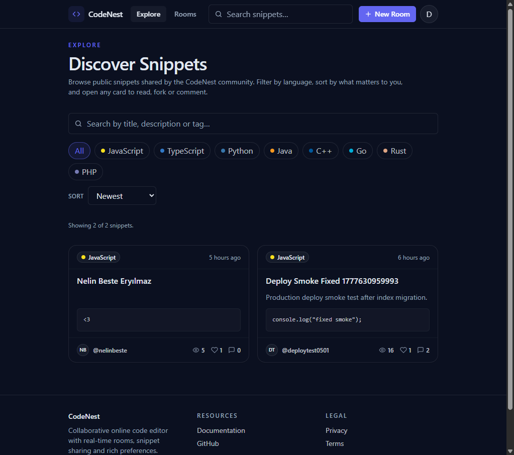
  </a>
</div>

---

## Features

- **Realtime collaborative editor** - Syncs shared room documents with Yjs CRDTs, y-websocket, Socket.io presence, and live cursor awareness.
- **Monaco-powered coding experience** - Provides syntax highlighting, editor preferences, readonly previews, and a responsive IDE-style layout.
- **Server-side code execution** - Runs code through a secure Express proxy for the Piston API with payload limits and runtime validation.
- **Snippet community** - Supports public snippet discovery, search, language filters, sorting, pagination, details, editing, deleting, and forking.
- **Comments and engagement** - Includes nested replies, soft deletes, likes, view counts, and ownership-aware actions.
- **User profiles and settings** - Offers public profiles plus profile, account, appearance, editor, privacy, and notification settings.
- **Role-aware access control** - Protects authenticated routes, admin areas, room access, snippet ownership, and moderation actions.
- **Admin moderation backend** - Provides endpoints for user management, snippet moderation, comment moderation, reports, and dashboard stats.
- **Security-first API** - Uses Helmet, CORS allowlists, rate limiting, input validation, bcrypt, JWT, sanitization, and production-safe errors.
- **Swagger documentation** - Exposes OpenAPI documentation at `/api-docs` and the raw schema at `/api-docs.json`.

---

## Live Demo

[🚀 View Live Demo](https://online-code-editorr.netlify.app/)

---

## Screenshots

All screenshots are captured from the [live deployment](https://online-code-editorr.netlify.app/) running against the seeded demo dataset.

<table>
  <tr>
    <td align="center" width="33%">
      <a href="./assets/screenshots/explore.png"></a>
      <sub><b>Explore</b><br/>Searchable public snippet discovery</sub>
    </td>
    <td align="center" width="33%">
      <a href="./assets/screenshots/snippet-detail.png">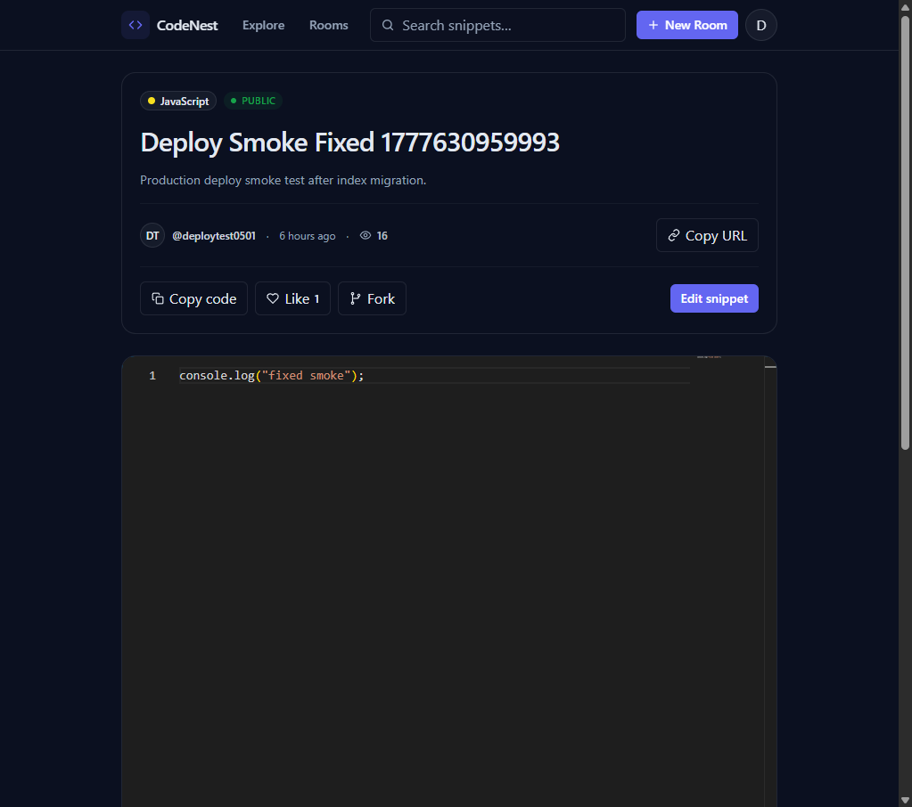</a>
      <sub><b>Snippet</b><br/>Code preview, actions & comments</sub>
    </td>
    <td align="center" width="33%">
      <a href="./assets/screenshots/public-profile.png">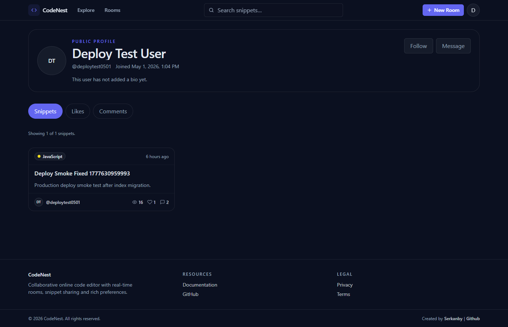</a>
      <sub><b>Profile</b><br/>Public activity and snippets</sub>
    </td>
  </tr>
  <tr>
    <td align="center" width="33%">
      <a href="./assets/screenshots/rooms.png">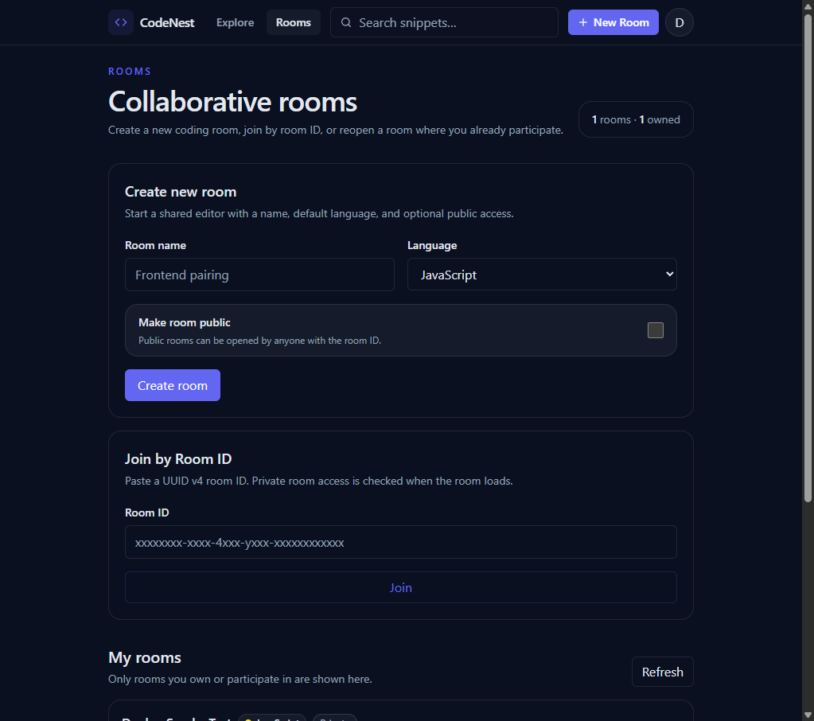</a>
      <sub><b>Rooms</b><br/>Create, join and reopen rooms</sub>
    </td>
    <td align="center" width="33%">
      <a href="./assets/screenshots/editor-room.png">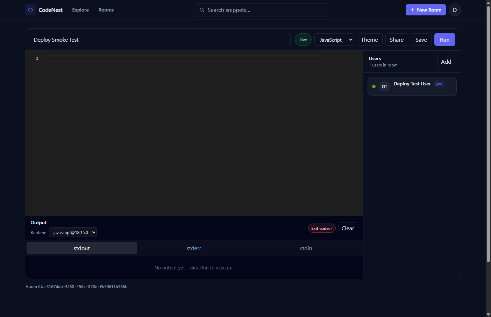</a>
      <sub><b>Editor</b><br/>Realtime Monaco collaboration</sub>
    </td>
    <td align="center" width="33%">
      <a href="./assets/screenshots/my-snippets.png">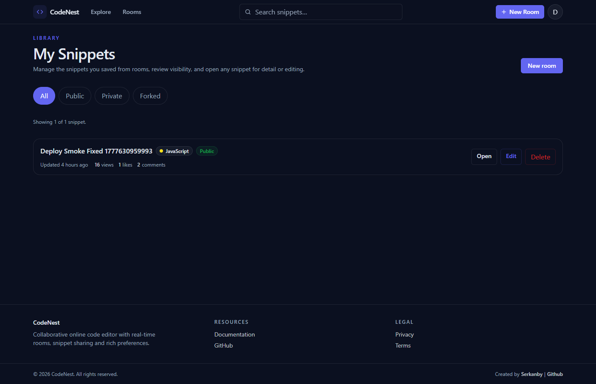</a>
      <sub><b>Library</b><br/>Owned snippet management</sub>
    </td>
  </tr>
  <tr>
    <td align="center" width="33%">
      <a href="./assets/screenshots/settings-profile.png">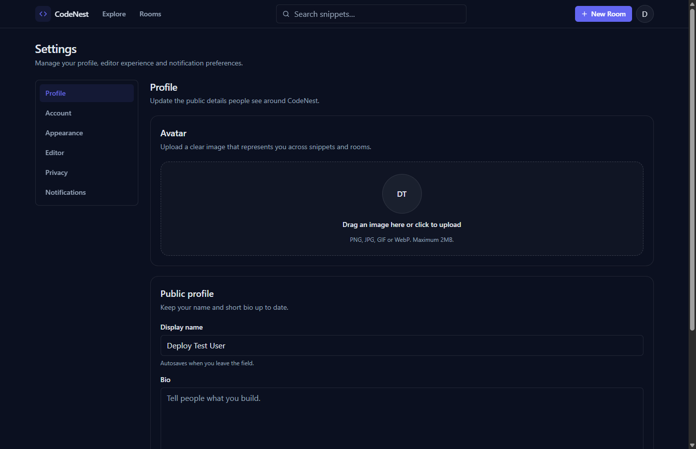</a>
      <sub><b>Profile settings</b><br/>Avatar and public details</sub>
    </td>
    <td align="center" width="33%">
      <a href="./assets/screenshots/settings-editor.png">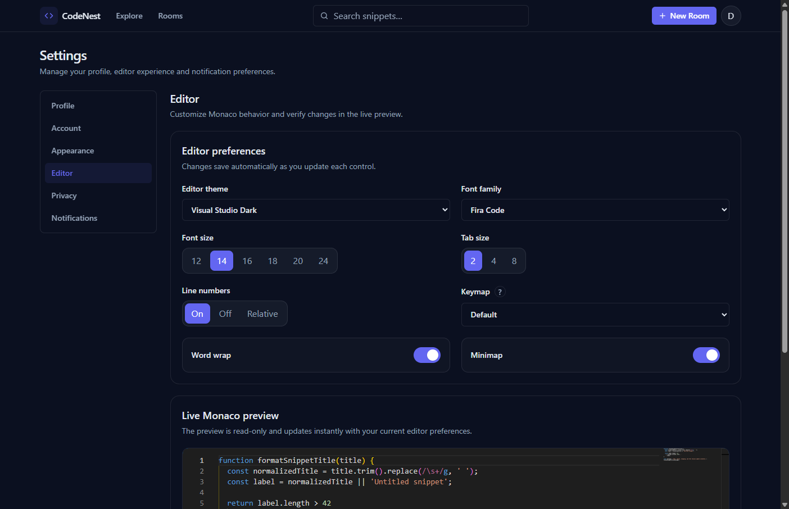</a>
      <sub><b>Editor settings</b><br/>Monaco preferences preview</sub>
    </td>
    <td align="center" width="33%">
      <a href="./assets/screenshots/access-control.png">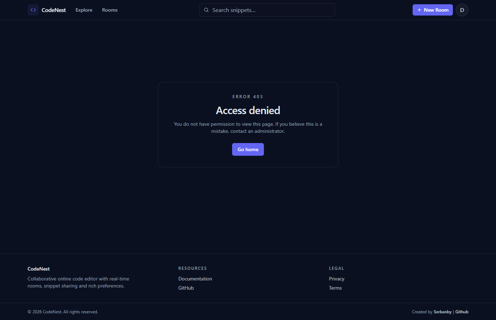</a>
      <sub><b>Access</b><br/>Role-protected route feedback</sub>
    </td>
  </tr>
</table>

---

## Architecture

A high-level visual map of the system. Both diagrams render natively on GitHub thanks to Mermaid support.

### Domain Model

How the core MongoDB collections relate to collaboration, community features, and moderation.

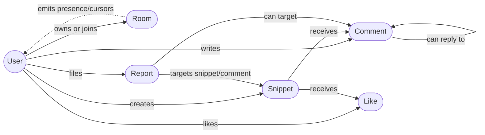

### Request Lifecycle

How a browser action moves through the stack for REST, realtime presence, CRDT sync, uploads, and code execution.

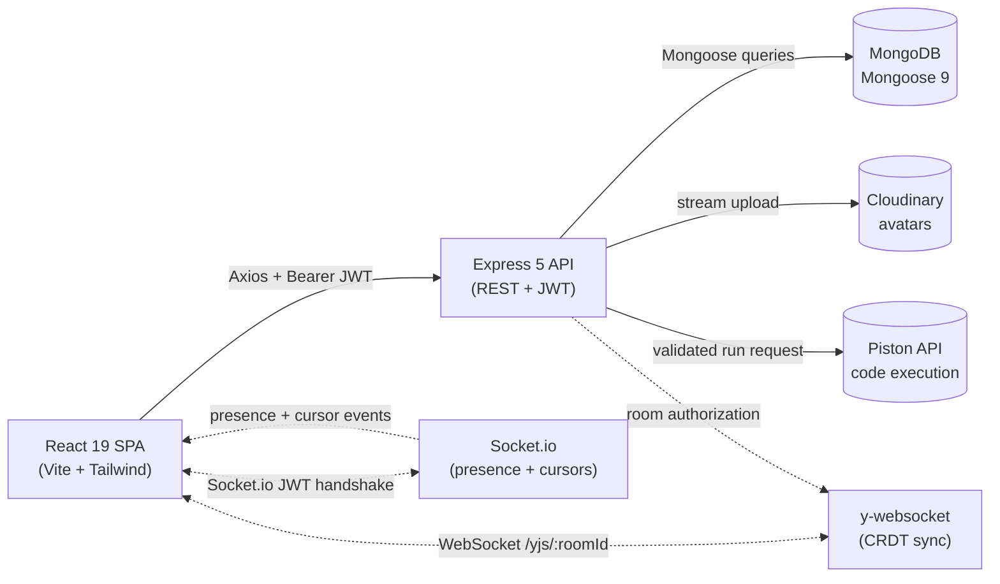

---

## Technologies

### Frontend

- **React 19**: Modern UI library with hooks, context, and route-driven page composition.
- **Vite 6**: Fast development server and optimized production build pipeline.
- **Tailwind CSS 4**: Utility-first styling with a dark, responsive, minimal UI system.
- **React Router 7**: Client-side routing for public, protected, settings, and admin layouts.
- **Axios**: API client for REST calls with JWT authorization support.
- **Monaco Editor**: Browser-based code editor used for rooms, snippets, and previews.
- **Yjs + y-monaco + y-websocket**: CRDT-based collaboration and Monaco document binding.
- **Socket.io Client**: Presence, cursor updates, and realtime room events.
- **React Hot Toast**: Lightweight feedback for success and error states.

### Backend

- **Node.js**: Server-side JavaScript runtime using native ES modules.
- **Express 5**: REST API framework with modular routes, controllers, validators, and middleware.
- **MongoDB (Mongoose 9)**: NoSQL persistence layer with schema models, indexes, and cascade workflows.
- **JWT**: Stateless authentication for protected REST routes, sockets, and room access.
- **bcrypt**: Secure password hashing with per-password salts.
- **Socket.io 4**: Realtime presence and cursor transport.
- **Yjs + y-websocket**: CRDT server for collaborative room documents.
- **Swagger UI Express**: Interactive API documentation generated from the OpenAPI spec.
- **Helmet, CORS, express-rate-limit**: Security headers, origin allowlists, and abuse protection.
- **Cloudinary + Multer**: Optional avatar upload pipeline with MIME and size checks.
- **Piston API**: Sandboxed multi-language code execution via server-side proxy.

---

## Installation

### Prerequisites

- **Node.js** v20+ and **npm**
- **MongoDB** local instance or MongoDB Atlas cluster
- **Cloudinary account** for avatar uploads, optional
- **Piston API** public endpoint or a self-hosted Piston service

### Local Development

**1. Clone the repository:**

```bash
git clone https://github.com/Serkanbyx/s4.17_Online-Code-Editor.git
cd s4.17_Online-Code-Editor
```

**2. Set up environment variables:**

```bash
cp server/.env.example server/.env
cp client/.env.example client/.env
```

**server/.env**

```env
NODE_ENV=development
PORT=5000
MONGO_URI=mongodb://127.0.0.1:27017/codenest
JWT_SECRET=replace_with_a_long_random_secret
JWT_EXPIRES_IN=7d
CORS_ORIGIN=http://localhost:5173
PISTON_BASE_URL=https://emkc.org/api/v2/piston
CLOUDINARY_CLOUD_NAME=
CLOUDINARY_API_KEY=
CLOUDINARY_API_SECRET=
ADMIN_EMAIL=admin@codenest.local
ADMIN_PASSWORD=replace_with_a_secure_admin_password
MAX_CODE_PAYLOAD_KB=64
```

**client/.env**

```env
VITE_API_URL=http://localhost:5000/api
VITE_SOCKET_URL=http://localhost:5000
VITE_YJS_URL=ws://localhost:5000
```

**Environment variable reference:**

| Variable | App | Description |
| --- | --- | --- |
| `MONGO_URI` | Server | MongoDB connection string. |
| `JWT_SECRET` | Server | Secret used to sign JWT tokens. Use at least 32 characters in production. |
| `JWT_EXPIRES_IN` | Server | JWT lifetime, defaults to `7d`. |
| `CORS_ORIGIN` | Server | Comma-separated list of allowed frontend origins. |
| `PISTON_BASE_URL` | Server | Base URL for Piston code execution. |
| `CLOUDINARY_*` | Server | Optional avatar upload credentials. |
| `ADMIN_EMAIL` | Server | Initial admin account email used by the seed script. |
| `ADMIN_PASSWORD` | Server | Initial admin password used by the seed script. |
| `MAX_CODE_PAYLOAD_KB` | Server | Maximum accepted code execution payload size. |
| `VITE_API_URL` | Client | Public REST API base URL. |
| `VITE_SOCKET_URL` | Client | Socket.io endpoint. |
| `VITE_YJS_URL` | Client | y-websocket endpoint. |

**3. Install dependencies:**

```bash
cd server
npm install

cd ../client
npm install
```

**4. Seed the initial admin user:**

```bash
cd server
npm run seed
```

**5. Run the application:**

```bash
# Terminal 1 - Backend
cd server
npm run dev

# Terminal 2 - Frontend
cd client
npm run dev
```

**6. Open the app:**

```bash
http://localhost:5173
```

---

## Usage

1. **Register a user account** from `/register`, then log in from `/login`.
2. **Explore public snippets** from the home page using search, language filters, and sorting.
3. **Create or join a room** from `/rooms`, then collaborate in the Monaco editor.
4. **Run code** from a room with the selected runtime through the Piston-backed API.
5. **Save snippets** from rooms, then manage them from `/me/snippets`.
6. **Open snippet details** to copy code, like, fork, comment, reply, or edit owned snippets.
7. **Customize settings** from `/settings/profile`, `/settings/editor`, `/settings/privacy`, and related pages.
8. **Use admin tools** with an admin account to manage users, snippets, comments, reports, and dashboard stats.
9. **Log out** from the account menu when finished.

---

## How It Works

### Authentication Flow

Users authenticate with email and password. The backend validates input, checks the hashed password with bcrypt, signs a JWT, and the client sends that token in the `Authorization` header for protected routes.

```javascript
// client/src/api/axios.js
api.interceptors.request.use((config) => {
  const token = localStorage.getItem('token');

  if (token) {
    config.headers.Authorization = `Bearer ${token}`;
  }

  return config;
});
```

### Protected API Flow

Protected routes use JWT middleware, role checks, validators, ownership checks, and centralized error handling. Controllers only accept allowed fields and avoid mass assignment.

```javascript
// server/index.js
app.use('/api/auth', authRoutes);
app.use('/api/admin', adminRoutes);
app.use('/api/code', codeRoutes);
app.use('/api/comments', commentRoutes);
app.use('/api/likes', likeRoutes);
app.use('/api/profile', profileRoutes);
app.use('/api/reports', reportRoutes);
app.use('/api/rooms', roomRoutes);
app.use('/api/snippets', snippetRoutes);
app.use('/api/upload', uploadRoutes);
```

### Realtime Collaboration Flow

The room page connects to Socket.io for presence and cursor metadata, while Yjs synchronizes the Monaco document over y-websocket. Room access is checked before CRDT upgrades so private rooms stay protected.

### Code Execution Flow

The client sends source code, language, and optional stdin to `/api/code/run`. The server validates payload size, maps the runtime, forwards the request to Piston, and returns stdout, stderr, compile output, and exit metadata.

---

## API Endpoints

> Authenticated endpoints require `Authorization: Bearer <token>`. Optional-auth endpoints return public data to guests and richer state to signed-in users when a token is present.

| Method | Endpoint | Auth | Description |
| --- | --- | --- | --- |
| `GET` | `/api/health` | No | Health check with environment and timestamp. |
| `POST` | `/api/auth/register` | No | Create a user account and return a JWT. |
| `POST` | `/api/auth/login` | No | Authenticate a user and return a JWT. |
| `GET` | `/api/auth/me` | Yes | Return the current user. |
| `PATCH` | `/api/auth/me` | Yes | Update display name, bio, or avatar URL. |
| `PATCH` | `/api/auth/password` | Yes | Change password after current password verification. |
| `DELETE` | `/api/auth/me` | Yes | Delete the current account and cascade owned data. |
| `POST` | `/api/snippets` | Yes | Create a snippet. |
| `GET` | `/api/snippets/me` | Yes | List current user's snippets. |
| `GET` | `/api/snippets/public` | Optional | Explore public active snippets. |
| `GET` | `/api/snippets/:id` | Optional | Read a visible snippet by ID. |
| `PATCH` | `/api/snippets/:id` | Owner/Admin | Update a snippet. |
| `DELETE` | `/api/snippets/:id` | Owner/Admin | Delete a snippet and cascade related data. |
| `POST` | `/api/snippets/:id/fork` | Yes | Fork a visible snippet into a private copy. |
| `GET` | `/api/comments/snippet/:snippetId` | Optional | List top-level comments for a snippet. |
| `GET` | `/api/comments/:commentId/replies` | Optional | List replies for a comment. |
| `POST` | `/api/comments` | Yes | Create a comment or reply. |
| `PATCH` | `/api/comments/:id` | Owner | Update comment content. |
| `DELETE` | `/api/comments/:id` | Owner/Admin | Soft-delete a comment. |
| `POST` | `/api/likes/:snippetId` | Yes | Toggle a snippet like. |
| `GET` | `/api/likes/me` | Yes | List current user's liked snippets. |
| `GET` | `/api/likes/:snippetId/me` | Yes | Check whether current user liked a snippet. |
| `POST` | `/api/rooms` | Yes | Create a collaboration room. |
| `GET` | `/api/rooms/me` | Yes | List owned or joined rooms. |
| `GET` | `/api/rooms/:roomId` | Optional | Read an accessible room. |
| `POST` | `/api/rooms/:roomId/join` | Yes | Join an accessible room. |
| `POST` | `/api/rooms/:roomId/leave` | Yes | Leave a room as a participant. |
| `POST` | `/api/rooms/:roomId/participants` | Owner | Add a participant by username. |
| `PATCH` | `/api/rooms/:roomId` | Owner | Update room name, language, or visibility. |
| `DELETE` | `/api/rooms/:roomId` | Owner | Delete a room and clean up CRDT state. |
| `GET` | `/api/code/runtimes` | Optional | Return supported Piston runtimes. |
| `POST` | `/api/code/run` | Yes | Execute code through the Piston proxy. |
| `POST` | `/api/upload/avatar` | Yes | Upload an avatar image to Cloudinary. |
| `PATCH` | `/api/profile/me/preferences` | Yes | Update user preferences. |
| `GET` | `/api/profile/:username` | Optional | Read a public profile. |
| `GET` | `/api/profile/:username/snippets` | Optional | List public snippets for a profile. |
| `GET` | `/api/profile/:username/likes` | Optional | List visible liked snippets for a profile. |
| `GET` | `/api/profile/:username/comments` | Optional | List visible comments for a profile. |
| `POST` | `/api/reports` | Yes | Report a snippet or comment. |
| `GET` | `/api/reports/me` | Yes | List reports filed by current user. |
| `GET` | `/api/admin/stats` | Admin | Return dashboard aggregate stats. |
| `GET` | `/api/admin/users` | Admin | List users with filters. |
| `GET` | `/api/admin/users/:id` | Admin | Read user details. |
| `PATCH` | `/api/admin/users/:id/role` | Admin | Change user role. |
| `PATCH` | `/api/admin/users/:id/ban` | Admin | Ban or unban a user. |
| `DELETE` | `/api/admin/users/:id` | Admin | Delete a user with cascade cleanup. |
| `GET` | `/api/admin/snippets` | Admin | List snippets for moderation. |
| `PATCH` | `/api/admin/snippets/:id/status` | Admin | Moderate snippet status. |
| `DELETE` | `/api/admin/snippets/:id` | Admin | Hard-delete a snippet. |
| `GET` | `/api/admin/comments` | Admin | List comments for moderation. |
| `PATCH` | `/api/admin/comments/:id/status` | Admin | Moderate comment status. |
| `GET` | `/api/admin/reports` | Admin | List the report queue. |
| `PATCH` | `/api/admin/reports/:id` | Admin | Resolve or dismiss a report. |

### Realtime Channels

| Channel / Event | Direction | Description |
| --- | --- | --- |
| `WSS /yjs/:roomId?token=<jwt>` | Client <-> Server | CRDT document sync and Yjs awareness. |
| `room:join` | Client -> Server | Join a Socket.io presence channel. |
| `room:leave` | Client -> Server | Leave a room presence channel. |
| `room:userJoined` | Server -> Client | Notify peers that a user joined. |
| `room:userLeft` | Server -> Client | Notify peers that a user left. |
| `room:usersInRoom` | Server -> Client | Send the initial room presence snapshot. |
| `cursor:change` | Client -> Server | Send local cursor and selection metadata. |
| `cursor:update` | Server -> Client | Broadcast peer cursor updates. |
| `room:languageChange` | Client -> Server -> Client | Broadcast owner-driven language changes. |

---

## Project Structure

A clean monorepo layout with an explicit backend / frontend split. Each panel below is collapsible - expand the one you care about.

<details open>
<summary><b>Server</b> - Express 5 API</summary>

```
server/
├── config/             # db, env, swagger
├── controllers/        # auth, snippets, comments, rooms, admin, reports
├── middleware/         # auth, admin, optional auth, validation, upload, security
├── models/             # User, Snippet, Comment, Like, Room, Report
├── routes/             # REST route groups mounted under /api
├── scripts/            # admin seed and snippet index migration
├── sockets/            # Socket.io presence, cursors, y-websocket server
├── utils/              # token, errors, constants, Cloudinary, Piston client
├── validators/         # express-validator schemas per resource
├── index.js            # app composition, routes, sockets, server startup
├── .env.example        # safe server env template
└── package.json        # backend scripts and dependencies
```

</details>

<details>
<summary><b>Client</b> - React 19 + Vite SPA</summary>

```
client/
├── public/             # favicon and static public assets
├── src/
│   ├── api/            # Axios instance and endpoint wrappers
│   ├── components/     # common, auth, layout, editor, snippets, admin UI
│   ├── context/        # auth, preferences, socket providers
│   ├── hooks/          # local storage, debounce, socket, Yjs, clipboard
│   ├── layouts/        # main, admin, settings layouts
│   ├── pages/          # auth, home, rooms, snippets, profile, settings, admin
│   ├── routes/         # protected, guest-only, admin guards
│   ├── utils/          # languages, formatting, helpers, API errors
│   ├── App.jsx         # route tree
│   ├── main.jsx        # React entry point
│   └── monacoWorkers.js
├── .env.example        # safe client env template
├── index.html
├── netlify.toml        # Netlify build and SPA redirects
├── vite.config.js
└── package.json        # frontend scripts and dependencies
```

</details>

<details>
<summary><b>Repository root</b> - docs, governance and shared assets</summary>

```
s4.17_Online-Code-Editor/
├── assets/
│   └── screenshots/    # live deployment screenshots used in README
├── client/             # React SPA
├── docs/
│   └── build-guide.md  # long-form build documentation
├── server/             # Express API and realtime services
├── .gitignore
├── LICENSE
└── README.md
```

</details>

---

## Security

- **Password hashing** - Passwords are hashed with bcrypt and never returned in API responses.
- **JWT hardening** - Production startup requires a `JWT_SECRET` with at least 32 characters.
- **Role protection** - Admin-only routes are guarded and regular users cannot assign privileged roles.
- **Ownership checks** - Snippet, comment, and room mutations verify ownership or admin permissions.
- **Rate limiting** - Separate limiters protect global API traffic, auth, admin, code execution, and write actions.
- **Input validation** - `express-validator` schemas validate request bodies, params, and query values.
- **Sanitization** - Mongo injection payloads are sanitized before controller logic runs.
- **ReDoS prevention** - Regex search input is escaped before MongoDB queries.
- **CORS allowlist** - Production CORS is configured with explicit frontend origins.
- **Helmet headers** - Common security headers are enabled for API and documentation surfaces.
- **Payload limits** - Global JSON, code execution, and file upload body sizes are constrained.
- **Upload safety** - Avatar uploads use MIME whitelisting, a 2 MB cap, and server-generated filenames.
- **Privacy controls** - Profile visibility preferences are enforced on the server.
- **Error handling** - Production errors avoid stack traces and internal path leaks.
- **Admin self-protection** - Admins cannot ban, delete, or demote themselves, and last-admin protection is enforced.
- **Realtime guards** - Socket.io and y-websocket connections verify JWT state, room access, and banned status.

---

## Deployment

### Frontend - Netlify

1. Connect the GitHub repository to Netlify.
2. Set the base directory to `client`.
3. Use `npm run build` as the build command.
4. Publish the `dist` directory.
5. Configure SPA redirects with `client/netlify.toml`.

| Variable | Value |
| --- | --- |
| `VITE_API_URL` | `https://your-render-api.onrender.com/api` |
| `VITE_SOCKET_URL` | `https://your-render-api.onrender.com` |
| `VITE_YJS_URL` | `wss://your-render-api.onrender.com` |

> The live frontend is deployed at [online-code-editorr.netlify.app](https://online-code-editorr.netlify.app/).

### Backend - Render

1. Create a new Web Service from the repository.
2. Set the root directory to `server`.
3. Use `npm install` as the build command.
4. Use `npm start` as the start command.
5. Add MongoDB Atlas, JWT, CORS, Piston, Cloudinary, and admin seed variables.

| Variable | Value |
| --- | --- |
| `NODE_ENV` | `production` |
| `PORT` | Render-provided port or `5000` locally |
| `MONGO_URI` | MongoDB Atlas connection string |
| `JWT_SECRET` | Long random production secret |
| `JWT_EXPIRES_IN` | `7d` or shorter |
| `CORS_ORIGIN` | `https://online-code-editorr.netlify.app` |
| `PISTON_BASE_URL` | `https://emkc.org/api/v2/piston` |
| `CLOUDINARY_CLOUD_NAME` | Cloudinary cloud name |
| `CLOUDINARY_API_KEY` | Cloudinary API key |
| `CLOUDINARY_API_SECRET` | Cloudinary API secret |
| `ADMIN_EMAIL` | Initial admin email |
| `ADMIN_PASSWORD` | Initial admin password |
| `MAX_CODE_PAYLOAD_KB` | `64` |

> On free hosting tiers, keep a cold-start friendly loading state on the client and monitor `/api/health`.

---

## Features in Detail

### Completed Features

- ✅ JWT register, login, current user, profile updates, password changes, and account deletion
- ✅ Public snippet discovery with filters, sorting, pagination, detail pages, and profile links
- ✅ Snippet create, edit, delete, fork, visibility, status, and ownership controls
- ✅ Nested comments, replies, soft deletes, and like toggling
- ✅ Collaborative rooms with public/private access, participants, presence, and cursor updates
- ✅ Monaco editor preferences with theme, font, size, tab size, line numbers, wrap, and minimap controls
- ✅ Piston-backed code execution with runtime discovery and output tabs
- ✅ Avatar uploads through Cloudinary
- ✅ Admin endpoints for users, snippets, comments, reports, and stats
- ✅ Swagger documentation and OpenAPI JSON

### Future Features

- [ ] Persistent Yjs document storage with `y-leveldb` or database-backed snapshots
- [ ] Invite links and participant roles for private rooms
- [ ] Built-in AI code review or formatting helpers
- [ ] End-to-end tests for collaboration and moderation flows
- [ ] CI workflow for linting, build verification, and security checks

---

## Contributing

1. Fork the repository.
2. Create a feature branch with a clear name.
3. Make focused changes with readable, reusable code.
4. Run the relevant build or manual verification steps.
5. Commit with a semantic message.
6. Push your branch and open a pull request.

| Prefix | Description |
| --- | --- |
| `feat:` | New feature |
| `fix:` | Bug fix |
| `refactor:` | Code refactoring |
| `docs:` | Documentation changes |
| `chore:` | Maintenance and dependency updates |

---

## License

This project is licensed under the [MIT License](./LICENSE).

---

## Developer

**Serkanby**

- 🌐 Website: [serkanbayraktar.com](https://serkanbayraktar.com/)
- GitHub: [@Serkanbyx](https://github.com/Serkanbyx)
- Email: [serkanbyx1@gmail.com](mailto:serkanbyx1@gmail.com)

---

## Acknowledgments

- [React](https://react.dev/) for the frontend UI foundation.
- [Vite](https://vite.dev/) for fast frontend tooling.
- [Monaco Editor](https://microsoft.github.io/monaco-editor/) for the in-browser code editor.
- [Yjs](https://docs.yjs.dev/) for CRDT-based collaboration.
- [Socket.io](https://socket.io/) for realtime presence and cursor events.
- [Piston](https://github.com/engineer-man/piston) for sandboxed code execution.
- [MongoDB](https://www.mongodb.com/) and [Mongoose](https://mongoosejs.com/) for persistence.

---

## Contact

- [Open an Issue](https://github.com/Serkanbyx/s4.17_Online-Code-Editor/issues)
- Email: [serkanbyx1@gmail.com](mailto:serkanbyx1@gmail.com)
- Website: [serkanbayraktar.com](https://serkanbayraktar.com/)

---

⭐ If you like this project, don't forget to give it a star!
