<div align="center">
  <p>
    <strong>&lt;/&gt; CodeNest</strong>
  </p>

  <h1>CodeNest</h1>

  <p><em>A full-stack realtime collaborative code editor with Monaco-powered IDE, Yjs CRDT synchronization, multi-language code execution, snippet sharing with social features, and an admin moderation panel.</em></p>

  <p>
    
    
    
    
    
    
    
    
    
    
    
    
    
  </p>

  <p>
    <a href="#live-demo">Live Demo</a> •
    <a href="#features">Features</a> •
    <a href="#installation">Quick Start</a> •
    <a href="#api-endpoints">API Docs</a> •
    <a href="#screenshots">Screenshots</a>
  </p>

  <a href="./assets/screenshots/landing.png">
    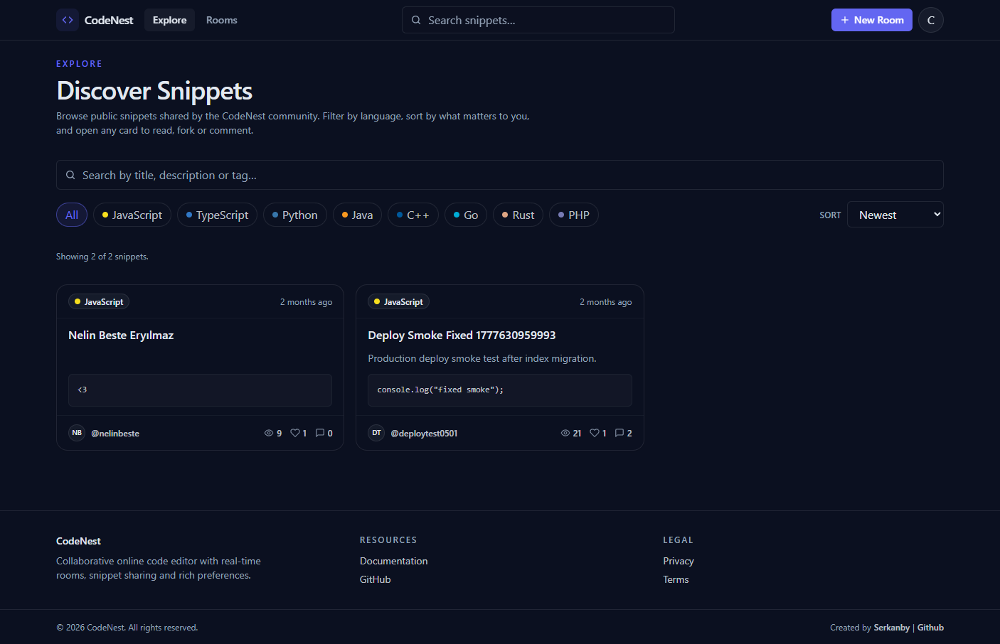
  </a>
</div>

---

## Features

- **Realtime Collaborative Editing** — Yjs CRDT-based document synchronization over WebSocket with conflict-free concurrent editing and live cursor positions
- **Monaco Code Editor** — Full VS Code editing experience with IntelliSense, syntax highlighting for 25+ languages, customizable themes, keymaps, and minimap
- **Multi-Language Code Execution** — JavaScript runs in a browser sandbox; Python, Java, Go, Rust, C/C++, and 20+ languages execute via the Piston API proxy
- **Snippet Sharing Platform** — Create, fork, tag, and share code snippets publicly with full-text search, filtering by language/tag, and popularity sorting
- **Collaboration Rooms** — Create private or public rooms, invite participants by username, and code together with real-time presence indicators
- **Social Features** — Like snippets, write threaded comments with replies, view public profiles, and report inappropriate content
- **JWT Authentication** — Secure register/login flow with bcrypt password hashing, token expiry, and banned-user enforcement
- **Role-Based Admin Panel** — Moderation dashboard with user management, snippet/comment moderation, report queue resolution, and analytics
- **Customizable Preferences** — Per-user editor settings (theme, font, tab size, keymap, word wrap, line numbers), appearance mode, and privacy controls
- **Swagger API Documentation** — Interactive OpenAPI 3.1 docs served at `/api-docs` with all endpoints, schemas, and authentication flows
- **Avatar Uploads** — Cloudinary-powered profile picture uploads with image optimization (optional)
- **Security Hardened** — Helmet headers, CORS whitelist, tiered rate limiting, input sanitization, express-validator schemas, and mongo-sanitize

---

## Live Demo

Deploy your own instance using the [Deployment](#deployment) section below, or run locally with the [Quick Start](#installation) guide.

After publishing, add your Netlify URL here:

`https://your-codenest-app.netlify.app`

---

## Screenshots

Screenshots below are stored in `assets/screenshots/`. Replace or extend them from your live deployment for the best portfolio presentation.

<table>
  <tr>
    <td align="center" width="33%">
      <a href="./assets/screenshots/landing.png"></a>
      <sub><b>Landing</b><br/>Public snippet discovery & hero</sub>
    </td>
    <td align="center" width="33%">
      <a href="./assets/screenshots/editor.png">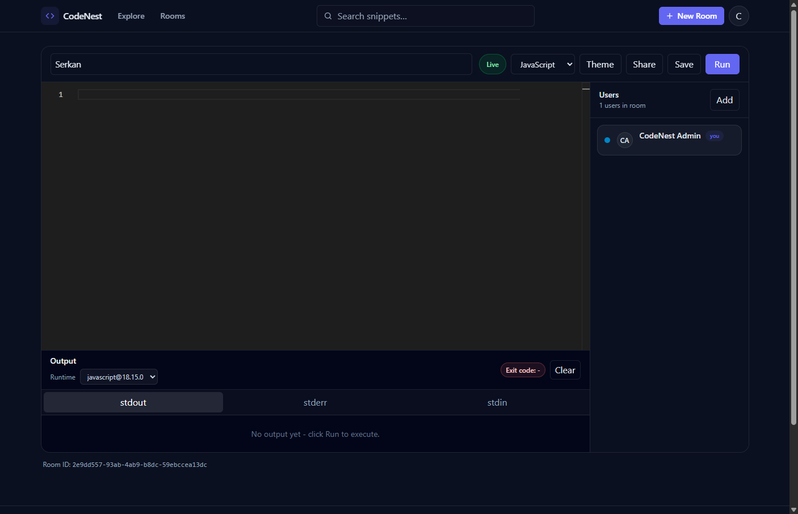</a>
      <sub><b>Editor</b><br/>Monaco IDE with live collaboration</sub>
    </td>
    <td align="center" width="33%">
      <a href="./assets/screenshots/snippet-detail.png">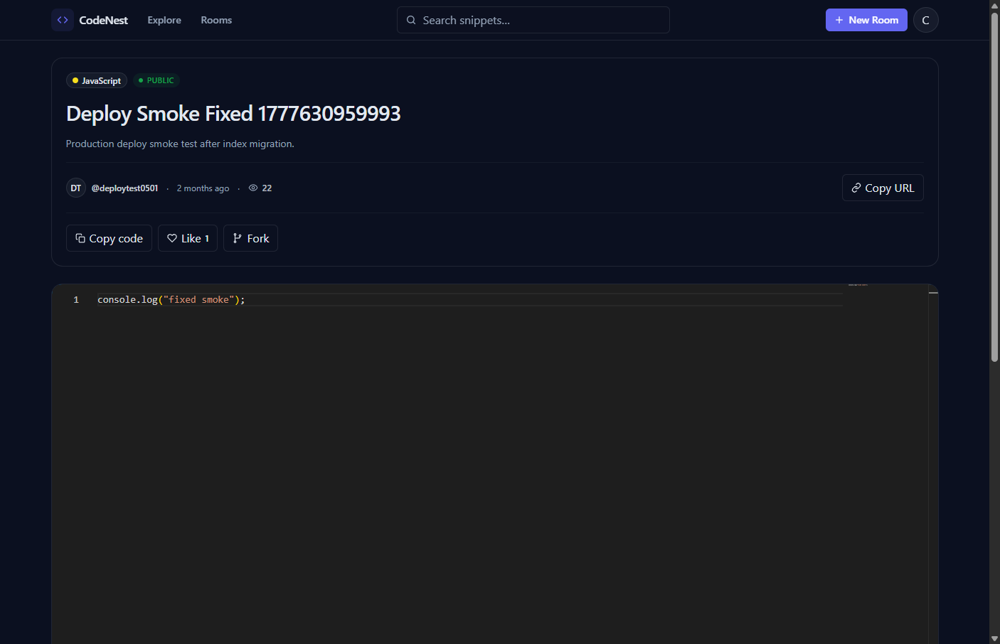</a>
      <sub><b>Snippet Detail</b><br/>Code view, likes & comments</sub>
    </td>
  </tr>
  <tr>
    <td align="center" width="33%">
      <a href="./assets/screenshots/rooms-hub.png">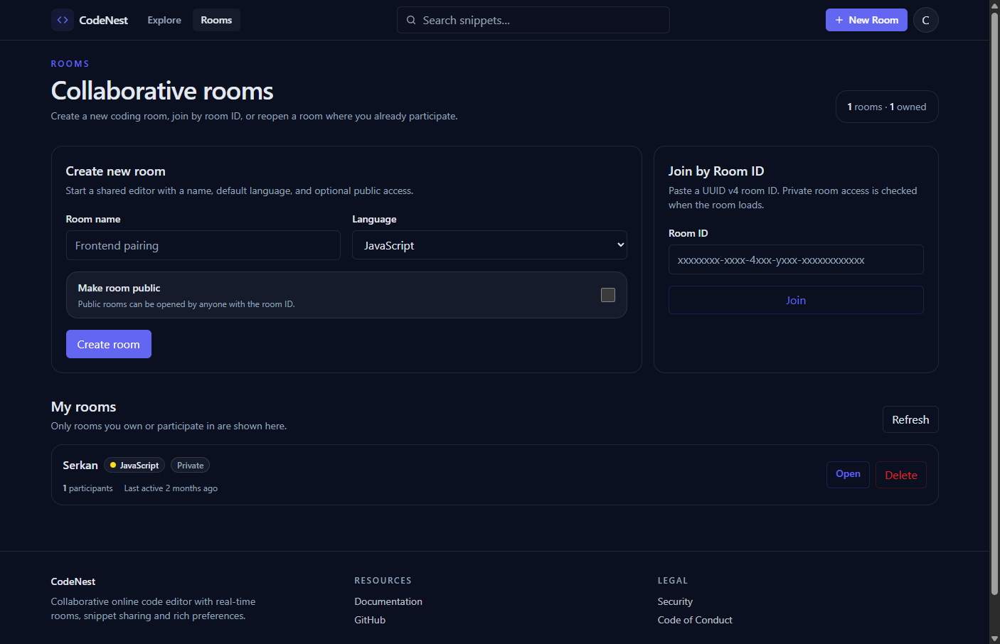</a>
      <sub><b>Rooms Hub</b><br/>Create & manage collab rooms</sub>
    </td>
    <td align="center" width="33%">
      <a href="./assets/screenshots/my-snippets.png">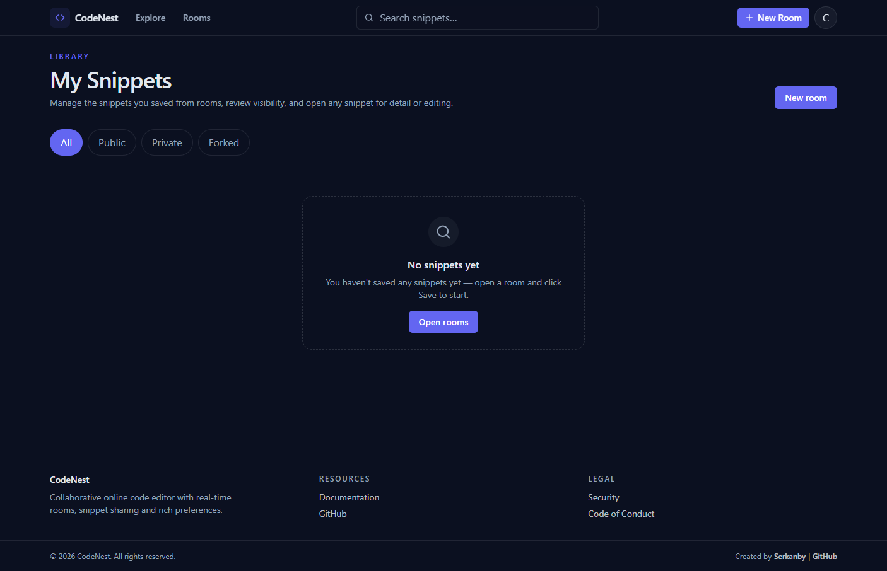</a>
      <sub><b>My Snippets</b><br/>Personal snippet management</sub>
    </td>
    <td align="center" width="33%">
      <a href="./assets/screenshots/profile.png">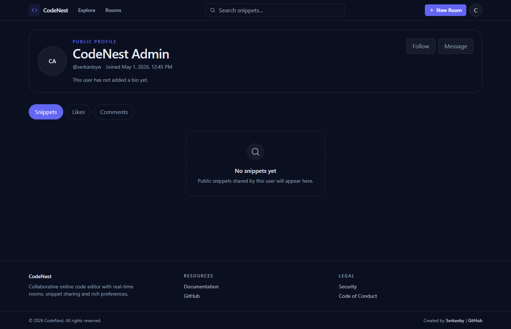</a>
      <sub><b>Profile</b><br/>Public user profile & activity</sub>
    </td>
  </tr>
  <tr>
    <td align="center" width="33%">
      <a href="./assets/screenshots/settings.png">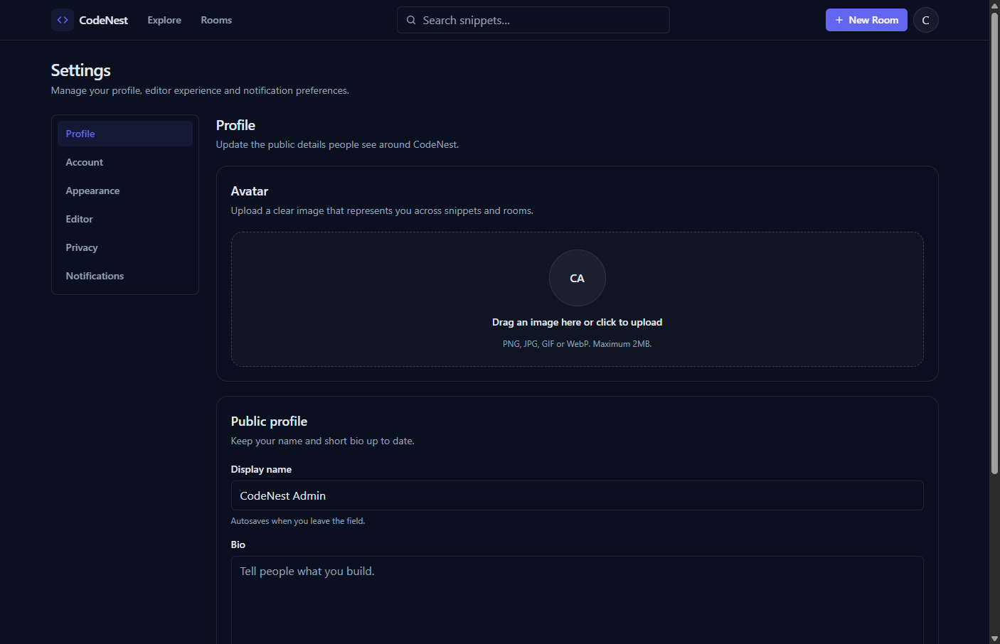</a>
      <sub><b>Settings</b><br/>Editor, appearance & privacy prefs</sub>
    </td>
    <td align="center" width="33%">
      <a href="./assets/screenshots/admin-dashboard.png">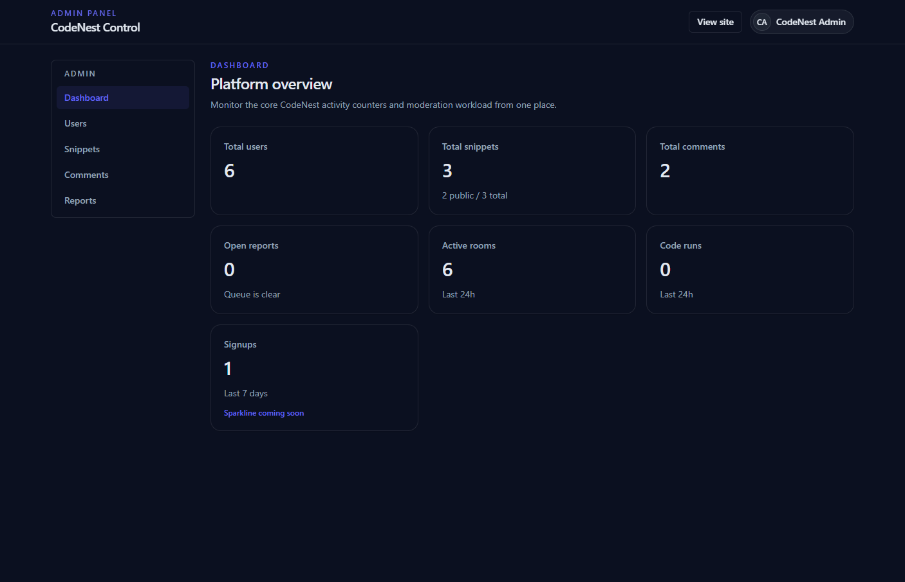</a>
      <sub><b>Admin Dashboard</b><br/>Analytics & moderation overview</sub>
    </td>
    <td align="center" width="33%">
      <a href="./assets/screenshots/admin-users.png">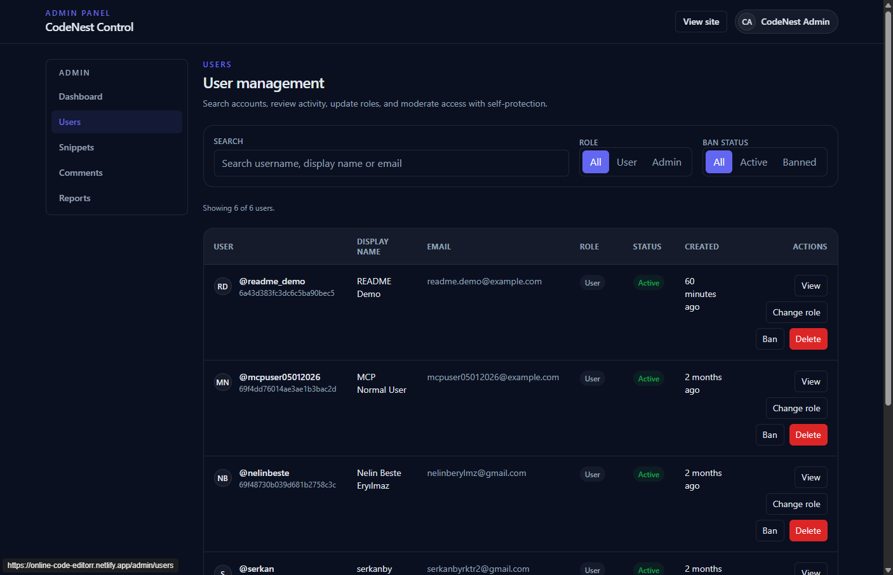</a>
      <sub><b>Admin Users</b><br/>User management & banning</sub>
    </td>
  </tr>
</table>

---

## Architecture

A high-level visual map of the system. Both diagrams render natively on GitHub thanks to Mermaid support.

### Domain Model

How the core collections relate to each other and how real-time delivery fans out.

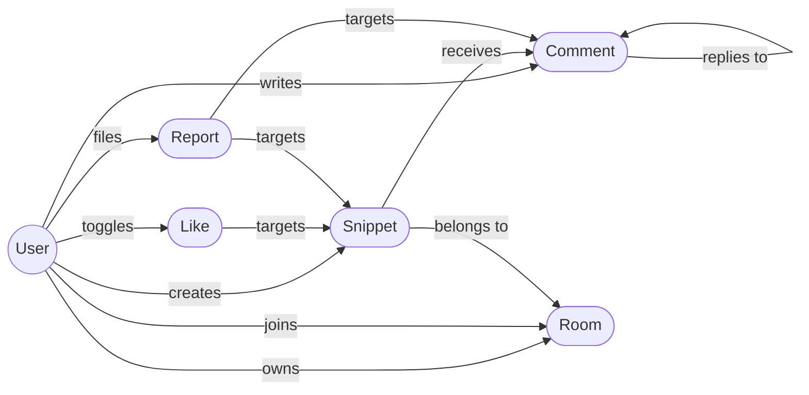
```mermaid
graph LR
  User(("User"))
  Snippet(["Snippet"])
  Comment(["Comment"])
  Like(["Like"])
  Room(["Room"])
  Report(["Report"])

  User -- "creates" --> Snippet
  User -- "writes" --> Comment
  User -- "toggles" --> Like
  User -- "owns" --> Room
  User -- "joins" --> Room
  User -- "files" --> Report
  Snippet -- "receives" --> Comment
  Comment -- "replies to" --> Comment
  Like -- "targets" --> Snippet
  Snippet -- "belongs to" --> Room
  Report -- "targets" --> Snippet
  Report -- "targets" --> Comment
```

### Request Lifecycle

How a single browser action travels through the stack.

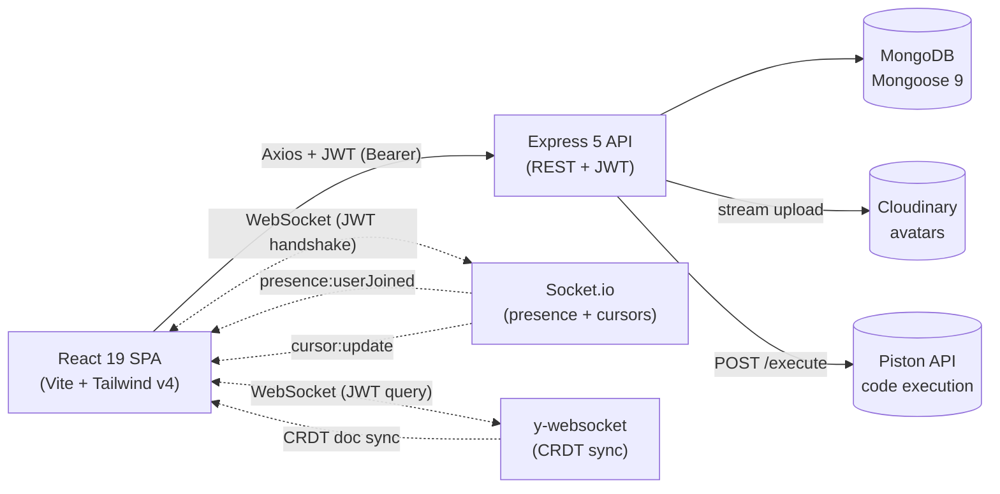
```mermaid
flowchart LR
  Browser["React 19 SPA<br/>(Vite + Tailwind v4)"]
  API["Express 5 API<br/>(REST + JWT)"]
  WS["Socket.io<br/>(presence + cursors)"]
  YJS["y-websocket<br/>(CRDT sync)"]
  DB[("MongoDB<br/>Mongoose 9")]
  CDN[("Cloudinary<br/>avatars")]
  Piston[("Piston API<br/>code execution")]

  Browser -- "Axios + JWT (Bearer)" --> API
  Browser <-. "WebSocket (JWT handshake)" .-> WS
  Browser <-. "WebSocket (JWT query)" .-> YJS
  API --> DB
  API -- "stream upload" --> CDN
  API -- "POST /execute" --> Piston
  WS -. "presence:userJoined" .-> Browser
  WS -. "cursor:update" .-> Browser
  YJS -. "CRDT doc sync" .-> Browser
```

---

## Technologies

### Frontend

- **React 19**: Modern UI library with hooks, context, and concurrent features
- **Vite 6**: Lightning-fast build tool with HMR and optimized production bundles
- **Tailwind CSS 4**: Utility-first CSS framework with Vite plugin integration
- **Monaco Editor**: VS Code's editor component with full language support and IntelliSense
- **Yjs + y-monaco**: CRDT-based real-time collaborative editing bound to Monaco
- **Socket.io Client**: Real-time presence and cursor position broadcasting
- **React Router 7**: Declarative client-side routing with nested layouts and guards
- **Axios**: Promise-based HTTP client with JWT interceptors
- **React Hot Toast**: Lightweight toast notification system
- **clsx**: Conditional className utility

### Backend

- **Node.js**: Server-side JavaScript runtime (ES Modules)
- **Express 5**: Minimal web framework with async error handling
- **MongoDB (Mongoose 9)**: NoSQL database with schema validation, compound indexes, and text search
- **Socket.io 4**: Real-time bidirectional communication for presence and cursor events
- **y-websocket + Yjs**: WebSocket server for CRDT document synchronization
- **JSON Web Token (JWT)**: Stateless authentication with configurable expiry
- **bcrypt**: Password hashing with salt rounds
- **Piston API**: Sandboxed multi-language code execution proxy
- **Cloudinary**: Cloud-based image upload and optimization (optional)
- **Swagger UI Express**: Interactive OpenAPI 3.1 documentation
- **Helmet**: HTTP security headers
- **express-rate-limit**: Tiered rate limiting (global, auth, code-run, write, admin)
- **express-validator**: Request payload validation with custom sanitizers
- **express-mongo-sanitize**: NoSQL injection prevention
- **Multer**: Multipart file upload handling
- **Morgan**: HTTP request logging

---

## Installation

### Prerequisites

- **Node.js** v20+ and **npm**
- **MongoDB** — MongoDB Atlas (free tier) or local instance
- **Cloudinary** account (optional, for avatar uploads)

### Local Development

**1. Clone the repository:**

```bash
git clone https://github.com/serkanbyx/online-code-editor.git
cd online-code-editor
```

**2. Set up environment variables:**

```bash
cp server/.env.example server/.env
cp client/.env.example client/.env
```

**server/.env**

```env
NODE_ENV=development
PORT=5000

MONGO_URI=mongodb://127.0.0.1:27017/codenest

# Use a long random string in production (minimum 32 characters)
JWT_SECRET=dev-only-change-me-before-production
JWT_EXPIRES_IN=7d

# Single origin or comma-separated list (no trailing slashes)
CORS_ORIGIN=http://localhost:5173

PISTON_BASE_URL=https://emkc.org/api/v2/piston

CLOUDINARY_CLOUD_NAME=
CLOUDINARY_API_KEY=
CLOUDINARY_API_SECRET=

ADMIN_EMAIL=admin@codenest.local
ADMIN_PASSWORD=your_admin_password

MAX_CODE_PAYLOAD_KB=64
```

**client/.env**

```env
VITE_API_URL=http://localhost:5000/api
VITE_SOCKET_URL=http://localhost:5000
VITE_YJS_URL=ws://localhost:5000
```

**3. Install dependencies:**

```bash
cd server && npm install
cd ../client && npm install
```

**4. Seed the admin user:**

```bash
cd server && npm run seed
```

**5. Run the application:**

```bash
# Terminal 1 — Backend
cd server && npm run dev

# Terminal 2 — Frontend
cd client && npm run dev
```

The API will be available at `http://localhost:5000` and the client at `http://localhost:5173`.

---

## Usage

1. **Register** — Create a new account with username, email, and password
2. **Login** — Authenticate and receive a JWT for protected actions
3. **Explore Snippets** — Browse public snippets on the homepage, filter by language or tags
4. **Create a Snippet** — Write code in the editor and save as public or private snippet
5. **Fork a Snippet** — Clone any public snippet to your own collection and modify it
6. **Create a Room** — Start a collaboration room and invite participants by username
7. **Code Together** — Edit code simultaneously with live cursors and presence indicators
8. **Run Code** — Execute JavaScript in the browser or other languages via Piston (login required)
9. **Interact** — Like snippets, write comments, and report inappropriate content
10. **Customize** — Adjust editor theme, font, keymap, and privacy settings
11. **Admin Panel** — Moderators can manage users, review reports, and moderate content

---

## How It Works?

### Authentication Flow

The app uses stateless JWT authentication. On login, the server issues a signed token containing the user ID. The client stores the token in `localStorage` and attaches it as a `Bearer` header on every subsequent API request.

```javascript
axiosInstance.interceptors.request.use((config) => {
  const token = getStoredToken();
  if (token) config.headers.Authorization = `Bearer ${token}`;
  return config;
});
```

### Real-Time Collaboration

Collaboration is powered by two parallel WebSocket channels:

1. **Socket.io** — Handles room presence (join/leave events) and cursor position broadcasting with token-bucket throttling (20 events/sec).
2. **y-websocket (Yjs)** — Manages the CRDT document state. Each room maps to a Yjs document that synchronizes edits conflict-free across all connected clients via `y-monaco` bindings.

```javascript
// y-websocket upgrade path: /yjs/{roomId}?token=JWT
// Socket.io path: /socket.io (with JWT in handshake auth)
```

### Code Execution

- **JavaScript** runs locally in a browser Web Worker sandbox (fast feedback, no server round-trip).
- **Other runnable languages** are proxied through the Piston API. The server validates the language, resolves the latest runtime version, and forwards the payload. Results (stdout, stderr, exit code) are returned to the client.
- **Markup/config languages** (HTML, CSS, JSON, YAML, Markdown, SQL) are available in the editor but the Run button is disabled when no Piston runtime exists.

### Admin Moderation

The admin panel uses role-based access control (`adminOnly` middleware). Admins can view dashboard statistics, manage user roles/bans, moderate snippets/comments (active → hidden → removed), and resolve user reports with configurable actions (noop, hide, remove, ban).

---

## API Endpoints

Full interactive documentation is available at `/api-docs` (Swagger UI).

### Auth

| Method | Endpoint | Auth | Description |
| ------ | -------- | ---- | ----------- |
| POST | `/api/auth/register` | No | Create a new user |
| POST | `/api/auth/login` | No | Login and receive JWT |
| GET | `/api/auth/me` | Yes | Get current user profile |
| PATCH | `/api/auth/me` | Yes | Update profile (displayName, bio) |
| PATCH | `/api/auth/password` | Yes | Change password |
| DELETE | `/api/auth/me` | Yes | Delete account |

### Snippets

| Method | Endpoint | Auth | Description |
| ------ | -------- | ---- | ----------- |
| POST | `/api/snippets` | Yes | Create a snippet |
| GET | `/api/snippets/me` | Yes | List own snippets (paginated) |
| GET | `/api/snippets/public` | Optional | Explore public snippets with filters |
| GET | `/api/snippets/:id` | Optional | Read a single snippet |
| PATCH | `/api/snippets/:id` | Yes | Update a snippet |
| DELETE | `/api/snippets/:id` | Yes | Delete a snippet |
| POST | `/api/snippets/:id/fork` | Yes | Fork a public snippet |

### Rooms

| Method | Endpoint | Auth | Description |
| ------ | -------- | ---- | ----------- |
| POST | `/api/rooms` | Yes | Create a collaboration room |
| GET | `/api/rooms/me` | Yes | List own/joined rooms |
| GET | `/api/rooms/:roomId` | Optional | Read room details |
| POST | `/api/rooms/:roomId/join` | Yes | Join a room |
| POST | `/api/rooms/:roomId/leave` | Yes | Leave a room |
| POST | `/api/rooms/:roomId/participants` | Yes | Add participant by username |
| PATCH | `/api/rooms/:roomId` | Yes | Update room settings |
| DELETE | `/api/rooms/:roomId` | Yes | Delete a room |

### Code Execution

| Method | Endpoint | Auth | Description |
| ------ | -------- | ---- | ----------- |
| GET | `/api/code/runtimes` | Optional | List supported runtimes |
| POST | `/api/code/run` | Yes | Execute code (rate limited: 8/min) |

### Comments

| Method | Endpoint | Auth | Description |
| ------ | -------- | ---- | ----------- |
| GET | `/api/comments/snippet/:snippetId` | Optional | List snippet comments |
| GET | `/api/comments/:commentId/replies` | Optional | List comment replies |
| POST | `/api/comments` | Yes | Create a comment or reply |
| PATCH | `/api/comments/:id` | Yes | Update a comment |
| DELETE | `/api/comments/:id` | Yes | Soft-delete a comment |

### Likes

| Method | Endpoint | Auth | Description |
| ------ | -------- | ---- | ----------- |
| POST | `/api/likes/:snippetId` | Yes | Toggle like on a snippet |
| GET | `/api/likes/me` | Yes | List liked snippets |
| GET | `/api/likes/:snippetId/me` | Yes | Check like state |

### Profiles

| Method | Endpoint | Auth | Description |
| ------ | -------- | ---- | ----------- |
| PATCH | `/api/profile/me/preferences` | Yes | Update preferences |
| GET | `/api/profile/:username` | Optional | Read public profile |
| GET | `/api/profile/:username/snippets` | Optional | List profile snippets |
| GET | `/api/profile/:username/likes` | Optional | List profile likes |
| GET | `/api/profile/:username/comments` | Optional | List profile comments |

### Reports

| Method | Endpoint | Auth | Description |
| ------ | -------- | ---- | ----------- |
| POST | `/api/reports` | Yes | Create a moderation report |
| GET | `/api/reports/me` | Yes | List own reports |

### Admin

| Method | Endpoint | Auth | Description |
| ------ | -------- | ---- | ----------- |
| GET | `/api/admin/stats` | Admin | Dashboard statistics |
| GET | `/api/admin/users` | Admin | List all users |
| GET | `/api/admin/users/:id` | Admin | User details |
| PATCH | `/api/admin/users/:id/role` | Admin | Update user role |
| PATCH | `/api/admin/users/:id/ban` | Admin | Ban/unban user |
| DELETE | `/api/admin/users/:id` | Admin | Delete user |
| GET | `/api/admin/snippets` | Admin | List snippets for moderation |
| PATCH | `/api/admin/snippets/:id/status` | Admin | Moderate snippet status |
| DELETE | `/api/admin/snippets/:id` | Admin | Hard-delete snippet |
| GET | `/api/admin/comments` | Admin | List comments for moderation |
| PATCH | `/api/admin/comments/:id/status` | Admin | Moderate comment status |
| GET | `/api/admin/reports` | Admin | List report queue |
| PATCH | `/api/admin/reports/:id` | Admin | Resolve/dismiss a report |

### Uploads

| Method | Endpoint | Auth | Description |
| ------ | -------- | ---- | ----------- |
| POST | `/api/upload/avatar` | Yes | Upload avatar (multipart) |

> All protected endpoints require `Authorization: Bearer <token>` header. Rate limits vary by tier: global (300/15min), auth (10/15min), code-run (8/min), write (30/min), admin (60/15min).

---

## Project Structure

A clean monorepo layout with an explicit backend / frontend split. Each panel below is collapsible — expand the one you care about.

<details open>
<summary><b>Server</b> — Express 5 API + Socket.io + y-websocket</summary>

```
server/
├── config/          # env validation, db connection, swagger spec
├── controllers/     # auth, snippet, room, code, comment, like, report, admin, profile, upload
├── middleware/      # auth, rateLimiters, validate, sanitize, upload, errorHandler, notFound, socketAuth
├── models/          # User, Snippet, Room, Comment, Like, Report (Mongoose schemas)
├── routes/          # one file per resource group (10 route files)
├── scripts/         # seedAdmin.js, migrateSnippetIndexes.js
├── sockets/         # Socket.io init, presenceHandlers, cursorHandlers, yjsServer, socketUtils
├── utils/           # ApiError, generateToken, pistonClient, cloudinary, constants, escapeRegex
├── validators/      # express-validator schemas per resource (8 validator files)
├── index.js         # Express app composition, HTTP server, Socket.io + Yjs attach
├── .env.example
└── package.json
```

</details>

<details>
<summary><b>Client</b> — React 19 + Vite 6 SPA</summary>

```
client/
├── public/              # static assets, _redirects (SPA fallback)
├── src/
│   ├── api/             # Axios instance + service modules
│   ├── components/      # auth, common, editor, layout, snippets
│   ├── config/          # production env validation
│   ├── context/         # AuthContext, SocketContext, PreferencesContext
│   ├── hooks/           # useYjsRoom, useSocket, useDebounce, useLocalStorage…
│   ├── layouts/         # MainLayout, AdminLayout, SettingsLayout
│   ├── pages/           # home, auth, snippets, rooms, profile, settings, admin
│   ├── routes/          # ProtectedRoute, AdminRoute, GuestOnlyRoute
│   ├── utils/           # languages, javascriptRunner, helpers, apiError
│   ├── App.jsx          # router + providers + scroll-to-top
│   └── main.jsx         # entry point
├── netlify.toml         # Netlify build + SPA redirect rules
├── .env.example
└── package.json
```

</details>

<details>
<summary><b>Repository root</b> — docs, governance & shared assets</summary>

```
online-code-editor/
├── client/              # → see Client panel above
├── server/              # → see Server panel above
├── docs/                # build-guide.md
├── assets/              # screenshots/
├── .github/
│   ├── ISSUE_TEMPLATE/  # bug_report.yml, feature_request.yml, config.yml
│   ├── CODE_OF_CONDUCT.md
│   ├── CONTRIBUTING.md
│   ├── SECURITY.md
│   └── PULL_REQUEST_TEMPLATE.md
├── LICENSE
└── README.md
```

</details>

---

## Security

- **Helmet** — Sets strict HTTP security headers (CSP, HSTS, X-Frame-Options, etc.)
- **CORS Whitelist** — Only configured client origins can access the API (comma-separated supported)
- **Tiered Rate Limiting** — Global, auth, code-run, write, and admin rate limiters with draft-7 standard headers
- **JWT Authentication** — Signed tokens with configurable expiry, Bearer scheme enforcement
- **bcrypt Hashing** — Passwords hashed with 12 salt rounds, never stored in plaintext
- **Input Validation** — All request bodies validated via express-validator schemas before reaching controllers
- **Mongo Sanitize** — Prevents NoSQL injection on body, params, and query
- **Payload Limits** — JSON body size capped at 64KB; code execution endpoint allows additional headroom via `MAX_CODE_PAYLOAD_KB`
- **Socket Authentication** — WebSocket connections require valid JWT in handshake/query params
- **Cursor Throttling** — Token-bucket rate limiting on cursor events (20/sec) to prevent flooding
- **Banned User Enforcement** — Banned users are rejected at both HTTP and WebSocket layers
- **Avatar Upload Policy** — Profile avatars can only be set via Cloudinary upload, not arbitrary URLs

---

## Deployment

### Backend (Render)

**1. Create a new Web Service on Render:**

| Setting | Value |
| ------- | ----- |
| Root Directory | `server` |
| Build Command | `npm install` |
| Start Command | `npm start` |
| Environment | Node |

**2. Add environment variables:**

| Variable | Value |
| -------- | ----- |
| `NODE_ENV` | `production` |
| `PORT` | `5000` |
| `MONGO_URI` | Your MongoDB Atlas connection string |
| `JWT_SECRET` | A strong random secret (32+ characters) |
| `JWT_EXPIRES_IN` | `7d` |
| `CORS_ORIGIN` | Your Netlify deployment URL |
| `PISTON_BASE_URL` | `https://emkc.org/api/v2/piston` |
| `CLOUDINARY_CLOUD_NAME` | Your Cloudinary cloud name (optional) |
| `CLOUDINARY_API_KEY` | Your Cloudinary API key (optional) |
| `CLOUDINARY_API_SECRET` | Your Cloudinary API secret (optional) |

### Frontend (Netlify)

**1. Create a new site on Netlify:**

| Setting | Value |
| ------- | ----- |
| Base Directory | `client` |
| Build Command | `npm run build` |
| Publish Directory | `dist` |

Netlify reads SPA redirect rules from `client/netlify.toml` (already included). A backup `client/public/_redirects` file is also provided.

**2. Add environment variables:**

| Variable | Value |
| -------- | ----- |
| `VITE_API_URL` | `https://your-api.onrender.com/api` |
| `VITE_SOCKET_URL` | `https://your-api.onrender.com` |
| `VITE_YJS_URL` | `wss://your-api.onrender.com` |

> **Important:** Make sure `CORS_ORIGIN` in the backend matches your Netlify URL exactly (no trailing slash).

---

## Features in Detail

### Completed Features

- JWT-based authentication (register, login, password change, account deletion)
- Monaco Editor with full language support and customizable settings
- Real-time collaborative editing via Yjs CRDT over WebSocket
- Live cursor positions and presence indicators via Socket.io
- Multi-language code execution (JavaScript in-browser + Piston for other runtimes)
- Snippet CRUD with public/private visibility and tagging
- Snippet forking with lineage tracking
- Full-text search across snippets (title, description, tags)
- Threaded comments with nested replies
- Like/unlike toggle with aggregated counts
- Public user profiles with activity feeds
- Collaboration rooms with participant management
- Room language switching (owner-only)
- Avatar upload via Cloudinary
- Admin dashboard with aggregate statistics
- User management (role assignment, banning)
- Content moderation (snippets, comments)
- Report queue with resolution actions
- Customizable editor preferences (theme, font, keymap, etc.)
- Privacy settings (show/hide email, likes, comments)
- Protected and admin-only routes
- Swagger/OpenAPI documentation
- Tiered rate limiting
- Security hardening (Helmet, sanitize, CORS, etc.)

### Future Features

- [ ] Email verification and password reset flow
- [ ] OAuth integration (GitHub, Google)
- [ ] Real-time notifications via WebSocket
- [ ] Snippet version history and diff view
- [ ] Room chat sidebar
- [ ] File-based projects (multi-file editor)
- [ ] Embedded snippet sharing (iframe/embed code)
- [ ] AI-powered code suggestions
- [ ] Dark/light theme toggle with system preference sync

---

## Contributing

Contributions are welcome! Please read [.github/CONTRIBUTING.md](./.github/CONTRIBUTING.md) for setup instructions, branch naming, and PR guidelines. **All user-facing copy, docs, and contributor communication must be in English.** The original step-by-step build playbook lives in [docs/build-guide.md](./docs/build-guide.md).

### Commit Message Convention

| Prefix | Description |
| ------ | ----------- |
| `feat:` | New feature |
| `fix:` | Bug fix |
| `refactor:` | Code refactoring |
| `docs:` | Documentation changes |
| `style:` | Code style (formatting, no logic change) |
| `chore:` | Maintenance and dependency updates |
| `test:` | Adding or updating tests |

---

## License

This project is licensed under the **MIT License** — see the [LICENSE](./LICENSE) file for details.

---

## Developer

**Serkan Bayraktar**

- [serkanbayraktar.com](https://serkanbayraktar.com/)
- [@Serkanbyx](https://github.com/Serkanbyx)
- serkanbyx1@gmail.com

---

## Acknowledgments

- [Monaco Editor](https://microsoft.github.io/monaco-editor/) — VS Code's powerful editor component
- [Yjs](https://yjs.dev/) — CRDT framework for real-time collaboration
- [Piston](https://github.com/engineer-man/piston) — Sandboxed code execution engine
- [Socket.io](https://socket.io/) — Real-time bidirectional event-based communication
- [Tailwind CSS](https://tailwindcss.com/) — Utility-first CSS framework
- [Express.js](https://expressjs.com/) — Fast, unopinionated web framework
- [Cloudinary](https://cloudinary.com/) — Image upload and optimization service

---

## Contact

- [Open an Issue](https://github.com/serkanbyx/online-code-editor/issues)
- serkanbyx1@gmail.com
- [serkanbayraktar.com](https://serkanbayraktar.com/)

---

⭐ If you like this project, don't forget to give it a star!
