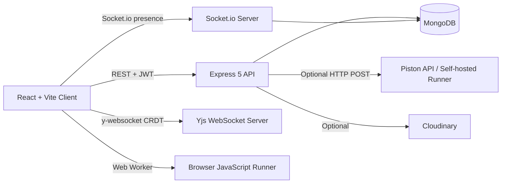

# CodeNest — Step-by-Step Build Guide

> **Archived: original build playbook.**
> This is the 49-step roadmap used to build CodeNest from scratch. The codebase
> has evolved since the first draft, especially around production deployment and
> code execution: the public Piston execute API now requires authorization, so the
> live portfolio build uses a browser-based JavaScript runner while keeping the
> backend Piston proxy path available for future provider access or self-hosting.
> For current architecture, setup, and deployment notes, see the project [README](../README.md).

---

> **Project Summary:**
> CodeNest is a full-stack online code editor that brings the VS Code editing experience (Monaco) to the browser, lets multiple users co-edit the same document in real time using Yjs CRDT, runs JavaScript in the browser for portfolio demos, keeps a backend code-runner proxy path for future provider access, and provides a snippet library with public discovery, likes, comments, and forking. Roles include `user` (default) and `admin` (moderation, user management). Security layers cover JWT auth, helmet, strict CORS, per-route rate limiters, custom NoSQL sanitization compatible with Express 5, mass-assignment protection, ownership checks, and a 30+ item production audit. Stack: React 19 + Vite + Tailwind v4 + Monaco + Yjs on the client; Node + Express 5 + Mongoose 9 + Socket.io + y-websocket on the server.

> Each step below is a self-contained prompt. Execute them in order.
> Stack: React 19 + Vite, Node/Express 5, MongoDB/Mongoose 9, JWT, TailwindCSS v4, React Router v7, Axios, Socket.io, Yjs + y-monaco + y-websocket, Monaco Editor, browser Web Worker runner, optional Piston API proxy.

---

## Table of Contents

**PHASE 1 — Backend Foundation**
- STEP 1 — Project Scaffolding & Dependency Setup
- STEP 2 — Environment Configuration & Database Connection
- STEP 3 — User Model & Schema
- STEP 4 — Auth System & Admin Seed

**PHASE 2 — Backend Resources**
- STEP 5 — Snippet Model & Core CRUD
- STEP 6 — Public Snippet Explore (Search, Filter, Sort, Pagination)
- STEP 7 — Like System
- STEP 8 — Fork Snippet Feature
- STEP 9 — Comments on Snippets
- STEP 10 — Room Model & Room Management API
- STEP 11 — Code Execution: Piston API Integration
- STEP 12 — Avatar Upload (Multer + Cloudinary)
- STEP 13 — Profile Endpoints (Public Profile + Preferences)
- STEP 14 — Socket.io Server (Presence & Cursor Events)
- STEP 15 — Yjs y-websocket Server (CRDT Realtime Sync)
- STEP 16 — Yjs Awareness (Cursor Presence in Editor)
- STEP 17 — Report System
- STEP 18 — Admin API: Dashboard & User Management
- STEP 19 — Admin API: Content Moderation (Snippets & Comments)
- STEP 20 — Admin API: Report Queue
- STEP 21 — Backend Validation & Security Audit

**PHASE 3 — Client Foundation**
- STEP 22 — Client Setup: Vite, Tailwind v4 & Theme
- STEP 23 — Axios Instance & Service Layer
- STEP 24 — Custom Hooks
- STEP 25 — Contexts: Auth, Preferences, Socket
- STEP 26 — Layouts, Navbar, Routing & Guards

**PHASE 4 — Client Pages**
- STEP 27 — Auth Pages (Login, Register)
- STEP 28 — Home / Explore Public Snippets
- STEP 29 — Snippet Detail Page
- STEP 30 — My Snippets Dashboard
- STEP 31 — Rooms Hub Page
- STEP 32 — Editor Page Skeleton
- STEP 33 — Editor: Yjs + y-monaco Binding
- STEP 34 — Editor: Awareness, Remote Cursors, User List
- STEP 35 — Editor: Run Code & Output Panel
- STEP 36 — Editor: Save Snippet & Share
- STEP 37 — Snippet Edit Page
- STEP 38 — Public User Profile Page
- STEP 39 — Settings Pages: Profile & Account
- STEP 40 — Settings Pages: Appearance & Editor
- STEP 41 — Settings Pages: Privacy & Notifications
- STEP 42 — Admin Pages: Dashboard & Users
- STEP 43 — Admin Pages: Snippets & Comments Moderation
- STEP 44 — Admin Pages: Report Queue

**PHASE 5 — Polish & Deploy**
- STEP 45 — UX Enhancements & Reusable UI
- STEP 46 — 404 Page & Route Guard Refinements
- STEP 47 — README & Documentation
- STEP 48 — Code Cleanup & Pre-Deploy Review
- STEP 49 — Deployment (MongoDB Atlas + Render + Netlify)

**Appendices**
- Appendix A — Shared Constants
- Appendix B — Common Patterns
- Appendix C — Editor Snapshot
- Appendix D — Common Pitfalls & Quick Fixes
- Appendix E — Per-Phase Pre-Flight Checklist

---

## Global Build Rules (apply to EVERY step)

> **STRICT — NO GIT OPERATIONS.**
> The AI MUST NOT execute any `git` command at any point during this build. This includes (non-exhaustive) `git init`, `git add`, `git commit`, `git push`, `git pull`, `git fetch`, `git merge`, `git rebase`, `git reset`, `git checkout`, `git branch`, `git tag`, `git stash`, `git remote`, `git config`, `git log`, `git diff`, `git status`, and `git ls-files`. Version control is managed exclusively by the user (e.g., via GitHub Desktop).
>
> **What this means in practice:**
> - Never run a shell command that begins with `git ` or pipes through `git`.
> - Never propose a `git` command in a code block as something to run; if a procedure conceptually needs version control (e.g., "before deploy, audit committed secrets"), describe the manual check the user performs in GitHub Desktop or their editor's source-control panel.
> - The repository may already be initialized; do NOT re-initialize, re-configure, or modify any `.git/` contents.
> - `.gitignore` is a regular file and may be created/edited normally; that is NOT a git operation.
>
> **Other global rules:**
> - Do NOT install packages the user did not approve in the dependency tables for each step.
> - Do NOT run `npm install` until the user explicitly asks for it; only specify the dependency lists.
> - Do NOT execute long-running processes (`npm run dev`, watchers) unless the user explicitly requests a smoke test.
> - Treat every step as a single self-contained AI prompt; do NOT cross-reference work that happens in a later step as if it already exists.

---

## Architecture at a Glance



The single Render service runs Express, Socket.io, and y-websocket on the same HTTP server (one URL, three layers). The original guide used a server-side Piston proxy for code execution; the deployed portfolio build now runs JavaScript in a browser Web Worker because the public Piston execute endpoint requires authorization.

---

# PHASE 1 — BACKEND FOUNDATION

---

## STEP 1 — Project Scaffolding & Dependency Setup

Create the monorepo workspace at the project root with two top-level folders: `server/` and `client/`. Initialize each as an independent npm package. (Reminder: per the **Global Build Rules** at the top of this document, no `git` commands are executed at any point — version control is the user's responsibility via GitHub Desktop.)

### Root Folder Structure

```
codenest/
  server/
  client/
  docs/
    build-guide.md
  .gitignore
  README.md
```

### Server Folder Tree

```
server/
  config/
    db.js
    env.js
  middleware/
    auth.js
    adminOnly.js
    optionalAuth.js
    errorHandler.js
    notFound.js
    sanitize.js
    rateLimiters.js
    validate.js
    upload.js
    socketAuth.js
  models/
    User.js
    Snippet.js
    Comment.js
    Like.js
    Room.js
    Report.js
  controllers/
    authController.js
    snippetController.js
    commentController.js
    likeController.js
    roomController.js
    codeController.js
    uploadController.js
    profileController.js
    adminController.js
  routes/
    authRoutes.js
    snippetRoutes.js
    commentRoutes.js
    likeRoutes.js
    roomRoutes.js
    codeRoutes.js
    uploadRoutes.js
    profileRoutes.js
    adminRoutes.js
  validators/
    authValidator.js
    snippetValidator.js
    commentValidator.js
    roomValidator.js
    codeValidator.js
    profileValidator.js
    adminValidator.js
  sockets/
    index.js
    presenceHandlers.js
    cursorHandlers.js
    yjsServer.js
  utils/
    generateToken.js
    asyncHandler.js
    apiError.js
    pistonClient.js
    escapeRegex.js
    pickFields.js
    cloudinary.js
    constants.js
  scripts/
    seedAdmin.js
  index.js
  package.json
  .env
  .env.example
```

### Client Folder Tree

```
client/
  public/
    favicon.svg
  src/
    api/
      axios.js
      authService.js
      snippetService.js
      commentService.js
      likeService.js
      roomService.js
      codeService.js
      uploadService.js
      profileService.js
      adminService.js
    components/
      common/
        Spinner.jsx
        Skeleton.jsx
        ConfirmModal.jsx
        EmptyState.jsx
        StatusBadge.jsx
        RoleBadge.jsx
        LanguageBadge.jsx
        Avatar.jsx
        ToggleSwitch.jsx
        SelectableCard.jsx
        CharacterCounter.jsx
      layout/
        Navbar.jsx
        Footer.jsx
        Sidebar.jsx
      editor/
        MonacoPane.jsx
        OutputPanel.jsx
        UserListSidebar.jsx
        LanguageSelect.jsx
        EditorToolbar.jsx
        SaveSnippetModal.jsx
        ShareLinkButton.jsx
      snippets/
        SnippetCard.jsx
        SnippetGrid.jsx
        SnippetFilters.jsx
        CommentThread.jsx
        CommentItem.jsx
      admin/
        AdminStatsCard.jsx
        AdminUsersTable.jsx
        AdminSnippetsTable.jsx
        AdminCommentsTable.jsx
        AdminReportsQueue.jsx
    context/
      AuthContext.jsx
      PreferencesContext.jsx
      SocketContext.jsx
    hooks/
      useLocalStorage.js
      useDebounce.js
      useSocket.js
      useYjsRoom.js
      useGuestId.js
      useCopyToClipboard.js
    layouts/
      MainLayout.jsx
      AdminLayout.jsx
      SettingsLayout.jsx
    pages/
      auth/
        LoginPage.jsx
        RegisterPage.jsx
      home/
        HomePage.jsx
      snippets/
        SnippetDetailPage.jsx
        MySnippetsPage.jsx
        EditSnippetPage.jsx
      rooms/
        RoomsHubPage.jsx
        EditorPage.jsx
      profile/
        ProfilePage.jsx
      settings/
        ProfileSettingsPage.jsx
        AccountSettingsPage.jsx
        AppearanceSettingsPage.jsx
        EditorSettingsPage.jsx
        PrivacySettingsPage.jsx
        NotificationsSettingsPage.jsx
      admin/
        AdminDashboardPage.jsx
        AdminUsersPage.jsx
        AdminSnippetsPage.jsx
        AdminCommentsPage.jsx
        AdminReportsPage.jsx
      misc/
        NotFoundPage.jsx
    routes/
      ProtectedRoute.jsx
      AdminRoute.jsx
      GuestOnlyRoute.jsx
    utils/
      formatDate.js
      helpers.js
      constants.js
      monacoLanguages.js
      cursorColors.js
    App.jsx
    main.jsx
    index.css
  index.html
  vite.config.js
  package.json
  .env
  .env.example
  netlify.toml
```

### Server Dependencies

| Package | Purpose |
|---|---|
| `express@^5` | HTTP server and routing |
| `mongoose@^9` | MongoDB ODM |
| `dotenv` | Load env variables |
| `cors` | CORS middleware |
| `helmet` | Secure HTTP headers |
| `bcrypt` | Password hashing |
| `jsonwebtoken` | JWT signing and verification |
| `express-rate-limit` | Request rate limiting |
| `express-validator` | Request body / query validation |
| `express-mongo-sanitize` | NoSQL operator stripping (used as standalone fn, not middleware) |
| `multer` | Multipart upload parser (memoryStorage) |
| `cloudinary` | Avatar storage SDK |
| `socket.io` | Realtime presence and cursor events |
| `y-websocket` | CRDT WebSocket transport (uses `utils/setupWSConnection`) |
| `yjs` | CRDT document model on the server (peer dep for `y-websocket`) |
| `lib0` | y-websocket peer dep for binary encoding |
| `uuid` | Generate `roomId` |
| `morgan` | Request logging (dev only) |

Server dev dependencies: `nodemon`, `cross-env`.

> Do NOT install `hpp`. It is incompatible with Express 5 because it reassigns `req.query` (a read-only getter in Express 5) and crashes the server.

### Client Dependencies

| Package | Purpose |
|---|---|
| `react@^19` and `react-dom@^19` | UI framework |
| `react-router-dom@^7` | SPA routing |
| `axios` | HTTP client |
| `@monaco-editor/react` | Monaco wrapper for React |
| `monaco-editor` | Monaco core (peer of the wrapper) |
| `yjs` | CRDT document on the client |
| `y-monaco` | Bind a Y.Text to a Monaco model |
| `y-websocket` | WebSocket provider |
| `socket.io-client` | Socket.io client |
| `react-hot-toast` | Toast notifications |
| `clsx` | Conditional class names |
| `uuid` | Guest IDs |

Client dev dependencies: `vite`, `@vitejs/plugin-react`, `tailwindcss@^4`, `@tailwindcss/vite`, `eslint`, `postcss`, `autoprefixer`.

### npm Scripts

`server/package.json` scripts:
- `dev`: `nodemon index.js`
- `start`: `node index.js`
- `seed`: `node scripts/seedAdmin.js`

`client/package.json` scripts:
- `dev`: `vite`
- `build`: `vite build`
- `preview`: `vite preview`

### Root `.gitignore`

Include: `node_modules/`, `.env`, `.env.local`, `.env.*.local`, `dist/`, `build/`, `coverage/`, `logs/`, `*.log`, `.DS_Store`, `Thumbs.db`, `.vite/`, `uploads/`, `.cache/`, `.idea/`, `.vscode/`.

**SECURITY:** Before the user commits anything (manually, via GitHub Desktop), `.env` files MUST be confirmed listed in `.gitignore` so they cannot be tracked. Per the **Global Build Rules**, the AI never runs `git` commands itself — only the contents of the `.gitignore` file are written here.

---

## STEP 2 — Environment Configuration & Database Connection

Create `server/config/env.js`, `server/config/db.js`, and `server/index.js`. Wire middleware in the exact order defined below. This step also establishes the rate limiters used by all later steps.

### `config/env.js`

Export a frozen object containing:

| Key | Source | Default | Validation |
|---|---|---|---|
| `NODE_ENV` | `process.env.NODE_ENV` | `'development'` | one of `development`/`production`/`test` |
| `PORT` | `process.env.PORT` | `5000` | positive integer |
| `MONGO_URI` | `process.env.MONGO_URI` | none | required, throws on missing |
| `JWT_SECRET` | `process.env.JWT_SECRET` | none | required; in production must be ≥ 32 chars or process exits with code 1 |
| `JWT_EXPIRES_IN` | `process.env.JWT_EXPIRES_IN` | `'7d'` | string |
| `CORS_ORIGIN` | `process.env.CORS_ORIGIN` | `'http://localhost:5173'` | comma-split into array |
| `PISTON_BASE_URL` | `process.env.PISTON_BASE_URL` | `'https://emkc.org/api/v2/piston'` | URL |
| `CLOUDINARY_CLOUD_NAME` | `process.env.CLOUDINARY_CLOUD_NAME` | `''` | optional |
| `CLOUDINARY_API_KEY` | `process.env.CLOUDINARY_API_KEY` | `''` | optional |
| `CLOUDINARY_API_SECRET` | `process.env.CLOUDINARY_API_SECRET` | `''` | optional |
| `ADMIN_EMAIL` | `process.env.ADMIN_EMAIL` | `''` | required for seed only |
| `ADMIN_PASSWORD` | `process.env.ADMIN_PASSWORD` | `''` | required for seed only |
| `MAX_CODE_PAYLOAD_KB` | `process.env.MAX_CODE_PAYLOAD_KB` | `64` | positive integer |

If `NODE_ENV === 'production'` and `JWT_SECRET.length < 32`, log a fatal error and call `process.exit(1)`.

### `config/db.js`

Export `connectDB()` that calls `mongoose.connect(env.MONGO_URI)`, logs `Mongo connected: <host>` on success, and exits the process on connection error. Set `mongoose.set('strictQuery', true)`.

### `index.js` Middleware Order

The order is mandatory because of the Express 5 `req.query` getter restriction.

1. `app.disable('x-powered-by')`
2. `app.set('trust proxy', 1)` (required for Render-style proxies and rate limiting)
3. `helmet()` with default options
4. `cors({ origin: env.CORS_ORIGIN, credentials: true })`
5. `express.json({ limit: '64kb' })` — small global cap; the code-run route accepts a slightly larger payload via its own router
6. `express.urlencoded({ extended: true, limit: '64kb' })`
7. Custom sanitize middleware (`middleware/sanitize.js`) that runs `mongoSanitize.sanitize(req.body)` and `mongoSanitize.sanitize(req.params)` only — never touches `req.query`
8. `morgan('dev')` only when `NODE_ENV !== 'production'`
9. Global rate limiter (see below) on all `/api` routes
10. Routes
11. `notFound` 404 catch-all (`middleware/notFound.js`)
12. `errorHandler` (`middleware/errorHandler.js`)

### `middleware/sanitize.js` (the only safe Express 5 pattern)

```js
import mongoSanitize from 'express-mongo-sanitize';
export default function sanitize(req, _res, next) {
  if (req.body) mongoSanitize.sanitize(req.body);
  if (req.params) mongoSanitize.sanitize(req.params);
  next();
}
```

> **Express 5 critical:** `req.query` is a read-only getter. Calling `app.use(mongoSanitize())` reassigns it and crashes every request with `TypeError: Cannot set property query of #<IncomingMessage> which has only a getter`. The pattern above touches `req.body` and `req.params` only.

### `middleware/rateLimiters.js`

Define and export five named limiters. All use `standardHeaders: 'draft-7'`, `legacyHeaders: false`, IP key.

| Limiter | windowMs | max | Applied to |
|---|---|---|---|
| `globalLimiter` | `15 * 60 * 1000` | `300` | every `/api` request |
| `authLimiter` | `15 * 60 * 1000` | `10` | `/api/auth/login`, `/api/auth/register` |
| `adminLimiter` | `15 * 60 * 1000` | `60` | every `/api/admin/*` request |
| `codeRunLimiter` | `60 * 1000` | `8` | `/api/code/run` only |
| `writeLimiter` | `60 * 1000` | `30` | likes, reports, comments |

### Health Check

`GET /api/health` returns `{ ok: true, env: NODE_ENV, time: new Date().toISOString() }`.

### `.env.example`

Mirror every key from `env.js` with empty values or safe placeholders. This file is checked in; the `.env` file is not.

**SECURITY:** `helmet`, `x-powered-by` disabled, strict CORS allowlist, body size capped at 64 KB globally, sanitize layer hardened against `$`/`.` operators on body and params, separate rate limiters per route group, JWT secret length enforced at startup. The Express 5 `req.query` immutability rule is applied throughout — no middleware ever assigns to it, and `hpp` is explicitly excluded from dependencies.

---

## STEP 3 — User Model & Schema

This step establishes the User schema with all preferences, hooks, and serialization safeguards. The auth system (controllers, middlewares, routes, seed) is implemented in **STEP 4** and depends on the model produced here.

### `models/User.js` — Field Specification

| Field | Type | Required | Default | Constraints |
|---|---|---|---|---|
| `username` | String | yes | — | 3–24 chars, lowercase, unique, indexed, regex `/^[a-z0-9_]+$/` |
| `displayName` | String | yes | — | 1–48 chars, trimmed |
| `email` | String | yes | — | unique, lowercase, indexed, valid email |
| `password` | String | yes | — | min 8 chars, `select: false` |
| `role` | String | yes | `'user'` | enum `['user', 'admin']` |
| `avatarUrl` | String | no | `''` | URL |
| `bio` | String | no | `''` | max 240 chars |
| `isBanned` | Boolean | yes | `false` | — |
| `bannedReason` | String | no | `''` | max 240 chars |
| `lastLoginAt` | Date | no | `null` | — |
| `preferences` | Subdocument | yes | see below | — |
| `createdAt` / `updatedAt` | Date | auto | — | Mongoose timestamps |

### `preferences` Subdocument

| Field | Type | Default | Enum / Range |
|---|---|---|---|
| `theme` | String | `'system'` | `light`, `dark`, `system` |
| `editorTheme` | String | `'vs-dark'` | `vs`, `vs-dark`, `hc-black`, `hc-light` |
| `fontSize` | Number | `14` | 10–24 |
| `tabSize` | Number | `2` | 2, 4, 8 |
| `keymap` | String | `'default'` | `default`, `vim`, `emacs` (UI hint only — Monaco runs default unless extended later) |
| `fontFamily` | String | `'Fira Code'` | `Fira Code`, `JetBrains Mono`, `Source Code Pro`, `Menlo`, `Consolas` |
| `language` | String | `'en'` | `en` (extensible) |
| `wordWrap` | String | `'on'` | `on`, `off` |
| `minimap` | Boolean | `true` | — |
| `lineNumbers` | String | `'on'` | `on`, `off`, `relative` |
| `privacy.showEmail` | Boolean | `false` | — |
| `privacy.showLikedSnippets` | Boolean | `true` | — |
| `privacy.showComments` | Boolean | `true` | — |
| `notifications.commentOnSnippet` | Boolean | `true` | — |
| `notifications.snippetForked` | Boolean | `true` | — |
| `notifications.productUpdates` | Boolean | `false` | — |

### Mongoose 9 Pre-Save Hook (Password Hashing)

> **Mongoose 9 critical:** Pre/post middleware no longer accepts `next`. Use `async function () { ... }` and `return` early. Calling `next()` throws `TypeError: next is not a function`.

```js
userSchema.pre('save', async function () {
  if (!this.isModified('password')) return;
  const salt = await bcrypt.genSalt(12);
  this.password = await bcrypt.hash(this.password, salt);
});
```

### Defense-in-Depth Serialization Transform

`select: false` is the first defense, but it can be bypassed accidentally — for example after `.select('+password')` in `login`/`changePassword`, or when a populated user object is spread into a response. Add a serialization transform that always strips sensitive fields, regardless of how the document was loaded:

```js
userSchema.set('toJSON', {
  virtuals: true,
  versionKey: false,
  transform: (_doc, ret) => {
    delete ret.password;
    delete ret.__v;
    return ret;
  }
});
userSchema.set('toObject', { virtuals: true, versionKey: false, transform: (_doc, ret) => { delete ret.password; delete ret.__v; return ret; } });
```

This guarantees `JSON.stringify(user)` and Express's `res.json(user)` never leak the hash, even if a controller forgets to project the field.

### Instance Methods

- `comparePassword(plain)` returns `bcrypt.compare(plain, this.password)`. Because `password` has `select: false`, controllers must explicitly include it via `.select('+password')` before calling this method.

**SECURITY (model only):**
- `password` is hashed with bcrypt salt 12 in the pre-save hook, marked `select: false`, AND stripped from every serialization via `toJSON`/`toObject` transforms (defense-in-depth).
- `role` defaults to `'user'`; the model itself does not restrict assignment, but the auth controllers in STEP 4 will whitelist fields so role escalation is impossible from any public route.
- Mongoose 9 hook signature is enforced (no `next` parameter — `Appendix D` lists the symptom if you forget).

After this step, run `node -e "import('./models/User.js').then(({default: U}) => console.log(U.schema.paths))"` to verify the schema compiles and contains every documented field. Do NOT proceed to STEP 4 until this passes.

---

## STEP 4 — Auth System & Admin Seed

This step builds the authentication layer on top of the User model from STEP 3: the JWT utility, the three auth middlewares, the six controllers, the routes, the global error handler, and the admin seed script.

### `utils/generateToken.js`

`generateToken(userId)` signs `{ id: userId }` with `env.JWT_SECRET`, `expiresIn: env.JWT_EXPIRES_IN`. Returns the token string.

### Auth Middlewares

| Middleware | Behavior |
|---|---|
| `protect` | Reads `Authorization: Bearer <token>`. Verifies JWT. Loads user (`-password`). If user missing or `isBanned`, returns 401 with generic `Not authorized`. Attaches `req.user`. |
| `optionalAuth` | Same as `protect` but never throws — sets `req.user = null` on failure and calls `next()`. |
| `adminOnly` | Requires `req.user?.role === 'admin'`, else 403 `Admin access required`. |

### `controllers/authController.js`

| Function | Route | Behavior |
|---|---|---|
| `register` | `POST /api/auth/register` | Whitelist `{ username, displayName, email, password }`. Reject duplicate username/email with generic `Email or username unavailable`. Create user, return `{ user, token }`. `role` is never read from `req.body`. |
| `login` | `POST /api/auth/login` | Find user by email with `+password`. If user missing OR password mismatch OR `isBanned`, return 401 `Invalid email or password`. On success update `lastLoginAt`, return `{ user, token }`. |
| `getMe` | `GET /api/auth/me` (`protect`) | Return current user. |
| `updateProfile` | `PATCH /api/auth/me` (`protect`) | Whitelist `{ displayName, bio, avatarUrl }`. Return updated user. |
| `changePassword` | `PATCH /api/auth/password` (`protect`) | Require `{ currentPassword, newPassword }`. Verify current. Hash via pre-save. |
| `deleteAccount` | `DELETE /api/auth/me` (`protect`) | Require `{ password }`. On match, cascade delete: snippets, comments, likes, reports authored by user, and remove from rooms `participants`. Then delete user. |

### `routes/authRoutes.js`

| Method | Path | Middleware | Handler |
|---|---|---|---|
| POST | `/register` | `authLimiter`, `validateRegister` | `register` |
| POST | `/login` | `authLimiter`, `validateLogin` | `login` |
| GET | `/me` | `protect` | `getMe` |
| PATCH | `/me` | `protect`, `validateUpdateProfile` | `updateProfile` |
| PATCH | `/password` | `protect`, `validateChangePassword` | `changePassword` |
| DELETE | `/me` | `protect`, `validateDeleteAccount` | `deleteAccount` |

### `middleware/errorHandler.js`

Centralized error formatter:
- Mongoose validation errors → 400 with normalized `errors` array
- Mongoose duplicate key → 409 with field-agnostic message
- JWT errors → 401 `Not authorized`
- `ApiError` subclass → its own `statusCode`, `message`
- Anything else → 500 `Internal server error` (no stack in production)

### `scripts/seedAdmin.js`

Connects DB, finds user by `ADMIN_EMAIL`. If absent, creates one with `role: 'admin'` using `ADMIN_PASSWORD`. Idempotent. Logs the resulting credentials banner once.

**SECURITY (auth layer):**
- `role` is never accepted from any public endpoint — `register` and `updateProfile` whitelist explicitly.
- Login error message does not reveal whether the email exists (user enumeration prevention).
- Banned users cannot authenticate, even with a valid token.
- Account deletion requires password confirmation and cascades to snippets, comments, likes, reports, and room participation.
- `protect` re-loads the user on every request so banning takes effect immediately (no waiting for token expiration).
- `authLimiter` (10 / 15 min / IP) is wired on `register` and `login` to slow down credential stuffing.
- The `errorHandler` surfaces only safe messages; Mongoose schema names, file paths, and stack traces are stripped in production.

---

# PHASE 2 — BACKEND RESOURCES

---

## STEP 5 — Snippet Model & Core CRUD

### `models/Snippet.js` — Field Specification

| Field | Type | Required | Default | Constraints |
|---|---|---|---|---|
| `title` | String | yes | — | 1–120 chars, trimmed |
| `description` | String | no | `''` | max 500 chars |
| `language` | String | yes | `'javascript'` | enum from `utils/constants.js` `SUPPORTED_LANGUAGES` |
| `code` | String | yes | `''` | max 100,000 chars |
| `author` | ObjectId(`User`) | yes | — | indexed |
| `isPublic` | Boolean | yes | `false` | — |
| `roomId` | String | no | `null` | indexed; UUID v4 string when present |
| `forkedFrom` | ObjectId(`Snippet`) | no | `null` | — |
| `tags` | [String] | no | `[]` | each tag 1–24 chars, lowercase, max 6 tags |
| `views` | Number | yes | `0` | min 0 |
| `likesCount` | Number | yes | `0` | min 0; denormalized counter |
| `commentsCount` | Number | yes | `0` | min 0; denormalized counter |
| `status` | String | yes | `'active'` | enum `active`, `hidden`, `removed` |
| `createdAt` / `updatedAt` | Date | auto | — | timestamps |

### Indexes

- `{ author: 1, createdAt: -1 }`
- `{ isPublic: 1, status: 1, createdAt: -1 }`
- Text index on `{ title: 'text', description: 'text', tags: 'text' }`

### Pre-Save Hook (Mongoose 9 signature)

```js
snippetSchema.pre('save', async function () {
  if (this.isModified('tags')) {
    this.tags = [...new Set(this.tags.map(t => t.toLowerCase().trim()))].slice(0, 6);
  }
});
```

### Virtual: `codePreview` (for List Views)

A small derived field used by list endpoints so list pages do not need to ship the full `code` field.

```js
snippetSchema.virtual('codePreview').get(function () {
  return (this.code || '').split('\n').slice(0, 4).join('\n');
});
snippetSchema.set('toJSON', { virtuals: true });
snippetSchema.set('toObject', { virtuals: true });
```

### List Projection Convention

To keep payloads bounded, **every list endpoint excludes the `code` field via `.select('-code')`** and relies on `codePreview` for card previews. Only the detail endpoint (`GET /api/snippets/:id`) returns the full `code`. This prevents 12-item list responses from carrying 12 × ~50 KB of source code.

| Endpoint | Returns `code`? |
|---|---|
| `GET /api/snippets/public` | no — preview only |
| `GET /api/snippets/me` | no — preview only |
| `GET /api/profile/:username/snippets` | no — preview only |
| `GET /api/profile/:username/likes` | no — preview only |
| `GET /api/admin/snippets` | no — preview only |
| `GET /api/snippets/:id` | yes — full code for editor/viewer |

### `controllers/snippetController.js`

| Function | Route | Behavior |
|---|---|---|
| `createSnippet` | `POST /api/snippets` (`protect`) | Whitelist `{ title, description, language, code, isPublic, roomId, forkedFrom, tags }`. `author = req.user._id`. `status` always `'active'`. Returns created snippet. |
| `getMySnippets` | `GET /api/snippets/me` (`protect`) | Pagination + optional `?visibility=public/private/forked`. Project with `.select('-code')`. Returns `{ items, page, totalPages, total }`. |
| `getSnippetById` | `GET /api/snippets/:id` (`optionalAuth`) | If snippet `isPublic` or current user is author/admin, return full document including `code`; otherwise 404. Increment `views` by 1 per request only when viewer is not the author. |
| `updateSnippet` | `PATCH /api/snippets/:id` (`protect`) | Ownership check (`author === req.user._id` OR admin). Whitelist `{ title, description, language, code, isPublic, tags }`. |
| `deleteSnippet` | `DELETE /api/snippets/:id` (`protect`) | Ownership check. Cascade delete all `Comment` and `Like` referencing this snippet. |

### `routes/snippetRoutes.js`

| Method | Path | Middleware | Handler |
|---|---|---|---|
| POST | `/` | `protect`, `validateCreateSnippet` | `createSnippet` |
| GET | `/me` | `protect`, `validatePagination` | `getMySnippets` |
| GET | `/:id` | `optionalAuth`, `validateObjectId` | `getSnippetById` |
| PATCH | `/:id` | `protect`, `validateObjectId`, `validateUpdateSnippet` | `updateSnippet` |
| DELETE | `/:id` | `protect`, `validateObjectId` | `deleteSnippet` |

**SECURITY:**
- Mass-assignment protection: explicit field whitelisting in `create` and `update`.
- `author`, `views`, `likesCount`, `commentsCount`, `status` are never settable through public endpoints.
- Private snippets return 404 (not 403) to non-owners to avoid existence leakage.
- View counter does not increment for the author to prevent self-inflation noise.
- `tags` are normalized and length-capped server-side.
- **Bandwidth guard:** list endpoints exclude the heavy `code` field (`.select('-code')`) and ship a 4-line `codePreview` virtual instead. A 12-item list page carries kilobytes of metadata, not megabytes of source code.

---

## STEP 6 — Public Snippet Explore (Search, Filter, Sort, Pagination)

Add a new public endpoint and a regex-escape utility used by every search-style query in this project.

### `utils/escapeRegex.js`

Returns the input string with every regex metacharacter escaped. Used to prevent ReDoS and operator injection in `$regex` filters.

### Endpoint

| Method | Path | Middleware | Handler |
|---|---|---|---|
| GET | `/api/snippets/public` | `optionalAuth`, `validatePublicQuery` | `getPublicSnippets` |

### `getPublicSnippets` Behavior

Accept query params:

| Param | Type | Default | Validation |
|---|---|---|---|
| `q` | string | `''` | trim, max 80 chars, escaped via `escapeRegex` |
| `language` | string | `''` | optional, must be in `SUPPORTED_LANGUAGES` |
| `tag` | string | `''` | optional, lowercase, 1–24 chars |
| `sort` | string | `'newest'` | enum `newest`, `oldest`, `mostLiked`, `mostViewed` |
| `page` | int | `1` | clamped to `>= 1` |
| `limit` | int | `12` | clamped to `1–50` |

Build the Mongo filter:
- `isPublic: true`, `status: 'active'`
- If `q`, add `$or` on title/description/tags using escaped `$regex` with `'i'` flag
- If `language`, add `language: language`
- If `tag`, add `tags: tag`

Sort map:
- `newest` → `{ createdAt: -1 }`
- `oldest` → `{ createdAt: 1 }`
- `mostLiked` → `{ likesCount: -1, createdAt: -1 }`
- `mostViewed` → `{ views: -1, createdAt: -1 }`

Return `{ items, page, totalPages, total }`. Apply `.select('-code')` so each item carries only the `codePreview` virtual, not the full source. Populate `author` with `username`, `displayName`, `avatarUrl` only.

**SECURITY:**
- `escapeRegex` prevents ReDoS and `$regex` injection.
- `limit` is hard-clamped to 50 to prevent unbounded queries.
- Only `active` + `isPublic` snippets are visible; drafts/hidden/removed are excluded.
- Author projection excludes email, role, preferences.
- `code` field is excluded from this list endpoint to keep response sizes bounded; clients receive `codePreview` (4 lines) for cards.

---

## STEP 7 — Like System

### `models/Like.js` — Field Specification

| Field | Type | Required | Constraints |
|---|---|---|---|
| `user` | ObjectId(`User`) | yes | indexed |
| `snippet` | ObjectId(`Snippet`) | yes | indexed |
| `createdAt` | Date | auto | — |

Compound unique index: `{ user: 1, snippet: 1 }` to enforce idempotency.

### `controllers/likeController.js`

| Function | Route | Behavior |
|---|---|---|
| `toggleLike` | `POST /api/likes/:snippetId` (`protect`) | Try `findOneAndDelete({ user, snippet })`. If found, decrement `likesCount`. Else create like, increment `likesCount`. Both branches return `{ liked: boolean, likesCount: number }`. |
| `getMyLikes` | `GET /api/likes/me` (`protect`) | Paginated list of liked snippets (populate snippet w/ author projection). |
| `hasLiked` | `GET /api/likes/:snippetId/me` (`protect`) | Returns `{ liked: boolean }`. |

### Routes

| Method | Path | Middleware | Handler |
|---|---|---|---|
| POST | `/:snippetId` | `protect`, `writeLimiter`, `validateObjectId('snippetId')` | `toggleLike` |
| GET | `/me` | `protect`, `validatePagination` | `getMyLikes` |
| GET | `/:snippetId/me` | `protect`, `validateObjectId('snippetId')` | `hasLiked` |

**SECURITY:**
- Compound unique index makes toggling idempotent and immune to race-condition double-likes.
- `writeLimiter` blocks rapid like-bombing.
- Counter is updated in the same controller transaction (use `Snippet.findByIdAndUpdate` with `{ $inc }` — no client-supplied counts).

---

## STEP 8 — Fork Snippet Feature

### Endpoint

| Method | Path | Middleware | Handler |
|---|---|---|---|
| POST | `/api/snippets/:id/fork` | `protect`, `validateObjectId` | `forkSnippet` |

### `forkSnippet` Behavior

1. Load source snippet by `:id`. If not found, or `status !== 'active'`, or `isPublic === false` and viewer is not the author, return 404.
2. Create a new snippet:
   - `title`: ``Fork of <source.title>`` (truncate to 120 chars)
   - `description`: source description
   - `language`: source language
   - `code`: source code
   - `tags`: source tags
   - `author`: `req.user._id`
   - `isPublic`: `false` (fork starts private)
   - `forkedFrom`: source `_id`
3. Return created snippet.

**SECURITY:**
- Forking a private snippet by anyone other than the owner is impossible (blocked at the visibility check).
- The forked snippet's `author` is server-controlled.
- `forkedFrom` is the only field copied from the source's identity — no inheritance of likes/comments/views.

---

## STEP 9 — Comments on Snippets

### `models/Comment.js` — Field Specification

| Field | Type | Required | Default | Constraints |
|---|---|---|---|---|
| `snippet` | ObjectId(`Snippet`) | yes | — | indexed |
| `author` | ObjectId(`User`) | yes | — | indexed |
| `content` | String | yes | — | 1–1000 chars |
| `parentComment` | ObjectId(`Comment`) | no | `null` | for replies |
| `status` | String | yes | `'active'` | enum `active`, `hidden`, `removed` |
| `createdAt` / `updatedAt` | Date | auto | — | — |

Index: `{ snippet: 1, parentComment: 1, createdAt: 1 }`.

### Pre-Save Hook (Mongoose 9 signature)

Trims `content`. No `next` parameter.

### `controllers/commentController.js`

| Function | Route | Behavior |
|---|---|---|
| `listComments` | `GET /api/comments/snippet/:snippetId` (`optionalAuth`) | Returns top-level comments (`parentComment: null`, `status: 'active'`) for the snippet. Paginated. Each item includes its first-level reply count. Author populated with `username/displayName/avatarUrl` only. |
| `listReplies` | `GET /api/comments/:commentId/replies` (`optionalAuth`) | Returns replies for a parent comment (`status: 'active'`). |
| `createComment` | `POST /api/comments` (`protect`, `writeLimiter`) | Whitelist `{ snippet, content, parentComment }`. Validate the parent if present (must belong to same `snippet`). Increment `Snippet.commentsCount`. |
| `updateComment` | `PATCH /api/comments/:id` (`protect`) | Ownership check. Only `content` editable. |
| `deleteComment` | `DELETE /api/comments/:id` (`protect`) | Ownership check OR admin. Soft-delete: set `status: 'removed'`, replace `content` with `'[deleted]'`. Decrement `Snippet.commentsCount` only if previously active. |

### Routes

| Method | Path | Middleware | Handler |
|---|---|---|---|
| GET | `/snippet/:snippetId` | `optionalAuth`, `validateObjectId('snippetId')`, `validatePagination` | `listComments` |
| GET | `/:commentId/replies` | `optionalAuth`, `validateObjectId('commentId')`, `validatePagination` | `listReplies` |
| POST | `/` | `protect`, `writeLimiter`, `validateCreateComment` | `createComment` |
| PATCH | `/:id` | `protect`, `validateObjectId`, `validateUpdateComment` | `updateComment` |
| DELETE | `/:id` | `protect`, `validateObjectId` | `deleteComment` |

**SECURITY:**
- `content` is escaped at validation time (`escape()` in express-validator) before storage to neutralize XSS.
- Reply parent must belong to the same snippet (prevents cross-thread injection).
- Soft-delete preserves moderation history but never returns the original text once removed.
- `writeLimiter` prevents comment flooding.
- Only the comment author or an admin may delete; only the author may edit.

---

## STEP 10 — Room Model & Room Management API

Rooms encapsulate a Yjs document and a Socket.io presence channel. Rooms exist independently from snippets; saving a snippet copies the current code from the room.

### `models/Room.js` — Field Specification

| Field | Type | Required | Default | Constraints |
|---|---|---|---|---|
| `roomId` | String | yes | — | unique, indexed; UUID v4 |
| `name` | String | yes | — | 1–80 chars, trimmed |
| `language` | String | yes | `'javascript'` | enum `SUPPORTED_LANGUAGES` |
| `owner` | ObjectId(`User`) | yes | — | indexed |
| `isPublic` | Boolean | yes | `false` | — |
| `participants` | [ObjectId(`User`)] | yes | `[]` | — |
| `lastActiveAt` | Date | yes | `Date.now` | indexed |
| `createdAt` / `updatedAt` | Date | auto | — | — |

### `controllers/roomController.js`

| Function | Route | Behavior |
|---|---|---|
| `createRoom` | `POST /api/rooms` (`protect`) | Whitelist `{ name, language, isPublic }`. Generate `roomId` via `uuidv4`. `owner = req.user._id`, `participants: [req.user._id]`. |
| `getMyRooms` | `GET /api/rooms/me` (`protect`) | Rooms where user is owner or participant. Paginated. Sorted by `lastActiveAt` desc. |
| `getRoomById` | `GET /api/rooms/:roomId` (`optionalAuth`) | If room is `isPublic` or viewer is participant/owner, return room with populated participants (`username`, `displayName`, `avatarUrl`). Otherwise 404. |
| `joinRoom` | `POST /api/rooms/:roomId/join` (`protect`) | Add `req.user._id` to `participants` if not present. Update `lastActiveAt`. |
| `leaveRoom` | `POST /api/rooms/:roomId/leave` (`protect`) | Remove `req.user._id` from `participants`. Owner cannot leave; must transfer or delete the room. |
| `updateRoom` | `PATCH /api/rooms/:roomId` (`protect`) | Owner-only. Whitelist `{ name, language, isPublic }`. |
| `deleteRoom` | `DELETE /api/rooms/:roomId` (`protect`) | Owner-only. Cleans up Yjs document via `yjsServer.deleteDoc(roomId)` (see Step 15). |

### Routes

| Method | Path | Middleware | Handler |
|---|---|---|---|
| POST | `/` | `protect`, `validateCreateRoom` | `createRoom` |
| GET | `/me` | `protect`, `validatePagination` | `getMyRooms` |
| GET | `/:roomId` | `optionalAuth`, `validateRoomId` | `getRoomById` |
| POST | `/:roomId/join` | `protect`, `validateRoomId` | `joinRoom` |
| POST | `/:roomId/leave` | `protect`, `validateRoomId` | `leaveRoom` |
| PATCH | `/:roomId` | `protect`, `validateRoomId`, `validateUpdateRoom` | `updateRoom` |
| DELETE | `/:roomId` | `protect`, `validateRoomId` | `deleteRoom` |

**SECURITY:**
- `roomId` is server-generated (UUID v4) — never client-supplied.
- Private rooms 404 to non-participants; existence is not leaked.
- Owner-only routes prevent participants from renaming or deleting.
- Yjs document deletion is tied to room deletion to prevent orphaned CRDT state.

---

## STEP 11 — Code Execution: Piston API Integration

The server proxies all code execution. The client never calls Piston directly. This guarantees rate limiting, payload caps, and a stable runtime catalog.

### `utils/pistonClient.js`

A small fetch-based client around `env.PISTON_BASE_URL`:

| Method | Description |
|---|---|
| `getRuntimes()` | `GET /runtimes`. Cached in-memory for 1 hour. Returns `[{ language, version, aliases }]`. |
| `execute({ language, version, code, stdin })` | `POST /execute` with body `{ language, version, files: [{ content: code }], stdin: stdin || '' }`. Returns `{ run, compile? }` object from Piston. |

The cache uses a simple `{ value, expiresAt }` module-level variable.

### `controllers/codeController.js`

| Function | Route | Behavior |
|---|---|---|
| `getRuntimes` | `GET /api/code/runtimes` (`optionalAuth`) | Returns the cached runtimes filtered to languages we support (intersect with `SUPPORTED_LANGUAGES`). |
| `runCode` | `POST /api/code/run` (`protect`, `codeRunLimiter`) | Validate body (see below). Resolve version: if client did not supply `version`, pick the latest available for that language from cache. Forward to `pistonClient.execute`. Return `{ stdout, stderr, code, signal, output, language, version }`. |

### `validators/codeValidator.js` for `runCode`

| Field | Rule |
|---|---|
| `language` | required, must be in `SUPPORTED_LANGUAGES` |
| `version` | optional, semver-ish string |
| `code` | required, string, min 1, max `MAX_CODE_PAYLOAD_KB * 1024` characters |
| `stdin` | optional string, max 8 KB |

### Code Run Router Body Limit

Mount the code router with its own body parser to allow up to 96 KB while keeping the global cap at 64 KB:

```js
app.use('/api/code', express.json({ limit: '96kb' }), codeRoutes);
```

**SECURITY:**
- Server-side proxying hides Piston details and lets us enforce one canonical version per language.
- `codeRunLimiter` (8/min/IP) prevents runaway billing-style abuse.
- Payload size is double-clamped (`MAX_CODE_PAYLOAD_KB` and the router-level body cap).
- Only authenticated users can run code (no anonymous abuse).
- Output is forwarded as-is but never stored — no execution history persisted.
- Client-supplied `version` is validated against the runtime catalog before forwarding.

---

## STEP 12 — Avatar Upload (Multer + Cloudinary)

### `utils/cloudinary.js`

Initialize Cloudinary SDK using env keys. Export `uploadBuffer(buffer, folder)` returning the secure URL. If keys are missing, throw a clean error early so the route fails fast with a 503 instead of a runtime crash.

### `middleware/upload.js`

Multer setup with `memoryStorage`, `limits.fileSize = 2 * 1024 * 1024` (2 MB), and `fileFilter` accepting only `image/jpeg`, `image/png`, `image/webp`.

### `controllers/uploadController.js`

| Function | Route | Behavior |
|---|---|---|
| `uploadAvatar` | `POST /api/upload/avatar` (`protect`, `upload.single('avatar')`) | If no file, 400 `Avatar file required`. Run `uploadBuffer(req.file.buffer, 'codenest/avatars')`. Update current user's `avatarUrl`. Return `{ avatarUrl }`. |

### Routes

| Method | Path | Middleware | Handler |
|---|---|---|---|
| POST | `/avatar` | `protect`, `upload.single('avatar')` | `uploadAvatar` |

**SECURITY:**
- MIME whitelist + 2 MB cap defends against oversized or malicious uploads.
- Filename is server-generated (Cloudinary public_id), never user-supplied.
- Multer error handler must surface in `errorHandler.js` with a clean 400 message.
- Upload route is auth-only.

---

## STEP 13 — Profile Endpoints (Public Profile + Preferences)

### `controllers/profileController.js`

| Function | Route | Behavior |
|---|---|---|
| `getPublicProfile` | `GET /api/profile/:username` (`optionalAuth`) | Find user by `username`. Project: `username`, `displayName`, `avatarUrl`, `bio`, `createdAt`, plus `email` only when `preferences.privacy.showEmail === true`. Return 404 if banned or missing. |
| `getUserSnippets` | `GET /api/profile/:username/snippets` (`optionalAuth`, `validatePagination`) | Public + active snippets only (private ones excluded for non-owners). |
| `getUserLikes` | `GET /api/profile/:username/likes` (`optionalAuth`, `validatePagination`) | Returns 403 if `preferences.privacy.showLikedSnippets === false` and viewer is not the user. |
| `getUserComments` | `GET /api/profile/:username/comments` (`optionalAuth`, `validatePagination`) | Returns 403 if `preferences.privacy.showComments === false` and viewer is not the user. |
| `updatePreferences` | `PATCH /api/profile/me/preferences` (`protect`) | Whitelist every preference key. Validate each value against its enum/range. Use `findByIdAndUpdate` with `$set` on a normalized preferences object. |

### Routes

| Method | Path | Middleware | Handler |
|---|---|---|---|
| GET | `/:username` | `optionalAuth` | `getPublicProfile` |
| GET | `/:username/snippets` | `optionalAuth`, `validatePagination` | `getUserSnippets` |
| GET | `/:username/likes` | `optionalAuth`, `validatePagination` | `getUserLikes` |
| GET | `/:username/comments` | `optionalAuth`, `validatePagination` | `getUserComments` |
| PATCH | `/me/preferences` | `protect`, `validateUpdatePreferences` | `updatePreferences` |

**SECURITY:**
- Privacy flags are enforced server-side. The client UI is a convenience, not a security boundary.
- Email is hidden by default and only revealed when the user opts in.
- Banned users disappear from public profile lookup.
- Each preference value is validated against its enum/range to prevent injection of arbitrary settings (e.g. negative `fontSize`).

---

## STEP 14 — Socket.io Server (Presence & Cursor Events)

The Socket.io layer is independent from Yjs and handles presence, cursor coordinates (for the user list sidebar), and lightweight room metadata events. The Yjs binary CRDT runs separately in Step 15 on the same HTTP server.

### `sockets/index.js`

Initialize `Server` with options:
- `cors: { origin: env.CORS_ORIGIN, credentials: true }`
- `path: '/socket.io'`
- `maxHttpBufferSize: 16 * 1024` (16 KB — presence payloads are tiny)

Wire `socketAuth` as a middleware on the default namespace. Then register `presenceHandlers` and `cursorHandlers` on each connection.

### `middleware/socketAuth.js`

Reads `socket.handshake.auth.token`. Verifies JWT. Loads user (`-password`). Rejects on missing/invalid token or banned user with `next(new Error('Unauthorized'))`. Attaches `socket.user`.

### `sockets/presenceHandlers.js`

Events:

| Event | Direction | Payload | Behavior |
|---|---|---|---|
| `room:join` | C→S | `{ roomId }` | Validate `roomId` format. Confirm DB room exists and viewer can access (public or participant). On success: `socket.join(roomId)`, broadcast `room:userJoined` `{ user }` to others, emit `room:usersInRoom` `{ users }` to the joining socket. |
| `room:leave` | C→S | `{ roomId }` | `socket.leave(roomId)`. Broadcast `room:userLeft` `{ userId }`. |
| `room:userJoined` | S→C | `{ user }` | Notifies others. |
| `room:userLeft` | S→C | `{ userId }` | Notifies others. |
| `room:usersInRoom` | S→C | `{ users }` | Snapshot for the joining client. |

Track presence in an in-memory `Map<roomId, Map<socketId, userPublic>>`. On `disconnect`, sweep the user out of every room they were in and broadcast `room:userLeft`.

### `sockets/cursorHandlers.js`

| Event | Direction | Payload | Behavior |
|---|---|---|---|
| `cursor:change` | C→S | `{ roomId, position: { lineNumber, column }, selection? }` | Validate payload shape and roomId. Throttle per socket (max 20 events/sec via lightweight token bucket). Broadcast `cursor:update` `{ userId, position, selection }` to room minus sender. |
| `cursor:update` | S→C | `{ userId, position, selection }` | Receiver paints remote caret. |

> Cursor coordinates here are a fallback / lightweight feed for the user list sidebar. The Yjs awareness protocol (Step 16) is the canonical source of truth for editor cursors. We keep this Socket.io channel for non-editor presence (e.g. room overview pages).

**SECURITY:**
- Handshake-level JWT verification rejects unauthenticated sockets before any room logic runs.
- `room:join` re-checks DB-level access — a forged `roomId` cannot bypass private room rules.
- Per-socket cursor throttle prevents flood attacks.
- `maxHttpBufferSize` of 16 KB caps presence payloads.
- Disconnect cleanup prevents zombie presence entries.

---

## STEP 15 — Yjs y-websocket Server (CRDT Realtime Sync)

Yjs runs over the same HTTP server as Express and Socket.io but uses its own WebSocket upgrade path `/yjs`. Each `roomId` is a separate Yjs document. Documents are kept in memory for the MVP; the spec calls out where to wire `y-leveldb` later.

### `sockets/yjsServer.js`

Use the `setupWSConnection` utility from `y-websocket/bin/utils`. Manage upgrades manually so we can route between Socket.io and y-websocket on the same port:

```js
import { WebSocketServer } from 'ws';
import { setupWSConnection } from 'y-websocket/bin/utils';

const yjsWss = new WebSocketServer({ noServer: true });
yjsWss.on('connection', (conn, req, { docName }) => {
  setupWSConnection(conn, req, { docName, gc: true });
});

export function attachYjsToServer(httpServer, { verifyAccess }) {
  httpServer.on('upgrade', async (req, socket, head) => {
    const url = new URL(req.url, 'http://localhost');
    if (!url.pathname.startsWith('/yjs/')) return;
    const docName = url.pathname.replace('/yjs/', '');
    const allowed = await verifyAccess({ req, docName });
    if (!allowed) { socket.destroy(); return; }
    yjsWss.handleUpgrade(req, socket, head, ws => {
      yjsWss.emit('connection', ws, req, { docName });
    });
  });
}

export function deleteDoc(roomId) { /* free in-memory doc, see y-websocket docs */ }
```

### `index.js` Integration

Create the HTTP server explicitly with `http.createServer(app)`, attach Socket.io to it, then call `attachYjsToServer(httpServer, { verifyAccess })`. Listen on `env.PORT`.

### Upgrade Routing Precedence (Critical)

Both Socket.io and the Yjs `WebSocketServer` listen on the same HTTP server's `'upgrade'` event. Node fires every upgrade to **every** registered listener — there is no built-in router. If the Yjs handler does not early-return on non-Yjs paths, it will hijack Socket.io handshakes and silently break presence.

The pattern enforces correct precedence with a single guard line:

```js
httpServer.on('upgrade', async (req, socket, head) => {
  const url = new URL(req.url, 'http://localhost');
  if (!url.pathname.startsWith('/yjs/')) return;
  // ...Yjs handling continues only for /yjs/* paths
});
```

Path responsibilities on the same HTTP server:
- `/socket.io/*` — handled by Socket.io's own upgrade listener (registered by `new Server(httpServer)`)
- `/yjs/<roomId>` — handled by `attachYjsToServer`
- Anything else — falls through; the socket is closed by Node's default behavior

Test this by connecting one tab to Socket.io (the user list sidebar should populate) and another tab to a Yjs room (the editor should sync). If either fails while the other works, the upgrade router is the suspect.

### `verifyAccess({ req, docName })`

1. Parse `?token=<jwt>` from `req.url`.
2. Verify JWT, load user.
3. Look up `Room` by `roomId === docName`.
4. Allow if the room is `isPublic` OR user is owner/participant.
5. Reject otherwise.

Cache the result per `(userId, docName)` for 30 s to avoid one DB hit per WebSocket message.

### Persistence Path (Documented for Production)

For the MVP, Yjs documents live in process memory. Restarts wipe them. To upgrade later, swap `setupWSConnection` for `y-leveldb`-backed persistence: instantiate `LeveldbPersistence('./yjs-storage')`, hook `bindState`/`writeState`. Document this in STEP 47 (README).

**SECURITY:**
- WebSocket upgrade is gated by `verifyAccess` — JWT is checked before the y-websocket handler ever runs.
- Private room CRDT documents are unreachable without participation.
- `gc: true` enables Yjs garbage collection of tombstoned ops.
- Token is sent via query parameter (Yjs convention); transport must be HTTPS in production so the URL stays encrypted on the wire.

---

## STEP 16 — Yjs Awareness (Cursor Presence in Editor)

Awareness is Yjs's broadcast layer for ephemeral state (cursor position, selection, user identity, color). The server side requires no extra code beyond what `setupWSConnection` already does — the work is establishing the contract every client uses.

### Awareness Payload Contract

Each client sets its own awareness state to:

```json
{
  "user": {
    "id": "<userId>",
    "name": "<displayName>",
    "color": "<hexColor>",
    "avatarUrl": "<url>"
  },
  "cursor": { "lineNumber": <int>, "column": <int> },
  "selection": { "startLineNumber": <int>, "startColumn": <int>, "endLineNumber": <int>, "endColumn": <int> } | null
}
```

### Color Assignment

`utils/cursorColors.js` exports a fixed palette of 16 visually distinct hex colors. Each client picks `colors[hash(userId) % 16]` so the same user always renders with the same color across sessions.

### Server-Side Verification (Already Done in Step 15)

`verifyAccess` ensures only legitimate participants connect. Awareness is ambient and trusts the connected peers — but because connection is gated, the trust boundary is correctly placed.

**SECURITY:**
- Awareness is opt-in: client never serializes anything beyond the documented contract.
- The cursor color is deterministic from `userId`, so impersonation by color choice is irrelevant.
- The Yjs awareness protocol does not relay arbitrary fields; clients ignore unknown awareness keys when rendering.

---

## STEP 17 — Report System

### `models/Report.js` — Field Specification

| Field | Type | Required | Default | Constraints |
|---|---|---|---|---|
| `targetType` | String | yes | — | enum `snippet`, `comment` |
| `targetId` | ObjectId | yes | — | — |
| `reporter` | ObjectId(`User`) | yes | — | indexed |
| `reason` | String | yes | — | enum `spam`, `abuse`, `copyright`, `inappropriate`, `other` |
| `details` | String | no | `''` | max 500 chars |
| `status` | String | yes | `'open'` | enum `open`, `resolved`, `dismissed` |
| `resolvedBy` | ObjectId(`User`) | no | `null` | admin who closed it |
| `resolvedAt` | Date | no | `null` | — |
| `createdAt` / `updatedAt` | Date | auto | — | — |

Compound index: `{ targetType: 1, targetId: 1, reporter: 1 }` unique to prevent duplicate reports by the same user against the same target.

### `controllers/reportController.js` (folded into `adminController.js` for admin-side, separate route for user-side)

| Function | Route | Behavior |
|---|---|---|
| `createReport` | `POST /api/reports` (`protect`, `writeLimiter`) | Whitelist `{ targetType, targetId, reason, details }`. Validate target exists. Reject duplicates with friendly 200 `Already reported` (idempotent UX). |
| `getMyReports` | `GET /api/reports/me` (`protect`, `validatePagination`) | Reports filed by current user. |

### Routes (`routes/reportRoutes.js`)

| Method | Path | Middleware | Handler |
|---|---|---|---|
| POST | `/` | `protect`, `writeLimiter`, `validateCreateReport` | `createReport` |
| GET | `/me` | `protect`, `validatePagination` | `getMyReports` |

(Admin moderation actions on reports are listed in STEP 20.)

**SECURITY:**
- Compound unique index prevents report spam against a single target.
- `targetId` and `targetType` are validated and the target is fetched to confirm existence before insertion.
- `details` is escaped to neutralize XSS, then truncated.
- Only admins can read other users' reports.

---

## STEP 18 — Admin API: Dashboard & User Management

All admin routes are mounted under `/api/admin` and protected by `protect`, `adminOnly`, and `adminLimiter`. This step delivers the dashboard aggregation and the full user management surface (list, detail, role change, ban, delete). Content moderation lives in **STEP 19** and the report queue in **STEP 20**.

### `controllers/adminController.js` Endpoints (this step)

| Function | Route | Behavior |
|---|---|---|
| `getDashboardStats` | `GET /api/admin/stats` | Aggregations: `totalUsers`, `totalSnippets`, `publicSnippets`, `totalComments`, `openReports`, `totalRooms`, `signupsLast7Days`, `runsLast24h` (the last requires we instrument an in-memory counter in `codeController` — increment on each successful run, expose via a getter). |
| `listUsers` | `GET /api/admin/users` | Paginated with `?q`, `?role`, `?banned` filters. Project safe fields. |
| `getUserById` | `GET /api/admin/users/:id` | Detailed profile incl. counts of snippets/comments/likes. |
| `updateUserRole` | `PATCH /api/admin/users/:id/role` | Body `{ role }`. Reject if `id === req.user._id` (cannot change own role). Reject if changing the only remaining admin to `user`. |
| `banUser` | `PATCH /api/admin/users/:id/ban` | Body `{ banned, reason }`. Reject self-ban. |
| `deleteUser` | `DELETE /api/admin/users/:id` | Reject self-delete. Cascade delete snippets/comments/likes/reports. |

### Routes (`routes/adminRoutes.js` — partial, this step)

Mount the router with the global middleware chain `protect, adminOnly, adminLimiter` applied at the router level. Add validators from `validators/adminValidator.js` for every endpoint with a body.

| Method | Path | Handler |
|---|---|---|
| GET | `/stats` | `getDashboardStats` |
| GET | `/users` | `listUsers` |
| GET | `/users/:id` | `getUserById` |
| PATCH | `/users/:id/role` | `updateUserRole` |
| PATCH | `/users/:id/ban` | `banUser` |
| DELETE | `/users/:id` | `deleteUser` |

### Last-Admin Protection (Critical)

Before demoting an admin, count remaining admins:

```js
if (user.role === 'admin' && newRole === 'user') {
  const remaining = await User.countDocuments({ role: 'admin', _id: { $ne: user._id } });
  if (remaining === 0) throw new ApiError(409, 'Cannot demote the last admin');
}
```

The same pattern applies to `deleteUser` if the target is an admin.

**SECURITY:**
- `adminOnly` middleware blocks every endpoint to non-admins.
- Self-protection: cannot ban, delete, or change role of `req.user._id`.
- Last-admin protection: demoting or deleting the only admin returns 409.
- Cascade delete on user removal cleans snippets, comments, likes, reports, and removes the user from every room's `participants` array.
- All validator inputs are escaped to prevent XSS in admin table renders.
- `adminLimiter` caps admin actions at 60 / 15 min / IP to slow down credential abuse.

---

## STEP 19 — Admin API: Content Moderation (Snippets & Comments)

This step extends the admin controller and router with snippet and comment moderation endpoints. Reports queue is the next step (17c).

### `controllers/adminController.js` Endpoints (this step)

| Function | Route | Behavior |
|---|---|---|
| `listSnippets` | `GET /api/admin/snippets` | Filter by `status`, `language`, `?q`. Paginated. Returns `.select('-code')` projection (consistent with the public list pattern from STEP 6). |
| `moderateSnippet` | `PATCH /api/admin/snippets/:id/status` | Body `{ status }` enum `active`, `hidden`, `removed`. Updates `status` only — no other fields. |
| `deleteSnippetAsAdmin` | `DELETE /api/admin/snippets/:id` | Hard delete + cascade (Comments, Likes referencing this snippet). |
| `listComments` | `GET /api/admin/comments` | Filter by `status`, `?q`. Paginated. Includes target snippet reference for each comment. |
| `moderateComment` | `PATCH /api/admin/comments/:id/status` | Body `{ status }` enum `active`, `hidden`, `removed`. When transitioning to `removed`, replace `content` with `'[removed by moderator]'`; when restoring to `active`, the original content is gone — log this in the response so the admin sees that restore is content-less. |

### Routes (additions to `routes/adminRoutes.js`)

| Method | Path | Handler |
|---|---|---|
| GET | `/snippets` | `listSnippets` |
| PATCH | `/snippets/:id/status` | `moderateSnippet` |
| DELETE | `/snippets/:id` | `deleteSnippetAsAdmin` |
| GET | `/comments` | `listComments` |
| PATCH | `/comments/:id/status` | `moderateComment` |

### Soft-Delete Counter Reconciliation

When a comment transitions from `active` → `hidden`/`removed`, decrement `Snippet.commentsCount`. When transitioning from a non-active state back to `active`, increment. Wrap both in a guard that compares the current and new status to avoid double-counting.

```js
if (oldStatus === 'active' && newStatus !== 'active') {
  await Snippet.findByIdAndUpdate(comment.snippet, { $inc: { commentsCount: -1 } });
} else if (oldStatus !== 'active' && newStatus === 'active') {
  await Snippet.findByIdAndUpdate(comment.snippet, { $inc: { commentsCount: 1 } });
}
```

The same pattern applies to `moderateSnippet` if you choose to track active-snippet counts on user profiles.

**SECURITY:**
- All four endpoints share the `protect`, `adminOnly`, `adminLimiter` chain.
- `moderateSnippet` and `moderateComment` only accept `status` from the body — no field bleeding (e.g., admin cannot accidentally rewrite a snippet's `code`).
- Soft-delete (`status: 'removed'`) preserves the document for moderation history but never returns the original content.
- `deleteSnippetAsAdmin` is a hard delete and is irreversible — the admin UI must surface a destructive `<ConfirmModal />`.
- List endpoints exclude `code` to keep moderation tables fast.

---

## STEP 20 — Admin API: Report Queue

This step closes the admin API loop by giving moderators a single queue to work through reports filed by users (Reports created in STEP 17).

### `controllers/adminController.js` Endpoints (this step)

| Function | Route | Behavior |
|---|---|---|
| `listReports` | `GET /api/admin/reports` | Filter by `?status` (`open`, `resolved`, `dismissed`), `?targetType` (`snippet`, `comment`). Paginated. Sorted by `status` (open first), then `createdAt` desc. Populates `reporter` (`username`, `displayName`, `avatarUrl`) and `target` (depending on `targetType`). |
| `resolveReport` | `PATCH /api/admin/reports/:id` | Body `{ status, action }`. `status` enum `resolved`, `dismissed`. `action` enum `noop`, `hideTarget`, `removeTarget`, `banUser`. Performs the action atomically and sets `resolvedBy = req.user._id`, `resolvedAt = new Date()`. |

### Action Workflow

The `action` field drives a server-side switch that performs the moderation effect alongside marking the report resolved. This keeps the moderator UI to a single click.

| `action` | Effect |
|---|---|
| `noop` | No side effect; report status changes only. Used when the report is dismissed or resolved by external action. |
| `hideTarget` | Sets the target's `status` to `'hidden'` (snippet or comment). |
| `removeTarget` | Sets the target's `status` to `'removed'` (and replaces comment content with `'[removed by moderator]'`). |
| `banUser` | Sets `isBanned: true` on the target's author with `bannedReason = 'Resolved from report ' + report._id`. Self-ban (target author === reporter, edge case) and admin-ban (target author is admin) both rejected with 400. |

### Routes (additions to `routes/adminRoutes.js`)

| Method | Path | Handler |
|---|---|---|
| GET | `/reports` | `listReports` |
| PATCH | `/reports/:id` | `resolveReport` |

### Idempotency

Resolving an already-`resolved` or `dismissed` report should return 200 with `{ message: 'Already resolved' }` rather than 409 — the UI may double-click. The action side-effect MUST NOT re-apply on subsequent calls (guard with `if (report.status !== 'open') return ...`).

**SECURITY:**
- `protect`, `adminOnly`, `adminLimiter` chain enforced.
- `banUser` action triggers the same self-protection rules as `STEP 18`'s `banUser` controller (cannot ban self, cannot ban an admin via this action).
- `resolveReport` is idempotent — replays do not double-apply moderation effects.
- Populated `reporter` data uses the safe field projection (no email, no role).

---

## STEP 21 — Backend Validation & Security Audit

This step finalizes `express-validator` rules across every route and provides the production audit checklist.

### `middleware/validate.js`

A reusable runner: takes an array of validation chains, executes them, and returns 400 with `{ success: false, errors: [{ field, message }] }` if any failed.

### Validator Coverage Matrix

| Validator File | Functions | Notes |
|---|---|---|
| `authValidator.js` | `validateRegister`, `validateLogin`, `validateUpdateProfile`, `validateChangePassword`, `validateDeleteAccount` | All text fields use `.trim().escape()`. Passwords use `.isLength({ min: 8 })` and a regex requiring at least one letter and one number. |
| `snippetValidator.js` | `validateCreateSnippet`, `validateUpdateSnippet`, `validatePublicQuery`, `validatePagination`, `validateObjectId` | `language` checked against enum, `tags` array length and per-tag regex enforced. |
| `commentValidator.js` | `validateCreateComment`, `validateUpdateComment` | `content` escaped, length 1–1000. |
| `roomValidator.js` | `validateCreateRoom`, `validateUpdateRoom`, `validateRoomId` | `roomId` UUID v4 regex. |
| `codeValidator.js` | `validateRunCode` | `code` size guarded by `MAX_CODE_PAYLOAD_KB`. |
| `profileValidator.js` | `validateUpdatePreferences` | Each preference checked against its enum/range. |
| `adminValidator.js` | per-endpoint validators listed in Steps 18/19/20 | Includes enum checks for `status`, `action`, `role`. |

### Production Security Audit Checklist (30 items)

- [ ] **Mass assignment:** every controller destructures only allowed fields; never spreads `req.body` into a model
- [ ] **Role protection:** `role` not settable via register, profile update, or any non-admin route
- [ ] **User enumeration:** login returns identical message for missing email and wrong password
- [ ] **Password security:** bcrypt salt 12, `select: false`, never returned in responses, change requires current password
- [ ] **JWT secret:** `≥ 32` chars enforced at startup in production; process exits if shorter
- [ ] **Rate limiters:** separate instances for global, auth, admin, code-run, write actions; correct `windowMs` and `max`
- [ ] **Helmet:** default security headers enabled
- [ ] **CORS:** strict allowlist via `CORS_ORIGIN`; never wildcard in production
- [ ] **Body size limits:** global 64 KB, code-run 96 KB, multer avatar 2 MB
- [ ] **Mongo sanitize:** custom middleware sanitizes `req.body` and `req.params` only — never assigns to `req.query`
- [ ] **Express 5 compatibility:** no middleware reassigns `req.query`; `hpp` is NOT installed
- [ ] **XSS:** every text input passes `escape()` in express-validator; React handles output escaping
- [ ] **ReDoS:** all `$regex` queries pass through `escapeRegex` first
- [ ] **Ownership checks:** snippet/comment update/delete verifies `author === req.user._id` or admin
- [ ] **Visibility filtering:** public snippet endpoints return only `isPublic && status === 'active'`
- [ ] **Pagination clamp:** `limit` capped (≤ 50), `page` forced to positive integer
- [ ] **File upload:** MIME whitelist (`image/jpeg|png|webp`), 2 MB cap, server-generated filenames
- [ ] **Admin self-protection:** cannot ban/delete self, cannot change own role, last-admin protection
- [ ] **Cascade deletes:** user deletion cleans snippets/comments/likes/reports; snippet deletion cleans comments/likes
- [ ] **Error handler:** no stack traces or internal paths leaked in production responses
- [ ] **Privacy:** `preferences.privacy.*` enforced server-side, not just client-side
- [ ] **`x-powered-by` disabled**
- [ ] **`.env.example` synced** with every required variable, no real secrets
- [ ] **No `console.log` of sensitive data** (tokens, passwords, full user docs) in production code
- [ ] **JWT storage:** client stores in `localStorage`, attached only via `Authorization` header; never written to a non-secure cookie
- [ ] **Mongoose 9 compatibility:** every pre/post hook is `async function ()` without `next` parameter; no calls to `next()`
- [ ] **Piston payload guard:** server enforces `MAX_CODE_PAYLOAD_KB`; client cannot bypass via large bodies (router-level limit)
- [ ] **Yjs room access guard:** WebSocket upgrade calls `verifyAccess` and rejects unauthorized `docName`s
- [ ] **Socket.io handshake JWT:** unauthenticated sockets are rejected; banned users cannot connect
- [ ] **Soft-deletes preserved:** removed comments display `[deleted]`/`[removed by moderator]`; original content not returned

---

# PHASE 3 — CLIENT FOUNDATION

---

## STEP 22 — Client Setup: Vite, Tailwind v4 & Theme

This step lays down the build pipeline (Vite + Tailwind v4) and the design system root (`index.css`). The networking layer (Axios + services) is **STEP 23** and the custom hooks are **STEP 24**.

### `vite.config.js`

```js
import { defineConfig } from 'vite';
import react from '@vitejs/plugin-react';
import tailwindcss from '@tailwindcss/vite';
export default defineConfig({
  plugins: [react(), tailwindcss()],
  server: { port: 5173 }
});
```

### `index.html`

Standard Vite template with `<div id="root"></div>` and a single `<link rel="icon" href="/favicon.svg">`.

### `src/main.jsx`

Mounts `<App />` into `#root` wrapped by `<BrowserRouter>` and the three context providers (defined in STEP 25). Strict Mode enabled — note that the Yjs hook in STEP 33 already accounts for Strict Mode's double-mount.

### `src/index.css` (Tailwind v4 + Theme)

```css
@import "tailwindcss";

@theme {
  --color-bg: #ffffff;
  --color-fg: #0f172a;
  --color-muted: #64748b;
  --color-accent: #6366f1;
  --color-success: #16a34a;
  --color-danger: #dc2626;
  --font-mono: "Fira Code", "JetBrains Mono", "Source Code Pro", Menlo, Consolas, monospace;
}

:root[data-theme="dark"] {
  --color-bg: #0b1020;
  --color-fg: #e2e8f0;
  --color-muted: #94a3b8;
}

:root[data-density="compact"] { --space: 0.5rem; }
:root[data-density="comfortable"] { --space: 0.75rem; }
:root[data-density="spacious"] { --space: 1rem; }

:root[data-fontsize="sm"] { font-size: 14px; }
:root[data-fontsize="md"] { font-size: 16px; }
:root[data-fontsize="lg"] { font-size: 18px; }

.no-anim *, .no-anim *::before, .no-anim *::after {
  animation: none !important;
  transition: none !important;
}
```

### `client/.env` and `client/.env.example`

| Key | Example value |
|---|---|
| `VITE_API_URL` | `http://localhost:5000/api` |
| `VITE_SOCKET_URL` | `http://localhost:5000` |
| `VITE_YJS_URL` | `ws://localhost:5000` |

The socket and Yjs URLs are kept distinct from the API URL because in production they remain on the same Render host but use `wss://` not `https://`. Keeping them separate makes the protocol switch explicit.

After this step, `npm run dev` should produce a styled white-on-light page reading "Hello CodeNest" (use a placeholder `<App />`). The page must respond to manually setting `<html data-theme="dark">` in DevTools by switching to dark colors — proves the theme tokens are wired.

**SECURITY:** No external script tags in `index.html`. All assets self-hosted. `.env` is in `.gitignore`; only `.env.example` is checked in.

---

## STEP 23 — Axios Instance & Service Layer

This step wires the HTTP client and the 11 service files. Hooks come in STEP 24.

### `src/api/axios.js`

A single shared axios instance with two interceptors. **No service file ever imports `axios` directly** — they all import this instance.

- `baseURL`: `import.meta.env.VITE_API_URL`
- `withCredentials: true`
- `timeout: 15000`
- Request interceptor: read token from `localStorage`, attach `Authorization: Bearer <token>` if present.
- Response interceptor: on `401`, clear token + dispatch a `window.dispatchEvent(new CustomEvent('auth:logout'))` (the AuthContext from STEP 25 listens and routes to `/login`). Re-throw the error so callers can show their own toast.

### Cold-Start UX Hook (Recommended)

Track `lastRequestAt` at module level. If the next request happens > 10 minutes after the previous one, raise the per-request `timeout` to 60000 (Render free tier cold start). Show a `react-hot-toast` loading toast: "Waking up the server, this may take up to a minute…". This complements the UptimeRobot ping from STEP 49.

### Service Files (`src/api/*Service.js`)

Each file exports an object with named methods. They all import the shared axios instance from `./axios`.

| File | Methods |
|---|---|
| `authService.js` | `register(data)`, `login(data)`, `me()`, `updateProfile(data)`, `changePassword(data)`, `deleteAccount(data)` |
| `snippetService.js` | `create(data)`, `getMy(params)`, `getById(id)`, `update(id, data)`, `remove(id)`, `getPublic(params)`, `fork(id)` |
| `commentService.js` | `listForSnippet(snippetId, params)`, `listReplies(commentId, params)`, `create(data)`, `update(id, data)`, `remove(id)` |
| `likeService.js` | `toggle(snippetId)`, `myLikes(params)`, `hasLiked(snippetId)` |
| `roomService.js` | `create(data)`, `getMy(params)`, `getById(roomId)`, `join(roomId)`, `leave(roomId)`, `update(roomId, data)`, `remove(roomId)`, `addParticipant(roomId, username)` |
| `codeService.js` | `runtimes()`, `run(data)` |
| `uploadService.js` | `avatar(formData)` (sets `Content-Type: multipart/form-data`) |
| `profileService.js` | `getPublic(username)`, `getSnippets(username, params)`, `getLikes(username, params)`, `getComments(username, params)`, `updatePreferences(data)` |
| `adminService.js` | one method per endpoint from STEPS 17a/b/c (`getStats`, `listUsers`, `getUserById`, `updateUserRole`, `banUser`, `deleteUser`, `listSnippets`, `moderateSnippet`, `deleteSnippet`, `listComments`, `moderateComment`, `listReports`, `resolveReport`) |
| `reportService.js` | `create(data)`, `getMy(params)` |

### Convention: Response Unwrapping

Every successful response carries `{ success: true, data: ... }` (or `items/page/...`). Each service method unwraps `response.data` and returns just the payload — components never see the envelope. Errors propagate as axios errors with `error.response.data.message` as the user-visible string.

```js
// Example pattern (snippetService.js, getById)
async getById(id) {
  const { data } = await axios.get(`/snippets/${id}`);
  return data.data; // unwrap envelope
}
```

**SECURITY:**
- Token lives only in `localStorage` and is sent only via `Authorization` header. No cookies, so no CSRF surface.
- The 401 interceptor clears the token aggressively and forces a re-login.
- `uploadService.avatar` uses `FormData`; the file size cap and MIME whitelist live server-side (STEP 12).
- React's default JSX escaping handles XSS; no service ever writes raw HTML.

---

## STEP 24 — Custom Hooks

This step delivers the six reusable hooks the rest of the client depends on. They are pure utility hooks; the contexts that compose them live in STEP 25.

### Hook Inventory

| Hook | Signature | Purpose |
|---|---|---|
| `useLocalStorage(key, initialValue)` | `[value, setValue]` | JSON-serialized localStorage state with cross-tab sync via the `storage` event. |
| `useDebounce(value, delayMs)` | `debouncedValue` | Generic debounce — used in search bars (default 300 ms). |
| `useSocket()` | `{ socket, connected }` | Returns the shared Socket.io client from `SocketContext`. Components must NOT instantiate their own `io()`. |
| `useYjsRoom(roomId)` | `{ ydoc, ytext, awareness, provider, status }` | Lazily creates a Yjs document and connects to `VITE_YJS_URL/yjs/<roomId>?token=<jwt>`. **Strict-Mode-safe**: uses the `useRef` guard pattern from STEP 33 to prevent double-instantiation. |
| `useGuestId()` | `guestId` | Persistent UUID stored in localStorage. Used for cursor color assignment in public viewer (STEP 29). Generated on first call via `crypto.randomUUID()`. |
| `useCopyToClipboard()` | `[copied, copy]` | Wraps `navigator.clipboard.writeText` with a 2-second `copied` flag for UI feedback. |

### Implementation Notes

- **`useLocalStorage`**: The `storage` event listener handles changes from OTHER tabs only. The setter must also update local state synchronously for the same tab. Wrap `JSON.parse` in a try/catch — corrupt values default to `initialValue`.
- **`useDebounce`**: Single `useEffect` with `setTimeout` + cleanup. Do NOT use lodash; native is sufficient.
- **`useYjsRoom`**: Full implementation (with the Strict Mode guard) is documented in **STEP 33** — implement the file here as an empty shell that returns `null` placeholders, and complete it in STEP 33 once the Yjs server (STEP 15) is running.
- **`useGuestId`**: Use `crypto.randomUUID()` if available, fall back to `uuid` package's v4. Set on first read, reuse forever.

**SECURITY:**
- `useYjsRoom` reads the token from `localStorage` at mount time and passes it as a `?token=` query param — production transport must be `wss://` so the URL stays encrypted.
- `useLocalStorage` is generic; never store secrets via this hook (the only sensitive thing in localStorage is the JWT, written by AuthContext directly).
- `useGuestId` generates a non-PII random UUID; it is not personally identifiable and does not need to be cleared on logout.

---

## STEP 25 — Contexts: Auth, Preferences, Socket

### `context/AuthContext.jsx`

State: `{ user, token, loading }`. On mount: if a token exists, call `authService.me()`. On 401, clear token. Expose:

| Method | Purpose |
|---|---|
| `login(data)` | Calls service, stores token, sets user |
| `register(data)` | Same as login then redirect |
| `logout()` | Clear token + user, redirect `/login` |
| `updateUser(partial)` | Merge into user state (used after profile updates and avatar upload) |
| `isAdmin` | Boolean derived from `user.role === 'admin'` |

The provider listens for the global `auth:logout` event from the axios interceptor and calls `logout()`.

### `context/PreferencesContext.jsx`

Source of truth: `user.preferences` for authenticated users; falls back to a `localStorage`-backed copy for guests so themes persist before sign-in. Exposes:

| Method | Purpose |
|---|---|
| `prefs` | The current preferences object |
| `updatePref(key, value)` | Optimistically update + call `profileService.updatePreferences` for authenticated users |
| `applyTheme()` | Apply `data-theme`, `data-fontsize`, `data-density` to `document.documentElement`. For `theme: 'system'`, attach a `matchMedia('(prefers-color-scheme: dark)')` listener. |
| `monacoOptions` | Derived `{ theme, fontSize, tabSize, fontFamily, wordWrap, minimap: { enabled }, lineNumbers }` ready to spread into `<Editor options={...} />` |

`applyTheme` runs in a `useEffect` on every `prefs` change.

### `context/SocketContext.jsx`

Lazily instantiates a single `socket = io(VITE_SOCKET_URL, { auth: { token }, autoConnect: false })`. Connects on mount when authenticated. Disconnects on logout. Re-attaches token on `auth:login` event. Exposes `{ socket, connected }`.

**SECURITY:**
- Theme application is purely cosmetic — privacy and notification flags must NOT be enforced from this context (server is the boundary).
- The Socket.io connection is authenticated with the same JWT used for REST and is closed on logout to avoid leaking presence after sign-out.

---

## STEP 26 — Layouts, Navbar, Routing & Guards

### `layouts/MainLayout.jsx`

Renders `<Navbar />`, `<main className="container mx-auto px-4 py-6"><Outlet /></main>`, `<Footer />`. Wraps all public + general user pages.

### `layouts/AdminLayout.jsx`

Two-column layout: collapsible sidebar (`Dashboard`, `Users`, `Snippets`, `Comments`, `Reports`) on the left, `<Outlet />` on the right. On mobile, the sidebar collapses into a top dropdown.

### `layouts/SettingsLayout.jsx`

Side nav (`Profile`, `Account`, `Appearance`, `Editor`, `Privacy`, `Notifications`) on desktop; mobile dropdown selector. `<Outlet />` to the right.

### `components/layout/Navbar.jsx`

| Region | Content |
|---|---|
| Left | Logo (links to `/`), nav links: `Explore`, `Rooms` |
| Center (desktop) | Quick search input → debounced redirect to `/?q=...` |
| Right (auth) | `New Room` button, avatar dropdown: `My Snippets`, `Profile`, `Settings`, divider, `Sign out`. If `isAdmin`, add `Admin Panel` link |
| Right (guest) | `Login`, `Register` buttons |
| Mobile | Hamburger that toggles a slide-down panel mirroring the desktop links |

### `components/layout/Footer.jsx`

Three columns: brand + tagline, Resources (Docs, GitHub), Legal (Privacy, Terms placeholders). Copyright row.

### `routes/ProtectedRoute.jsx`

If `loading`, render `<Spinner />`. If no user, redirect `/login?next=<pathname>`. Else `<Outlet />`.

### `routes/AdminRoute.jsx`

Composes `ProtectedRoute` then checks `isAdmin`. Non-admins see a 403 page.

### `routes/GuestOnlyRoute.jsx`

If user exists, redirect `/`. Else `<Outlet />`.

### `App.jsx` Route Map

| Path | Element |
|---|---|
| `/` | `MainLayout` → `HomePage` |
| `/login` | `MainLayout` → `GuestOnlyRoute` → `LoginPage` |
| `/register` | `MainLayout` → `GuestOnlyRoute` → `RegisterPage` |
| `/snippets/:id` | `MainLayout` → `SnippetDetailPage` |
| `/snippets/:id/edit` | `MainLayout` → `ProtectedRoute` → `EditSnippetPage` |
| `/me/snippets` | `MainLayout` → `ProtectedRoute` → `MySnippetsPage` |
| `/rooms` | `MainLayout` → `ProtectedRoute` → `RoomsHubPage` |
| `/room/:roomId` | `MainLayout` → `ProtectedRoute` → `EditorPage` |
| `/u/:username` | `MainLayout` → `ProfilePage` |
| `/settings` | `MainLayout` → `ProtectedRoute` → `SettingsLayout` → `Outlet` |
| `/settings/profile` | nested → `ProfileSettingsPage` |
| `/settings/account` | nested → `AccountSettingsPage` |
| `/settings/appearance` | nested → `AppearanceSettingsPage` |
| `/settings/editor` | nested → `EditorSettingsPage` |
| `/settings/privacy` | nested → `PrivacySettingsPage` |
| `/settings/notifications` | nested → `NotificationsSettingsPage` |
| `/admin` | `AdminLayout` → `AdminRoute` → `Outlet` |
| `/admin/dashboard` | nested → `AdminDashboardPage` |
| `/admin/users` | nested → `AdminUsersPage` |
| `/admin/snippets` | nested → `AdminSnippetsPage` |
| `/admin/comments` | nested → `AdminCommentsPage` |
| `/admin/reports` | nested → `AdminReportsPage` |
| `*` | `NotFoundPage` |

**SECURITY:**
- Guards always render a `<Spinner />` during the auth check to avoid flashing a wrong page.
- `next` parameter on `/login` redirects after successful auth so deep links work without exposing the target page to anonymous users.
- The route map is the single source of truth for who can see what — links in the Navbar mirror but never replace these guards.

---

# PHASE 4 — CLIENT PAGES

---

## STEP 27 — Auth Pages (Login, Register)

### `pages/auth/LoginPage.jsx`

- Form fields: `email`, `password` (with show/hide toggle).
- Client-side checks: required, email format. Server-side errors surfaced in a dedicated `<FormError />` slot.
- Submit calls `authService.login`. On success, store token + user via `AuthContext.login`, redirect to `?next` or `/`.
- Footer link: `Don't have an account? Register`.

### `pages/auth/RegisterPage.jsx`

- Form fields: `username`, `displayName`, `email`, `password`, `passwordConfirm`.
- Client-side checks: username regex (lowercase letters/digits/underscores, 3–24), passwords match, password strength meter (length + at least one digit + one letter).
- Submit calls `authService.register`. On success, log the user in immediately.
- Footer link: `Already have an account? Login`.

Both pages are centered cards with brand logo, max-width 28rem, large CTA button, subtle background.

**SECURITY:**
- Forms rely on the server validators as the source of truth; client checks are UX only.
- Password input uses `type="password"`. Show/hide toggle is local state only and never logs the value.
- After a wrong-credential response, the form does not reveal which field was wrong — it surfaces the server's generic message verbatim.

---

## STEP 28 — Home / Explore Public Snippets

### `pages/home/HomePage.jsx`

Header band:
- Title `Discover Snippets` and a one-line tagline.
- Search input bound to `?q` with 300 ms `useDebounce`.
- Language filter chips (top 8 languages + `All`) bound to `?language`.
- Sort dropdown: `Newest`, `Oldest`, `Most liked`, `Most viewed` bound to `?sort`.

Body:
- `<SnippetGrid />` rendering a 1/2/3-column responsive grid of `<SnippetCard />`.
- Loading state: 12 `<Skeleton />` cards.
- Empty state: `<EmptyState />` with illustration placeholder + reset filters CTA.
- Pagination footer: `Prev`, page indicator `Page X of Y`, `Next`. Disable when out of range.

`useEffect` driven by URL search params. Calls `snippetService.getPublic({ q, language, sort, page, limit: 12 })`.

### `components/snippets/SnippetCard.jsx`

| Region | Content |
|---|---|
| Header | `<LanguageBadge />`, posted-relative date |
| Body | Title (link), description (clamped 2 lines), code preview (first 4 lines, monospaced) |
| Footer | Author avatar + username (links to `/u/:username`), `views`, `likesCount`, `commentsCount` icons |

The whole card links to `/snippets/:id`.

**SECURITY:**
- All text is rendered as plain text — no `dangerouslySetInnerHTML`.
- Author projection is enforced server-side; the card trusts only public fields.

---

## STEP 29 — Snippet Detail Page

### `pages/snippets/SnippetDetailPage.jsx`

Layout:
- Header: title, author (avatar + username link), language badge, created date, `Copy URL` button.
- Action row: `Copy code`, `Like` toggle (with optimistic count), `Fork` (auth required → otherwise login prompt).
- Read-only Monaco viewer: `<Editor height="60vh" language={snippet.language} value={snippet.code} options={{ readOnly: true, ...monacoOptions }} />`.
- `<CommentThread snippetId={snippet._id} />` below the editor.

### `components/snippets/CommentThread.jsx`

- Top: `<CommentForm />` (only for authenticated users; guests see a small "Login to comment" prompt).
- List: paginated top-level comments. Each `<CommentItem />` shows author avatar/displayName, relative time, content, reply count.
- `<CommentItem />` collapses replies behind a `Show N replies` toggle; on toggle, calls `commentService.listReplies`.
- Reply form on each item; on submit creates a comment with `parentComment` set.
- Owner of a comment sees `Edit` and `Delete` buttons. Admins see `Delete` regardless.

### Like Behavior

- On mount, if authenticated, call `likeService.hasLiked` to set initial filled/unfilled state.
- Click toggles optimistically: increment/decrement count, send `likeService.toggle`. Roll back on error.

### Fork Behavior

- Click triggers `snippetService.fork(snippet._id)`.
- On success, navigate to `/snippets/<newId>/edit` with a toast `Forked! Now editing your copy`.

**SECURITY:**
- The viewer is `readOnly: true` — Monaco can never mutate the snippet from this page.
- Fork is the only path to derive a writable copy; ownership is created server-side.
- Comment content is escaped on the server before storage; React escapes again on render.

---

## STEP 30 — My Snippets Dashboard

### `pages/snippets/MySnippetsPage.jsx`

Tabs: `All`, `Public`, `Private`, `Forked`. Tab state lives in `?visibility=` URL param.

Per item card row:
- Title, language badge, visibility pill, updated-at relative date.
- Quick stats: views, likes, comments.
- Actions: `Open` (→ detail), `Edit` (→ edit page), `Delete` (with `<ConfirmModal />`).

Empty state:
- `All`: "You haven't saved any snippets yet — open a room and click Save to start."
- `Public`/`Private`/`Forked`: variant-specific message + CTA.

Pagination footer mirrors the home page.

**SECURITY:**
- The page reads only the current user's snippets via `snippetService.getMy`.
- Delete asks for confirmation and uses the protected `DELETE /api/snippets/:id` (ownership re-checked server-side).

---

## STEP 31 — Rooms Hub Page

### `pages/rooms/RoomsHubPage.jsx`

Top section: `Create new room` card.
- Inline form: `name` (required), `language` (default `javascript`), `isPublic` toggle (defaults off).
- Submit → `roomService.create` → navigate to `/room/<roomId>`.

Middle section: `Join by Room ID` card.
- Single text input + `Join` button.
- Validates UUID format client-side, then navigates to `/room/<roomId>`.

Bottom section: `My rooms` list.
- Each row: name, language badge, public/private pill, participants count, `Last active <relative>`, `Open` button.
- Owner-only `Delete` action.

**SECURITY:**
- Joining a private room as a non-participant will fail at the room route's data load with a 404 — the hub does not expose rooms the user cannot enter.
- `roomId` validity is double-checked server-side; the client UUID regex is UX only.

---

## STEP 32 — Editor Page Skeleton

### `pages/rooms/EditorPage.jsx` Layout

Three-pane responsive layout (CSS grid):

```
+-------------------------------------------+
| Toolbar: Room name | Language | Theme | Share | Save | Run |
+--------------------------------+----------+
|                                |          |
|        MonacoPane              |  Users   |
|        (main)                  |  Sidebar |
|                                |          |
+--------------------------------+----------+
| OutputPanel                              |
+-------------------------------------------+
```

On mobile (< 768 px), collapse into a tab switcher: `Code`, `Output`, `Users`.

### `components/editor/EditorToolbar.jsx`

| Control | Behavior |
|---|---|
| Room name | Editable for owner (inline rename via `roomService.update`); read-only for others |
| `<LanguageSelect />` | Bound to `room.language`; on change, owner triggers `roomService.update` and broadcasts via Socket.io `room:languageChange` (handled in Step 33) |
| Theme toggle | Cycles between `vs-dark` and `vs`, writing into `PreferencesContext.editorTheme` |
| Share | Copies `window.location.href`; toast `Link copied` |
| Save | Opens `<SaveSnippetModal />` (Step 36) |
| Run | Calls Step 35 logic |

### `components/editor/MonacoPane.jsx`

Renders `<Editor />` with:
- `height="100%"`
- `language={room.language}`
- `theme={prefs.editorTheme}`
- `options={{ ...monacoOptions, ...EDITOR_DEFAULT_OPTIONS, readOnly: false }}`
- `onMount={handleMount}` — captures editor + monaco instance refs (used by Step 33 for `MonacoBinding`)

### Required Monaco Options (`EDITOR_DEFAULT_OPTIONS`)

Define a single shared options object in `utils/constants.js` and spread it everywhere `<Editor />` is rendered. The defaults below fix three classes of common Monaco bugs:

```js
export const EDITOR_DEFAULT_OPTIONS = {
  automaticLayout: true,
  scrollBeyondLastLine: false,
  smoothScrolling: true,
  renderWhitespace: 'selection',
  bracketPairColorization: { enabled: true },
  guides: { bracketPairs: true, indentation: true },
  padding: { top: 12, bottom: 12 }
};

export const EDITOR_VIEWER_OPTIONS = {
  ...EDITOR_DEFAULT_OPTIONS,
  readOnly: true,
  domReadOnly: true,
  contextmenu: false
};
```

| Option | Why it is mandatory |
|---|---|
| `automaticLayout: true` | Without this, Monaco does NOT re-measure its container on resize. The 3-pane editor layout (Step 32) and the mobile tab switcher (Step 45) both resize the container; without `automaticLayout`, the editor clips, overflows, or stays at 0 px height after a tab switch. |
| `readOnly: true` + `domReadOnly: true` (viewer pages, Step 29) | `readOnly` blocks programmatic edits but the user can still paste via the right-click context menu. `domReadOnly` blocks the underlying contenteditable element. Both are required for a true read-only view. |
| `contextmenu: false` (viewer pages) | Removes the menu entirely on read-only views so paste/cut never appear as options. |
| `scrollBeyondLastLine: false` | Keeps the bottom of the document flush with the panel — critical for the 3-pane layout where the output panel sits directly below. |
| `bracketPairColorization` + `guides` | Brings the editor closer to a "real VS Code" feel without extra setup. |

Use `EDITOR_DEFAULT_OPTIONS` in the room editor and `EDITOR_VIEWER_OPTIONS` in the snippet detail page.

This step does NOT yet wire Yjs or Run; it only ensures the layout, toolbar, language select, theme toggle, share button, and Monaco mount work in isolation. The pane uses local state for code as a placeholder until Step 33 replaces it with the Yjs binding.

**SECURITY:**
- Owner-only controls (rename, language change) check `room.owner === user._id` client-side; the server route enforces the same.
- Share button copies the URL only; it does not include the JWT in the link.
- `domReadOnly: true` + `contextmenu: false` on viewer pages closes the paste-via-context-menu loophole that pure `readOnly: true` does not cover.

---

## STEP 33 — Editor: Yjs + y-monaco Binding

Replace the placeholder local state in `MonacoPane` with a Yjs document bound to the Monaco model.

### `useYjsRoom(roomId)` Implementation

1. Lazily create a `Y.Doc` and a `WebsocketProvider(VITE_YJS_URL, roomId, ydoc, { params: { token } })`.
2. Expose `ytext = ydoc.getText('monaco')`.
3. Expose `awareness = provider.awareness`.
4. Expose `status` (`connecting` / `connected` / `disconnected`) tracked by listening to `provider.on('status', ...)`.
5. On unmount or roomId change, call `provider.destroy()` and `ydoc.destroy()`.

### React Strict Mode Hardening (Critical)

In development, React Strict Mode intentionally double-invokes effects: `useEffect → cleanup → useEffect`. With Yjs this manifests as:

1. First mount creates `Y.Doc` + `WebsocketProvider` → connects, registers awareness for the local user.
2. Strict cleanup destroys the provider → connection closes, awareness for this client is removed remotely.
3. Second mount creates a NEW provider → reconnects with a **new clientID**, so the previous awareness entry now lingers as a "ghost cursor" on remote peers until their TTL expires.

In production this does not happen, but during development you will see duplicate users in the sidebar and stale cursors. The hook MUST guard against this:

```js
export function useYjsRoom(roomId) {
  const ref = useRef(null);
  const [status, setStatus] = useState('connecting');

  useEffect(() => {
    if (!roomId) return;
    if (ref.current?.roomId === roomId) return; // already wired for this room

    const ydoc = new Y.Doc({ gc: true });
    const token = localStorage.getItem('token') || '';
    const provider = new WebsocketProvider(
      import.meta.env.VITE_YJS_URL, roomId, ydoc,
      { params: { token } }
    );
    const ytext = ydoc.getText('monaco');
    provider.on('status', e => setStatus(e.status));
    ref.current = { roomId, ydoc, ytext, provider };

    return () => {
      provider.awareness.setLocalState(null);
      provider.destroy();
      ydoc.destroy();
      ref.current = null;
    };
  }, [roomId]);

  return {
    ydoc: ref.current?.ydoc,
    ytext: ref.current?.ytext,
    awareness: ref.current?.provider?.awareness,
    provider: ref.current?.provider,
    status
  };
}
```

Key rules:
- **Always set `awareness.setLocalState(null)` before `provider.destroy()`** so peers see the disappearance immediately, not after the awareness TTL.
- **Always destroy in cleanup** — never rely on the browser to GC a `WebsocketProvider`; it holds an open WebSocket.
- The `ref.current?.roomId === roomId` guard means Strict Mode's double-invoke does not create a second connection. The first invocation wires up; the second sees an existing wiring and skips.
- The cleanup still runs on real unmount and on `roomId` change.

### Monaco Binding Wiring

In `EditorPage.jsx`:
1. Get `{ ydoc, ytext, awareness, status } = useYjsRoom(roomId)`.
2. Pass `ytext` and `awareness` down to `<MonacoPane />`.
3. In `MonacoPane.handleMount(editor, monaco)`:
   - Set the initial language model via `monaco.editor.setModelLanguage(editor.getModel(), language)`.
   - Create a `MonacoBinding(ytext, editor.getModel(), new Set([editor]), awareness)`.
   - Store the binding in a ref; destroy it on unmount.
4. When the language dropdown changes (owner only), broadcast `room:languageChange` over Socket.io. Every client listens and calls `monaco.editor.setModelLanguage(model, newLanguage)`. The CRDT document content is language-agnostic, so changing the highlight does not desync.

### Status Pill

Render a small connection status pill in the toolbar driven by `status`:
- `connecting`: yellow + "Connecting..."
- `connected`: green + "Live"
- `disconnected`: red + "Offline"

**SECURITY:**
- `WebsocketProvider` URL includes `?token=<jwt>`. Since the server's `verifyAccess` (Step 15) runs before any CRDT bytes flow, an invalid or absent token causes immediate disconnect.
- The CRDT document is conflict-free by design — no last-write-wins ambiguity, no race conditions to exploit.
- Document persistence is in-memory (MVP). The README must clearly call out that a server restart wipes unsaved work — saving as a snippet is the durability mechanism.
- The Strict Mode guard prevents duplicate WebSocket connections in development; production is single-mount and unaffected.

---

## STEP 34 — Editor: Awareness, Remote Cursors, User List

### Remote Cursors

`y-monaco` already paints remote selections from awareness when the awareness state contains `user.name` and `user.color`. To enable this:

1. On editor mount, set local awareness:
   ```js
   awareness.setLocalStateField('user', {
     id: user._id,
     name: user.displayName,
     color: pickCursorColor(user._id),
     avatarUrl: user.avatarUrl
   });
   ```
2. CSS hooks: `y-monaco` adds class `yRemoteSelection-<clientID>` and `yRemoteSelectionHead-<clientID>`. Override their colors dynamically by injecting a `<style>` tag whose contents derive from current `awareness.getStates()`.

### `components/editor/UserListSidebar.jsx`

- Subscribes to `awareness.on('change', ...)` and renders `awareness.getStates()` as a list.
- Each row: colored dot, avatar, display name, and a small "(you)" tag for the local user.
- Header: "X users in room".
- On hover, show line/column from awareness `cursor`.
- An unread "wave" animation triggers when a new user joins (skipped if `prefs.animations === false`).

### Leave / Cleanup

On `EditorPage` unmount:
1. Set local awareness to `null` (Yjs broadcasts the disappearance).
2. Call `provider.destroy()` and `ydoc.destroy()` from the hook.
3. Emit `room:leave` over Socket.io to clean up presence in the room hub views (Step 14).

**SECURITY:**
- All awareness fields rendered are display-only and escaped by React.
- Disconnect cleanup prevents zombie cursors persisting after a tab close.
- Cursor colors are deterministic per user — impersonation by color choice is moot.

---

## STEP 35 — Editor: Run Code & Output Panel

### Toolbar Run Button

- Disabled while a run is in flight (display `Running...`).
- Throttled client-side to one click per 2 s (defense in depth; the server-side `codeRunLimiter` is the real boundary).

### Run Flow

1. Build the request body: `{ language: room.language, code: ytext.toString(), stdin: outputState.stdin }`.
2. POST `/api/code/run` via `codeService.run`.
3. On success, write to `OutputPanel` state: `{ stdout, stderr, code: exitCode, signal, version }`.
4. On error, write `{ stderr: err.message }` and toast a friendly `Run failed` message.

### `components/editor/OutputPanel.jsx`

| Region | Content |
|---|---|
| Header | `Output` label, `Runtime: <language>@<version>`, `Exit code: <n>` pill (green if 0, red otherwise), `Clear` button |
| Tabs | `stdout`, `stderr`, `stdin` |
| `stdout` | `<pre>` block, success-colored text |
| `stderr` | `<pre>` block, danger-colored text |
| `stdin` | Editable `<textarea>` capped at 8 KB (mirrors server validator) used for the next run |

Output is rendered as text (whitespace preserved). Empty state displays `No output yet — click Run to execute.`

### Runtime Catalog Cache

On editor mount, call `codeService.runtimes()` once and cache in `useRef`. The current language's selected version (latest by default) is shown as the runtime tag. A small `Runtime` dropdown is reserved (initially read-only) so we can later let users pick versions without changing the contract.

**SECURITY:**
- The client sends `code` from `ytext.toString()` — never from URL or other untrusted sources.
- Auth is required (`protect`) and the strict `codeRunLimiter` runs first server-side.
- `stdin` size is capped both in the textarea (8 KB) and in the server validator.
- Output is rendered as text — never executed or interpreted in HTML.

---

## STEP 36 — Editor: Save Snippet & Share

### `components/editor/SaveSnippetModal.jsx`

Form fields:
- `title` (required, 1–120, prefilled from room name)
- `description` (optional, max 500)
- `tags` (chip input, max 6, lowercase)
- `isPublic` toggle

Submit:
- If currently editing an existing snippet attached to this room (`editorState.snippetId` is set), call `snippetService.update(id, payload)`.
- Otherwise call `snippetService.create({ ...payload, language: room.language, code: ytext.toString(), roomId })`. Store the returned `_id` so subsequent saves update in place.
- Toast `Saved!` and close modal.

### Share Link

- Already wired in toolbar (Step 32): copy current URL.
- Add a tooltip explaining: "Anyone with this link who is signed in can join the room. Private rooms also require an invite via 'Add participant' (admin/owner)."

### Add Participant (Owner)

A small `Add by username` popover in the user list sidebar (owner-only) that:
1. Calls a new endpoint we declare here: `POST /api/rooms/:roomId/participants` with `{ username }`. Server validates owner, looks up user, adds to `participants`. (Add to Step 10 controller in implementation; mention in this step's note.)
2. On success, the new user appears in the participants list once they connect.

**SECURITY:**
- `Save` mutates only the current user's snippets; ownership is enforced server-side on update/delete.
- `roomId` linkage is server-side; the client cannot impersonate a different room.
- Add-participant is owner-only and validated server-side.

---

## STEP 37 — Snippet Edit Page

### `pages/snippets/EditSnippetPage.jsx`

Loads `snippetService.getById(id)`. If the current user is not the author, redirect to `/snippets/:id` with a toast `You don't have permission to edit this snippet`.

Layout mirrors the editor page but with no Yjs/room concepts:
- A solo Monaco editor bound to local state (no CRDT).
- A toolbar with `Title` input, language select, theme toggle, `Cancel`, `Save`, `Delete` buttons.
- A small `Run` button that uses the same `codeService.run` flow (no room).
- `Save` calls `snippetService.update(id, payload)`.
- `Delete` opens `<ConfirmModal />`, then calls `snippetService.remove(id)`.

**SECURITY:**
- Even though the client redirects on a non-author load, the server enforces ownership on every PATCH/DELETE.
- The page does not connect to Yjs/Socket.io — solo edits never leak into a room.

---

## STEP 38 — Public User Profile Page

### `pages/profile/ProfilePage.jsx`

Header:
- Avatar (large), display name, `@username`, optional `Email` (only when server returned it), member-since date, bio.
- CTAs: `Follow` placeholder (not implemented; greyed out with "Coming soon" tooltip — declared explicitly to avoid scope creep), `Message` placeholder.

Tabs: `Snippets`, `Likes`, `Comments`.
- Each tab triggers the corresponding `profileService.get*` call with pagination.
- If a tab is privacy-blocked server-side (403), show a polite `<EmptyState />`: "This user keeps their <likes/comments> private."

**SECURITY:**
- Tabs respect server-side privacy enforcement; the client never sees data the server didn't release.
- Email is shown only if the server returned it (we never speculate from the client side).

---

## STEP 39 — Settings Pages: Profile & Account

All settings pages share `SettingsLayout` (sidebar tabs: Profile, Account, Appearance, Editor, Privacy, Notifications). This step delivers the two profile-management pages. Appearance/Editor are STEP 40, Privacy/Notifications are STEP 41.

### `ProfileSettingsPage.jsx`

| Field | Behavior |
|---|---|
| Avatar | `<AvatarUploader />` — drag-drop + click, preview, validates ≤ 2MB and `image/*` client-side (server enforces too). On success, calls `uploadService.avatar(formData)` and `auth.updateUser({ avatarUrl })`. |
| `displayName` | Text input, 1–48 chars, auto-save on blur. Min-length warning inline. |
| `bio` | Textarea with `<CharacterCounter current={bio.length} max={240} />`. Auto-save on blur. |

Auto-save UX: A right-aligned subtle indicator switches between `Saving…`, `Saved`, and `Save failed — retry` (the last is a clickable button that retries the last failed payload).

### `AccountSettingsPage.jsx`

Three sections:

**Section 1 — Read-only identity**
- `username`, `email`, `createdAt` displayed in a definition list. Username is the canonical handle and cannot be changed (document this restriction with a small `<HelpTooltip />`).

**Section 2 — Change password (form)**
- Fields: `currentPassword`, `newPassword`, `newPasswordConfirm` (each a `<PasswordInput />` with show/hide).
- Client validation: `newPassword` ≥ 8 chars, must equal confirm.
- Submit calls `authService.changePassword`. On success, clear the form and show a success toast.

**Section 3 — Danger zone**
- Card with `border-danger`. Button "Delete my account" opens `<ConfirmModal />`.
- Modal asks for `password` confirmation **and** the literal text "DELETE" typed in a separate input (double-confirmation pattern).
- On confirm: `authService.deleteAccount({ password })` → on success → call `auth.logout()` → redirect `/`.

**SECURITY:**
- Avatar upload limits and MIME whitelist live server-side (STEP 12); the client UX simply mirrors them so the user sees errors before round-tripping.
- Password change requires current password verified server-side; the client never trusts client-side equality alone.
- Account deletion requires both password AND typed-literal confirmation client-side AND password verification server-side.
- The `Delete my account` button is reachable only via this page — no shortcut anywhere else.

---

## STEP 40 — Settings Pages: Appearance & Editor

This step delivers the two visual-preference pages. All toggles save-on-change through `PreferencesContext.updatePref(key, value)`, which optimistically updates local state, persists via `profileService.updatePreferences`, and reverts + toasts on server rejection.

### `AppearanceSettingsPage.jsx`

| Control | Type | Values |
|---|---|---|
| Theme | Segmented control | `Light`, `Dark`, `System` |
| Font size | Segmented control | `Small`, `Medium`, `Large` (writes `data-fontsize` on `<html>`) |
| Density | Segmented control | `Compact`, `Comfortable`, `Spacious` (writes `data-density` on `<html>`) |
| Animations | Toggle switch | When off, `<html>` gets `class="no-anim"` (the global rule from STEP 22 kills transitions/animations) |

Live preview: A small `<PreviewCard />` below the controls renders sample UI (button, input, badge) so the user can see density/font/theme effects without leaving the page.

### `EditorSettingsPage.jsx`

| Control | Type | Values |
|---|---|---|
| Editor theme | Dropdown | `vs`, `vs-dark`, `hc-black`, `hc-light` |
| Tab size | Segmented control | `2`, `4`, `8` |
| Font family | Dropdown | `Fira Code`, `JetBrains Mono`, `Source Code Pro`, `Menlo`, `Consolas` |
| Word wrap | Toggle | `on` / `off` |
| Minimap | Toggle | `true` / `false` |
| Line numbers | Segmented | `on`, `off`, `relative` |
| Keymap | Dropdown | `default`, `vim`, `emacs` (UI hint only — Monaco runs `default` unless extended later; mark this with `<HelpTooltip />`) |

**Live Monaco Preview (Critical):**
A read-only `<Editor />` instance at the bottom renders a fixed JavaScript sample (10–12 lines including a function, a string with whitespace, a long line that triggers wrap behavior). Apply `EDITOR_VIEWER_OPTIONS` from STEP 32 plus the user's current preferences. The preview updates instantly when any control changes — this is the primary UX value of this page.

```jsx
<Editor
  height="220px"
  language="javascript"
  theme={prefs.editorTheme}
  value={SAMPLE_CODE}
  options={{
    ...EDITOR_VIEWER_OPTIONS,
    fontSize: prefs.fontSize,
    fontFamily: prefs.fontFamily,
    tabSize: prefs.tabSize,
    wordWrap: prefs.wordWrap,
    minimap: { enabled: prefs.minimap },
    lineNumbers: prefs.lineNumbers
  }}
/>
```

**SECURITY:**
- All preference values are POSTed through the validated `/api/auth/preferences` endpoint; the server enforces enum membership and numeric ranges (`fontSize` 10–24, `tabSize` ∈ {2,4,8}).
- Optimistic updates are reverted on 4xx responses with a toast — UI never silently diverges from the server state.
- The Monaco preview is `readOnly: true` and has `contextmenu: false` so it cannot be used to inject content or trigger copy of test data the user did not author.

---

## STEP 41 — Settings Pages: Privacy & Notifications

This step closes the settings surface with the two opt-in toggle pages.

### `PrivacySettingsPage.jsx`

Toggle switches (each a `<Toggle label description />` row), all save-on-toggle through `PreferencesContext.updatePref('privacy.X', value)`:

| Key | Default | What it controls |
|---|---|---|
| `privacy.showEmail` | `false` | When `true`, the email is rendered on the public profile page (STEP 37). When `false`, the email is omitted from the `getPublicProfile` projection server-side (STEP 13 already enforces this — never trust the client). |
| `privacy.showLikedSnippets` | `true` | When `false`, the "Liked" tab on the public profile is hidden and the `getPublicProfileLikes` endpoint returns `403`. |
| `privacy.showComments` | `true` | When `false`, the "Comments" tab on the public profile is hidden and the matching endpoint returns `403`. |

Each row has a one-line description below the label so users understand the trade-off. Above the list, an info banner explains "These settings affect what visitors see on `/u/<your-username>`. Logged-in admins can still see all your content."

### `NotificationsSettingsPage.jsx`

Same `<Toggle />` row pattern, save-on-toggle:

| Key | Default | What it represents |
|---|---|---|
| `notifications.commentOnSnippet` | `true` | Toggle persisted for future delivery (email or in-app). |
| `notifications.snippetForked` | `true` | Same. |
| `notifications.productUpdates` | `false` | Same; default off respects opt-in marketing convention. |

A banner above the list reads: "Notification delivery is not yet implemented; your preferences are saved for when it ships." This sets honest expectations and prevents support tickets.

**SECURITY:**
- Privacy toggles are enforced server-side by STEP 13's profile controller — the client toggles are UX hints, NOT the source of truth. A malicious user toggling `showEmail` in DevTools cannot expose anyone else's email.
- Notification toggles have no security surface today (no delivery), but the schema and endpoint are validated so they can be safely consumed when delivery ships.
- Auto-save uses the same validated `/api/auth/preferences` endpoint as STEP 40 — the server schema rejects unknown keys with 400.

---

## STEP 42 — Admin Pages: Dashboard & Users

All admin pages use `AdminLayout` (sidebar nav: Dashboard, Users, Snippets, Comments, Reports) and are protected by `AdminRoute`. This step delivers the dashboard and the user management table. Snippets/Comments are STEP 43, Reports queue is STEP 44.

### `AdminLayout.jsx`

Sidebar with five tabs (above), main content area, top bar showing the current admin's avatar/displayName and a "View site" link. Renders `<Outlet />`.

### `AdminDashboardPage.jsx`

Grid of `<AdminStatsCard title value subtitle? trend? />` consuming `adminService.getStats()`:

| Card | Value source |
|---|---|
| Total users | `stats.totalUsers` |
| Total snippets | `stats.publicSnippets` / `stats.totalSnippets` (subtitle "public / total") |
| Total comments | `stats.totalComments` |
| Open reports | `stats.openReports` (red border when > 0 — surfaces moderator workload) |
| Active rooms (last 24h) | `stats.totalRooms` |
| Code runs (last 24h) | `stats.runsLast24h` |
| Signups last 7 days | `stats.signupsLast7Days` (sparkline placeholder — plain number is fine for v1) |

Loading state: render six `<Skeleton />` placeholders. Error state: `<EmptyState icon="x" title="Failed to load stats" action="Retry" />`.

### `AdminUsersPage.jsx`

`<AdminUsersTable />` columns: avatar, username, displayName, email, role (`<RoleBadge />`), banned (`<StatusBadge status="banned" />` if true), createdAt (`formatRelative`), actions.

Filters bar above the table:
- Search input (debounced 300 ms via `useDebounce`) → maps to `?q`.
- `<Segmented>` for role: `All`, `User`, `Admin` → `?role=user|admin|all`.
- `<Segmented>` for ban: `All`, `Active`, `Banned` → `?banned=true|false|all`.

Row actions:
| Action | UI | Effect |
|---|---|---|
| View | Expand inline drawer | Loads `adminService.getUserById` → shows snippet/comment/like counts and last login. |
| Change role | `<ConfirmModal />` with role picker | Calls `adminService.updateUserRole`. If the current admin is being demoted (impossible because of self-protection), surface the 409 message. |
| Ban / Unban | `<ConfirmModal />` with `reason` textarea (required when banning, ≤ 240 chars) | Calls `adminService.banUser`. |
| Delete | `<ConfirmModal tone="danger" />` with cascade warning ("This will also delete N snippets, M comments, and remove this user from K rooms") | Calls `adminService.deleteUser`. |

**Self-protection (critical):**
The row whose `_id === auth.user._id` hides `Delete`, `Ban`, and `Change role`. Replace the actions cell with a small "It's you" badge so the admin understands why no actions are available. This duplicates the server-side protection from STEP 18 — UX clarity, defense in depth.

**SECURITY:**
- `AdminRoute` wraps `ProtectedRoute`; non-admin URL access lands on the 403 page.
- Self-protection is duplicated client-side (hide buttons) and server-side (reject requests).
- Cascade warning copy is generated from the user-detail counts so admins make informed decisions.

---

## STEP 43 — Admin Pages: Snippets & Comments Moderation

This step delivers the two content-moderation tables. They mirror the API split from STEP 19.

### `AdminSnippetsPage.jsx`

`<AdminSnippetsTable />` columns: title (link to viewer), author (avatar + username link), language (`<LanguageBadge />`), status (`<StatusBadge />`), public (boolean badge), likes, comments, createdAt, actions.

Filters bar:
- Search input (debounced) → `?q`.
- `<Segmented>` status: `All`, `Active`, `Hidden`, `Removed` → `?status=...`.
- Language dropdown sourced from `LANGUAGES` constant → `?language=...`.

Row actions:
| Action | Effect |
|---|---|
| Open in viewer | New tab to `/snippets/:id`. |
| Hide | `adminService.moderateSnippet(id, { status: 'hidden' })`. Toast "Snippet hidden". |
| Restore | `adminService.moderateSnippet(id, { status: 'active' })`. |
| Remove | `<ConfirmModal />` then `moderateSnippet(id, { status: 'removed' })`. Document that the snippet is hidden from public listings but recoverable. |
| Delete forever | `<ConfirmModal tone="danger" />` with explicit warning then `adminService.deleteSnippet(id)`. Irreversible. |

The `Hide`/`Restore` button is mutually exclusive based on current status — only one renders.

### `AdminCommentsPage.jsx`

`<AdminCommentsTable />` columns: snippet (title link to `/snippets/:id` with hash anchor to comment), author (avatar + username), content (truncated 80 chars; full text in a `<HoverTooltip />`), status, createdAt, actions.

Filters bar:
- Search input (debounced) → `?q` (matches comment content server-side).
- `<Segmented>` status: `All`, `Active`, `Hidden`, `Removed` → `?status=...`.

Row actions:
| Action | Effect |
|---|---|
| Hide | `moderateComment(id, { status: 'hidden' })`. |
| Restore | `moderateComment(id, { status: 'active' })`. **Show a warning toast** if the comment was previously `removed` — "Original content was replaced when removed; restoring will not bring it back" (matches the server-side note from STEP 19). |
| Remove | `<ConfirmModal />` then `moderateComment(id, { status: 'removed' })`. Document that the content is replaced with `[removed by moderator]`. |

### Optimistic Updates with Rollback

Both tables update the row's `status` cell instantly on action click. On 4xx/5xx, revert the cell and toast the server message. This keeps moderation snappy while staying truthful.

```js
async function moderate(id, nextStatus) {
  const prev = rows.find(r => r._id === id).status;
  setRows(rs => rs.map(r => r._id === id ? { ...r, status: nextStatus } : r));
  try {
    await adminService.moderateSnippet(id, { status: nextStatus });
  } catch (e) {
    setRows(rs => rs.map(r => r._id === id ? { ...r, status: prev } : r));
    toast.error(e.response?.data?.message ?? 'Action failed');
  }
}
```

**SECURITY:**
- All actions hit `adminService` methods that are validated server-side (STEP 19 enforces enum membership on `status`).
- `Delete forever` is the only hard-delete in the moderation surface and surfaces a destructive `<ConfirmModal />`.
- Comment content rendered in the table is plain text (no `dangerouslySetInnerHTML`) — escaped by React.

---

## STEP 44 — Admin Pages: Report Queue

This step delivers the moderator's workhorse view: a queue of user-filed reports with one-click resolution.

### `AdminReportsPage.jsx`

`<AdminReportsQueue />` lists reports as cards grouped by `status` (Open section at top, then Resolved, then Dismissed). Counts in each section header (`Open · 12`, `Resolved · 84`, `Dismissed · 17`).

Filters bar:
- `<Segmented>` status: `All`, `Open`, `Resolved`, `Dismissed` → `?status=...`.
- `<Segmented>` target type: `All`, `Snippet`, `Comment` → `?targetType=...`.

### `<ReportCard />` Anatomy

```
+----------------------------------------------------------+
| [Reporter avatar] @username · 2h ago      [Status badge] |
| Reported a [Snippet|Comment] — Reason: spam              |
| Details: "..."                                           |
|                                                          |
| Target preview:                                          |
|   - Snippet: title, language badge, link to viewer       |
|   - Comment: truncated 100 chars + link to thread        |
|                                                          |
| Action: [noop ▾]    [Resolve]  [Dismiss]                 |
+----------------------------------------------------------+
```

| Action picker value | What it does on Resolve |
|---|---|
| `noop` | Status → `resolved`, no side effect. |
| `hideTarget` | Status → `resolved`, target's `status` → `hidden`. |
| `removeTarget` | Status → `resolved`, target's `status` → `removed` (comment content replaced). |
| `banUser` | Status → `resolved`, target's author `isBanned: true` with `bannedReason` referencing the report. **Disabled when the target's author is the reporter or is themselves an admin** (matches the server-side guard from STEP 20). |

`Dismiss` always sends `{ status: 'dismissed', action: 'noop' }` regardless of the picker.

### Resolved/Dismissed Cards

For non-open reports, replace the action picker and buttons with a small footer:
```
Resolved by @<adminUsername> · <relativeTime> · action: <action>
```

This gives moderators audit visibility without re-opening resolved reports.

### Idempotency Hint

If a moderator double-clicks `Resolve` (network blip), the second call returns 200 `{ message: 'Already resolved' }` (server-side, STEP 20). The client should treat that as success — show "Already resolved" toast, not an error.

**SECURITY:**
- The `banUser` action option is disabled in the UI when the target's author is an admin or is the reporter — the server enforces this too (defense in depth, STEP 20).
- All actions hit the validated `adminService.resolveReport` endpoint.
- Reporter avatars/usernames use the safe public profile projection (no email).
- Hard-banned users see the standard ban screen on next request (STEP 4's `protect` middleware re-checks `isBanned` every request).

---

# PHASE 5 — POLISH & DEPLOY

---

## STEP 45 — UX Enhancements & Reusable UI

Implement and integrate the shared components below.

### Component Inventory

| Component | Props | Notes |
|---|---|---|
| `Spinner` | `size?: 'sm'/'md'/'lg'` | Animated SVG; respects `prefs.animations === false` |
| `Skeleton` | `className`, `lines?: number` | Pulsing gray block(s) |
| `EmptyState` | `icon?`, `title`, `description?`, `action?` | Centered card |
| `ConfirmModal` | `open`, `onClose`, `title`, `description`, `confirmLabel`, `cancelLabel`, `tone?: 'default'/'danger'`, `onConfirm` | Focus-trapped, `Esc` closes |
| `StatusBadge` | `status` | Maps to color via `utils/constants.STATUS_COLORS` |
| `RoleBadge` | `role` | `admin` purple, `user` slate |
| `LanguageBadge` | `language` | Color from `utils/constants.LANGUAGE_COLORS` |
| `Avatar` | `user`, `size?` | Falls back to initials when `avatarUrl` empty |
| `ToggleSwitch` | `checked`, `onChange`, `label`, `description?` | a11y: real `<input type="checkbox">` visually hidden |
| `SelectableCard` | `selected`, `onSelect`, `title`, `description?` | Used in settings |
| `CharacterCounter` | `current`, `max` | Reuses `<small>` with red-on-overflow |

### Toasts

Mount `<Toaster position="top-right" />` from `react-hot-toast` once in `MainLayout`. Wrap success/error/loading helpers in `utils/helpers.js` so calling code is consistent.

### Scroll Behavior

`App.jsx` sets up a small `<ScrollToTop />` component that scrolls to top on every route change.

### Responsive Audit

| Breakpoint | Behavior |
|---|---|
| `< 640 px` | Navbar collapses to hamburger; editor switches to tabbed view |
| `640–1023 px` | 2-column snippet grid; editor: Monaco + bottom output, sidebar in drawer |
| `≥ 1024 px` | 3-column grid; editor: 3-pane layout |

**SECURITY:** `ConfirmModal` is the only path to destructive actions; the modal copy must be specific so users understand the consequence (e.g., "This permanently deletes the snippet and all its comments and likes.").

---

## STEP 46 — 404 Page & Route Guard Refinements

### `pages/misc/NotFoundPage.jsx`

Centered card: large `404`, message `We couldn't find the page you're looking for.`, two buttons: `Go home` and `Browse snippets`.

### Guard Refinements

- `ProtectedRoute` and `AdminRoute` render `<Spinner />` (full screen) while `auth.loading === true`.
- `GuestOnlyRoute` redirects to `?next` if present (otherwise `/`).
- 403 page (used by `AdminRoute` rejection): friendly card explaining the access denial with a `Go home` button. Implement as a small inline component inside `AdminRoute` or a shared `Forbidden.jsx` under `pages/misc/`.

---

## STEP 47 — README & Documentation

Create `README.md` at the project root. Sections in order:

### Header

- Project name + tagline.
- Tech badges row (React, Vite, Tailwind, Node, Express, MongoDB, Socket.io, Yjs, Monaco).
- Screenshot placeholder (Markdown image with `./docs/screenshot-editor.png`).

### Features

Bullet list of every shipped feature: realtime co-editing via Yjs CRDT, Monaco-powered editing, 30+ languages via Piston, snippet save/share/fork, public discovery with search/filter, comments + replies, likes, user profiles with privacy preferences, admin moderation, settings (theme, editor, density), responsive UI.

### Roles & Permissions Table

| Capability | Guest | User | Admin |
|---|---|---|---|
| Browse public snippets | yes | yes | yes |
| View public profile | yes | yes | yes |
| Register / Login | yes | — | — |
| Create snippet / room | — | yes | yes |
| Run code | — | yes | yes |
| Comment / Like / Fork | — | yes | yes |
| Change own preferences | — | yes | yes |
| Delete own data | — | yes | yes |
| Moderate snippets / comments | — | — | yes |
| Manage users (ban, role) | — | — | yes |
| Resolve reports | — | — | yes |

### REST Endpoints Table

A condensed table of every route from Steps 3–20 (method, path, auth, purpose).

### Socket.io Events Table

| Event | Direction | Payload | Purpose |
|---|---|---|---|
| `room:join` | C→S | `{ roomId }` | Join presence channel |
| `room:leave` | C→S | `{ roomId }` | Leave |
| `room:userJoined` | S→C | `{ user }` | Notify peers |
| `room:userLeft` | S→C | `{ userId }` | Notify peers |
| `room:usersInRoom` | S→C | `{ users }` | Initial snapshot |
| `cursor:change` | C→S | `{ roomId, position, selection? }` | Send my cursor |
| `cursor:update` | S→C | `{ userId, position, selection }` | Receive others' cursors |
| `room:languageChange` | C→S→C | `{ roomId, language }` | Owner-driven syntax switch |

### Yjs Channel

| Path | Purpose |
|---|---|
| `WSS /yjs/:roomId?token=<jwt>` | CRDT document sync, awareness |

### Supported Languages

Bullet list of every entry in `SUPPORTED_LANGUAGES` with Piston version notes ("latest from runtime catalog").

### Piston API Explainer

Two-sentence description: "Code runs through the Piston API hosted at emkc.org. It is free, requires no API key, and supports 30+ languages with sandboxed execution. Self-hosting Piston is supported by setting `PISTON_BASE_URL`."

### Folder Structure

Insert the trees from Step 1 (server + client).

### Security

Bullet list of the 30 audit items from Step 21.

### Getting Started

Numbered steps:
1. Clone the repo and install: `cd server && npm install` then `cd ../client && npm install`.
2. Copy `.env.example` to `.env` in both folders and fill in values.
3. Start MongoDB locally or set `MONGO_URI` to your Atlas cluster.
4. Seed admin: `cd server && npm run seed`.
5. Run backend: `npm run dev`.
6. Run frontend: `cd ../client && npm run dev`.
7. Open `http://localhost:5173`.

### Deployment

Refer to STEP 49 with high-level summary.

### License

`MIT` placeholder.

---

## STEP 48 — Code Cleanup & Pre-Deploy Review

Pre-deploy sweep:

- Remove every `console.log` outside of intentional `console.error` in `errorHandler.js`.
- Run `eslint .` on both `server/` and `client/` and clear all warnings.
- Compare `.env` to `.env.example` in both folders; ensure every key exists in `.env.example` with empty/safe placeholder.
- Search for any leftover TODO/FIXME comments and either resolve or document.
- Confirm `package.json` `dependencies` vs `devDependencies` split is correct (no test libs in production).
- Verify no real secrets are tracked. The user performs this check manually in GitHub Desktop by reviewing the file list of every previous commit (or any equivalent source-control UI) and searching for tokens like `AKIA`, `sk_live`, the literal word `password`, JWT secrets, and Cloudinary keys. Per the **Global Build Rules**, the AI does NOT run any `git` command for this audit.
- Run a production build of the client: `npm run build` to surface any bundler issues.
- Confirm Monaco workers load correctly in the production build (Vite handles this automatically with `@monaco-editor/react` ≥ 4).

---

## STEP 49 — Deployment (MongoDB Atlas + Render + Netlify)

### MongoDB Atlas

1. Create a new project and a Free-tier cluster.
2. Create a database user with a 24+ char generated password.
3. Network Access → Allow access from anywhere only if Render's IP cannot be pinned; otherwise restrict to Render's egress.
4. Copy the connection string and replace `<password>` and database name (`codenest`).

### Render Backend

Create a new Web Service:
- Build command: `npm install`
- Start command: `npm start`
- Root directory: `server/`
- Health check path: `/api/health`

Environment variables:

| Key | Value Notes |
|---|---|
| `NODE_ENV` | `production` |
| `PORT` | leave blank — Render injects |
| `MONGO_URI` | Atlas connection string |
| `JWT_SECRET` | generated string ≥ 32 chars (verify or app exits) |
| `JWT_EXPIRES_IN` | `7d` |
| `CORS_ORIGIN` | exact Netlify URL, e.g. `https://codenest.netlify.app` |
| `PISTON_BASE_URL` | `https://emkc.org/api/v2/piston` |
| `MAX_CODE_PAYLOAD_KB` | `64` |
| `CLOUDINARY_*` | filled if avatars enabled |
| `ADMIN_EMAIL` / `ADMIN_PASSWORD` | for one-off seed run via Render shell |

Notes:
- Express, Socket.io, and y-websocket all run on the same Render service URL. Socket.io uses path `/socket.io`; Yjs uses path `/yjs/<roomId>`.
- After first deploy, run `node scripts/seedAdmin.js` from the Render shell to create the admin account.
- **`trust proxy` must be set on the Express app** (already in Step 2: `app.set('trust proxy', 1)`). Without it, `express-rate-limit` will see Render's proxy IP for every request and the limiters degrade to "one bucket for everyone".

### Render Free Tier Cold Start (Important for Demos)

Render's free tier spins down a service after **15 minutes** of inactivity. The next request triggers a cold start that takes **30 to 60 seconds**, during which the user sees a hung page or a connection error. This will happen during portfolio demos unless mitigated.

Two-pronged fix:

1. **Free uptime monitor** — Configure a free service to ping `GET /api/health` every 10 minutes:
   - **UptimeRobot** (`https://uptimerobot.com`) — Free plan allows 50 monitors at 5-minute intervals.
   - **cron-job.org** — Free, allows 1-minute granularity.
   - **GitHub Actions cron** — A workflow on a `cron: '*/10 * * * *'` schedule running `curl https://<service>.onrender.com/api/health`.

   Pick one. The endpoint already exists from Step 2.

2. **Client-side cold-start UX** — In `axios.js`, set `timeout: 60000` for the first request after a long idle period (track `lastRequestAt` in a module-level variable; if > 10 minutes, bump the timeout for the next call only). Show a friendly toast: "Waking up the server, this may take up to a minute…" so the user does not refresh in panic.

Together, the monitor keeps the service warm 24/7 (free) and the client UX gracefully handles the rare cases where it is not.

> Paid Render tiers ($7/month) keep the service always-on and remove this constraint. For a portfolio project, the monitor pattern is the standard solution.

### Netlify Frontend

- Base directory: `client/`
- Build command: `npm run build`
- Publish directory: `client/dist`

`client/netlify.toml`:

```toml
[build]
  publish = "dist"
  command = "npm run build"

[[redirects]]
  from = "/*"
  to = "/index.html"
  status = 200
```

Environment variables:

| Key | Value |
|---|---|
| `VITE_API_URL` | `https://<render-service>.onrender.com/api` |
| `VITE_SOCKET_URL` | `https://<render-service>.onrender.com` |
| `VITE_YJS_URL` | `wss://<render-service>.onrender.com` |

### Post-Deploy Functional Checklist

- [ ] Register a new account from the deployed site
- [ ] Login + see profile
- [ ] Create a snippet, set public, view it logged out in another browser
- [ ] Run code in 3 different languages (JavaScript, Python, C++)
- [ ] Open a room in two browsers and verify Yjs realtime co-editing
- [ ] Verify remote cursor color and user list updates
- [ ] Comment + reply, edit + delete
- [ ] Like a snippet, verify count + persistence
- [ ] Fork a public snippet, verify it lands in `/me/snippets` private
- [ ] Upload an avatar (if Cloudinary configured)
- [ ] Toggle every setting (theme, editor, density, privacy, notifications) and verify persistence
- [ ] Visit a public profile from logged-in and logged-out states; verify privacy gates
- [ ] Login as admin → moderate a snippet, hide a comment, ban + unban a user, resolve a report

### Post-Deploy Security Checklist

- [ ] Send 11 logins in a row from the same IP — the 11th returns 429
- [ ] Send `Origin: https://evil.example` on a CORS-protected endpoint — request is blocked
- [ ] POST `{ "email": { "$gt": "" }, "password": { "$gt": "" } }` to `/api/auth/login` — returns 400/401, not a bypass
- [ ] Trigger a server error and confirm the response has no stack trace, file path, or Mongoose detail in production
- [ ] Hit `/api/health` and confirm `Helmet` headers (`X-Content-Type-Options`, `X-Frame-Options`, `Strict-Transport-Security`) are present
- [ ] Connect to `/yjs/<random-uuid>?token=<invalid>` — connection is dropped immediately
- [ ] Connect to Socket.io without a token — `connect_error` is fired
- [ ] POST `/api/snippets` with a body containing `role: 'admin'` — the resulting snippet's author is the requester and the user's role does not change
- [ ] As a regular user, PATCH `/api/auth/me` with `{ "role": "admin" }` — the role does not change in the response
- [ ] As a regular user, hit `/api/admin/users` — receive 403
- [ ] As an admin, attempt to ban your own account — receive 400
- [ ] Run `node -e "console.log(process.env.JWT_SECRET.length)"` on Render to confirm `≥ 32`
- [ ] Confirm `x-powered-by` header is absent on every response

---

# Appendix A — Shared Constants (`utils/constants.js`)

```js
export const SUPPORTED_LANGUAGES = [
  'javascript','typescript','python','java','c','cpp','csharp','go','rust',
  'ruby','php','swift','kotlin','scala','r','dart','elixir','perl','lua',
  'bash','sql','html','css','json','yaml','markdown'
];

export const LANGUAGE_COLORS = {
  javascript: '#f7df1e', typescript: '#3178c6', python: '#3776ab',
  java: '#f89820', cpp: '#00599c', csharp: '#239120', go: '#00add8',
  rust: '#dea584', ruby: '#cc342d', php: '#777bb4'
};

export const STATUS_COLORS = {
  active: 'emerald', hidden: 'amber', removed: 'rose',
  open: 'sky', resolved: 'emerald', dismissed: 'slate'
};

export const REPORT_REASONS = ['spam','abuse','copyright','inappropriate','other'];
```

The same file (with adjusted import path) lives on both server and client to keep the language enum in lockstep.

---

# Appendix B — Common Patterns

### Async Handler

`utils/asyncHandler.js`:

```js
export default fn => (req, res, next) => Promise.resolve(fn(req, res, next)).catch(next);
```

Wraps every controller so `try/catch` is centralized in `errorHandler.js`.

### `ApiError` Subclass

`utils/apiError.js`:

```js
export class ApiError extends Error {
  constructor(statusCode, message) { super(message); this.statusCode = statusCode; }
}
```

Used by controllers for explicit non-Mongoose errors.

### `pickFields`

`utils/pickFields.js`:

```js
export default (src, allowed) => allowed.reduce((acc, k) => {
  if (src[k] !== undefined) acc[k] = src[k];
  return acc;
}, {});
```

Used in `update` controllers to enforce mass-assignment whitelists.

### Response Envelope

Every successful response uses one of:
- `{ success: true, data: <payload> }`
- `{ success: true, message: '<msg>' }`
- `{ success: true, items, page, totalPages, total }` for paginated lists

Every error response uses `{ success: false, message: '<msg>', errors? }`.

---

# Appendix C — Editor Snapshot

```
+---------------------------------------------------------------+
| CodeNest | Room: web-demo (public) | JS v | Theme | Share | Save | Run |
+---------------------------------------------+-----------------+
| 1  function fizzBuzz(n) {                  |  3 users in room|
| 2    for (let i = 1; i <= n; i++) {        |  ● Alice (you)  |
| 3      let out = "";                       |  ● Bob          |
| 4      if (i % 3 === 0) out += "Fizz";     |  ● Carol        |
| 5      if (i % 5 === 0) out += "Buzz";     |                 |
| 6      console.log(out || i);              |                 |
| 7    }                                     |                 |
| 8  }                                       |                 |
| 9  fizzBuzz(15);                           |                 |
+---------------------------------------------+-----------------+
| Output (stdout) — Runtime: javascript@18.15.0 — Exit: 0       |
| 1                                                              |
| 2                                                              |
| Fizz                                                           |
| 4                                                              |
| Buzz                                                           |
+---------------------------------------------------------------+
```

---

# Appendix D — Common Pitfalls & Quick Fixes

This is a debugging reference. When something breaks, check this table first — most "weird" symptoms fall into one of these buckets.

## Backend — Express 5 / Mongoose 9 Quirks

| Symptom | Root Cause | Fix |
|---|---|---|
| Every request returns `500 TypeError: Cannot set property query of #<IncomingMessage> which has only a getter` | A middleware (`hpp` or `mongoSanitize()` as default middleware) is reassigning `req.query`, which is read-only in Express 5 | Remove `hpp` from dependencies. Replace `app.use(mongoSanitize())` with the custom `sanitize.js` middleware from Step 2 that touches only `req.body` and `req.params` |
| `TypeError: next is not a function` thrown from a Mongoose pre-save hook | Mongoose 9 removed the `next` parameter from middleware | Rewrite the hook as `async function () { ... }` (no `next`); use `return` for early exit instead of `return next()` |
| Rate limiter sees the same IP for everyone (every request gets blocked together) | Render's reverse proxy is in front; Express thinks every request comes from the proxy | `app.set('trust proxy', 1)` in Step 2 must be present |
| `mongoose.connect` succeeds but queries hang in production | Atlas IP whitelist does not include Render's egress | Allow `0.0.0.0/0` in Atlas (compensated by strong DB credentials) |
| `password` hash leaks in a response after `changePassword` | Controller called `.select('+password')` then returned the user | The `toJSON` transform in Step 3 strips it; verify the transform is set on the schema |

## Yjs / Realtime Layer

| Symptom | Root Cause | Fix |
|---|---|---|
| Two of "you" appear in the user sidebar in dev | React Strict Mode double-invoke creates two `WebsocketProvider` instances | Apply the `useRef` guard pattern from Step 33 |
| Ghost cursors persist after a user closes their tab | Cleanup did not call `awareness.setLocalState(null)` before `provider.destroy()` | Always null awareness first, then destroy |
| Yjs document is empty after server restart, even though users were in the room | MVP persistence is in-memory; restart wipes documents | Save snippets explicitly to MongoDB; document this behavior in the README; for production, swap to `y-leveldb` (Step 15) |
| Socket.io presence stops working after Yjs is added | Yjs upgrade handler does not early-return on `/socket.io/*` paths | Apply the path guard from Step 15: `if (!url.pathname.startsWith('/yjs/')) return;` |
| Yjs connection works locally but fails in production with mixed-content error | Site is served over `https://` but Yjs URL is `ws://` | Use `wss://` in `VITE_YJS_URL` for production |
| Two users typing produce a garbled mess | Code is bound to local React state instead of `ytext` | Replace local `useState` with the `MonacoBinding` pattern from Step 33 |
| Cursor color of the same user changes between sessions | Color is randomly assigned per session | Use `pickCursorColor(user._id)` — deterministic from user ID |

## Monaco Editor

| Symptom | Root Cause | Fix |
|---|---|---|
| Editor stays at 0px height after the user switches tabs on mobile | Monaco does not auto-relayout on container resize | Spread `EDITOR_DEFAULT_OPTIONS` (includes `automaticLayout: true`) from Step 32 |
| Read-only viewer still allows paste via right-click | Pure `readOnly: true` does not disable the DOM contenteditable layer | Use `EDITOR_VIEWER_OPTIONS` which adds `domReadOnly: true` and `contextmenu: false` |
| Cursor jumps to the start every keystroke | The `<Editor>` parent re-renders and Monaco recreates the model | Memoize the parent or pass a stable `key`; never derive `key` from changing state |
| Language switch breaks the Yjs binding | Binding was created against the OLD model | Use `monaco.editor.setModelLanguage(model, lang)` — never recreate the model. The CRDT is language-agnostic |
| Monaco workers fail to load in production | Vite did not bundle the workers | Confirm `@monaco-editor/react` is on a recent v4+ version; run `npm run preview` locally to validate before deploying |

## Auth & Session

| Symptom | Root Cause | Fix |
|---|---|---|
| User is silently logged out on page refresh | Token in localStorage but `me()` returns 401 (e.g., `JWT_SECRET` rotated) | Axios interceptor must clear localStorage and dispatch the `auth:logout` event so AuthContext routes to `/login` |
| Login succeeds but reveals which field was wrong | Controller returns different messages for "user not found" and "wrong password" | Use the single message `Invalid email or password` for all login failures |
| Banned user can still authenticate via existing token | `protect` middleware does not check `isBanned` | Loading the user must include the banned check; reject with generic 401 |

## Performance

| Symptom | Root Cause | Fix |
|---|---|---|
| Public snippet page takes 3+ seconds to load | List endpoint returns full `code` for every item (12 × ~50KB) | Apply the projection in Step 6 (`.select('-code')`) |
| Like spam by repeated clicks creates duplicate Like documents | No unique index on `(user, snippet)` | Add the compound unique index from Step 7 |
| Search query containing `((((((((` hangs the server | Unescaped regex in `$regex` filter (ReDoS) | Always pass through `escapeRegex` (Step 6) |

## Deployment

| Symptom | Root Cause | Fix |
|---|---|---|
| Direct URL `/room/abc-123` returns 404 on Netlify | SPA rewrite is missing | Add the `_redirects` rule or `netlify.toml` from Step 49 |
| First request after 15 minutes idle takes ~60s | Render free tier cold start | Set up the UptimeRobot ping from Step 49 + add the cold-start UX in axios |
| WebSocket connection refused in production | `VITE_YJS_URL` uses `ws://` instead of `wss://` | Update env variable; redeploy frontend |
| Admin paneline can be accessed from a logged-in non-admin user via direct URL navigation | `AdminRoute` is missing or `isAdmin` is computed only client-side without server enforcement | The page itself relies on `/api/admin/*` which has `adminOnly`; the 403 will appear, but the URL guard should prevent the flash. Verify both layers |

---

# Appendix E — Per-Phase Pre-Flight Checklist

Run these checks before moving from one phase to the next. They are designed to catch the kind of half-finished work that compounds into hard-to-debug regressions later.

## Before Leaving Phase 1 (Backend Foundation → Backend Resources)

- [ ] `GET /api/health` returns 200 with `{ ok: true }`
- [ ] Sending `Origin: https://evil.example` to any `/api/*` endpoint is blocked by CORS
- [ ] Sending the 11th login attempt within the rate window returns 429
- [ ] `JWT_SECRET` length is verified at startup (set it to a 10-char value briefly to confirm the process exits in production mode)
- [ ] Posting a body with extra fields (e.g. `role: 'admin'`) on register does NOT create an admin
- [ ] `console.log(JSON.stringify(user))` after `findById` does NOT contain `password`
- [ ] `seedAdmin.js` is idempotent (running it twice does not duplicate the admin)
- [ ] No middleware in the chain reassigns `req.query` (smoke test: every endpoint returns 200/4xx, never a 500 with `Cannot set property query`)

## Before Leaving Phase 2 (Backend Resources → Client Foundation)

- [ ] Every endpoint listed in Steps 4–17 has a validator wired in (grep your routes — every route should reference a `validate*` middleware)
- [ ] Every mutating endpoint (POST/PATCH/DELETE) on user-owned resources performs an ownership check
- [ ] Every list endpoint applies `.select('-code')` where applicable
- [ ] Every paginated endpoint clamps `limit` to ≤ 50
- [ ] Every search endpoint escapes the user input via `escapeRegex` before constructing `$regex`
- [ ] Socket.io rejects unauthenticated connections (`socket.handshake.auth.token` missing)
- [ ] Yjs WebSocket rejects connections without a valid `?token=` query parameter
- [ ] Admin endpoints reject requests from non-admin users with 403
- [ ] Admin self-protection works: own role change, self-ban, self-delete all return 400/409
- [ ] Cascade delete on user removal cleans snippets, comments, likes, reports, and room participation
- [ ] Piston `runCode` rejects payloads larger than `MAX_CODE_PAYLOAD_KB` and rate-limits at 8/min
- [ ] All 30 items in the Step 21 audit checklist are checked

## Before Leaving Phase 3 (Client Foundation → Client Pages)

- [ ] Token round-trips through localStorage on page refresh (login → refresh → still logged in)
- [ ] Axios 401 interceptor clears localStorage and triggers redirect to `/login`
- [ ] All three contexts (`AuthContext`, `PreferencesContext`, `SocketContext`) are mounted in `main.jsx` in the correct nesting order
- [ ] Theme toggle changes `data-theme` on `<html>` immediately
- [ ] `system` theme respects the OS preference and updates live when the OS theme changes
- [ ] Every service file uses the shared axios instance (no `import axios from 'axios'` in service files)
- [ ] Route guards show a `<Spinner />` during `auth.loading`, never a flash of the wrong page

## Before Leaving Phase 4 (Client Pages → Polish & Deploy)

- [ ] Every page renders correctly at 360px, 768px, and 1280px widths
- [ ] Realtime co-editing works: open `/room/<id>` in two browsers; typing in one shows in the other within 200 ms
- [ ] Remote cursor color matches between sessions for the same user
- [ ] Closing a tab removes the user from the sidebar within 5 seconds (awareness TTL)
- [ ] Run code works for at least 5 different languages
- [ ] Saving a snippet from a room creates a row in `/me/snippets`
- [ ] Forking a public snippet creates a private copy authored by the current user
- [ ] Each settings toggle persists across a full page refresh
- [ ] Privacy toggles actually hide the data on the public profile (test from a logged-out browser)
- [ ] Admin pages render only for admin accounts; direct URL navigation as a regular user lands on the 403 page

## Before Final Deploy (Polish → Production)

- [ ] `npm run build` completes for both `server` and `client` with zero warnings
- [ ] No `console.log` in `server/` outside of `errorHandler.js` (intentional `console.error` is fine)
- [ ] No `console.log` in `client/` outside of explicit dev-only blocks
- [ ] `.env.example` matches every key used in code (run a diff)
- [ ] No real secrets are present in any tracked file
- [ ] `package.json` has correct `dependencies` vs `devDependencies` split
- [ ] All third-party assets (avatar placeholder, favicon) are included
- [ ] README screenshots placeholder is filled or removed
- [ ] Both `client/.env` and `server/.env` are in `.gitignore`
- [ ] Render service has `trust proxy` working (rate limiter test)
- [ ] Netlify SPA redirect works (visit `/me/snippets` directly in a fresh tab)
- [ ] UptimeRobot or equivalent is pinging `/api/health` every 10 minutes
- [ ] Every item in the Step 49 functional and security checklists passes against the deployed URL

---

End of `docs/build-guide.md`. Execute steps strictly in order. Each step is a complete, standalone prompt; do not skip ahead even if the user stack already includes a step's deliverable, because later steps assume the exact field names, route paths, and middleware ordering specified above.
